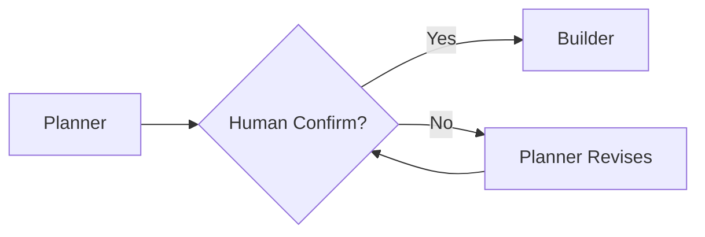

# Skill Suite Architecture — Experience Report

> **Status**: Draft v1.0
> **Date**: 2026-06-03
> **Source**: 7-dimension comparison (ver-3 suite vs ITC-BASE)
> **Purpose**: Extract distilled knowledge for skill-suite upgrade

---

## 1. TỔNG QUAN HAI HỆ THỐNG

### 1.1 ver-3 Suite — Universal Skill Package System

**Mục tiêu**: Tạo production-grade agent skills có thể cài đặt vào `.hermes/skills/` hoặc `.agents/skills/`

```
┌─────────────────────────────────────────────────────────────┐
│  LAYER 4: OUTPUT (Production Skills)                        │
│  .hermes/skills/ | .agents/skills/                          │
├─────────────────────────────────────────────────────────────┤
│  LAYER 3: BUILD (6-Stage Pipeline)                          │
│  skill-explorer → skill-knowledge-miner → skill-architect   │
│              → skill-gatekeeper → skill-planner → skill-builder │
├─────────────────────────────────────────────────────────────┤
│  LAYER 2: SHARED INFRASTRUCTURE                              │
│  _shared/knowledge/ | _shared/validators/ | _shared/schemas/ │
├─────────────────────────────────────────────────────────────┤
│  LAYER 1: CONTEXT STATE                                     │
│  .skill-context/{skill-name}/design.md | todo.md | build-log│
└─────────────────────────────────────────────────────────────┘
```

### 1.2 ITC-BASE — Feature Development Pipeline

**Mục tiêu**: Ship feature từ requirement đến deployed code trong 1 dự án cụ thể

```
Human/PM → Orchestrator → BA → Validator → Designer → Planner
    → [Human confirm] → Implement → Review → Test → Ship
```

---

## 2. TINH TÚY TRI THỨC — DISTILLED KNOWLEDGE

### 2.1 KEEP: ver-3 Strengths (PHẢI GIỮ)

| Pattern | Lý do | Áp dụng cho Skill Suite |
|---------|-------|-------------------------|
| **7-Zone Structure** | Module hóa skill thành Core/Knowledge/Scripts/Templates/Data/Loop/Assets — portable và reusable | ✅ Core contract cho mọi skill |
| **CASE System (PREVENT/DETECT/RECOVER)** | 3-mechanism rollback: state-aware boot + gate validators + rollback engine | ✅ Cần cho skill dài, nhiều stage |
| **Trace Tags `[TỪ DESIGN §N]`** | Chống hallucination — mọi task phải trace về nguồn thiết kế | ✅ Anti-hallucination bắt buộc |
| **Feedback Closed-Loop 4-hop** | Builder → Gatekeeper → Planner → Architect → Explorer (tự phát hiện và sửa lỗi) | ✅ Tự phục hồi khi lỗi |
| **Progressive Disclosure (3 Tiers)** | Tối ưu token — chỉ load file cần thiết theo điều kiện cụ thể | ✅ Tier 1: boot, Tier 2: conditional, Tier 3: on-demand |
| **3 Programmatic Validators** | schema_validator.py, trace_validator.py, handoff_validator.py | ✅ Machine-checkable quality |
| **Skill Lifecycle (raw→designed→planned→built→verified→installed)** | Rõ ràng, có checkpoint resume | ✅ State tracking |
| **Semantic Versioning (MAJOR.MINOR.PATCH)** | Quản lý thay đổi skill có kiểm soát | ✅ Version contract |

### 2.2 ADD: ITC-BASE Strengths (CẦN BỔ SUNG)

| Pattern | Lý do | Cách tích hợp vào Skill Suite |
|---------|-------|-------------------------------|
| **Rule Hierarchy** | Khi xung đột, có quy tắc rõ: `.mdc > agents/*.md > skills/*.SKILL.md` | Thêm `SKILL_RULES.mdc` với priority |
| **Mandatory Human Confirmation Gate** | ITC-BASE Gate 4 bắt buộc human confirm TASKS.md trước Phase 5 | Thêm **Gate X: Human Confirm Design** trước Stage 4 (Builder) |
| **Ambiguity Resolution Gate** | BLOCKED nếu có OPEN ambiguity — không cho phép ambiguous requirement đi tiếp | Thêm `[CẦN LÀM RÕ]` resolution checkpoint |
| **Dedicated security-reviewer Skill** | OWASP 10 categories, auto-trigger cho sensitive skills (auth/payment/upload) | Tạo `skill-security-reviewer` gọi từ Stage 2 (Gatekeeper) |
| **PM Agent cho Ambiguity Resolution** | PM agent tự quyết định, không hỏi human — tránh pipeline bị đình trệ | Tích hợp vào Gatekeeper stage |
| **OWASP Security Checklist** | 10 categories với severity: CRITICAL/HIGH/MEDIUM/LOW/INFO | Dùng cho security-sensitive skills |

### 2.3 REMOVE: Không phù hợp cho Skill Suite

| Pattern | Lý do | Thay thế |
|---------|-------|----------|
| **Full E2E Playwright Testing** | Skill không có UI-to-DB flow — chỉ là hướng dẫn cho AI | Schema-based validation đủ |
| **Orchestrator Agent** | Quá nặng cho skill creation — skill được invoke trực tiếp | Không cần |
| **50 Quality Criteria** | Quá nhiều cho skill, overhead cao | Giảm còn **20 criteria** (5 per stage) |
| **Human Confirm TASKS.md** | Skill không có TASKS.md — có design.md và todo.md | Thay bằng **Human Confirm design.md + todo.md** |

---

## 3. KIẾN TRÚC ĐỀ XUẤT — HYBRID ARCHITECTURE

### 3.1 Sơ đồ Kiến trúc Mới

```
┌─────────────────────────────────────────────────────────────────────┐
│              SKILL CREATION PIPELINE — HYBRID ARCHITECTURE           │
│                                                                      │
│  Stage 0      Stage 0.5     Stage 1      Stage 2      Stage 3       │
│  Explorer  →  Knowledge  →  Architect →  Gatekeeper →  Planner  →   │
│  (explor.)    Miner        (design.)     (quality)     (todo.)       │
│                                    │                    │            │
│                              ┌─────┴─────┐              │            │
│                              │ Security  │              │            │
│                              │ Reviewer  │              │            │
│                              │ (OWASP)   │              │            │
│                              └───────────┘              │            │
│                                    │                    │            │
│       ◀──────────────────────────────────────────────────────────   │
│                        FEEDBACK CLOSED-LOOP                         │
└─────────────────────────────────────────────────────────────────────┘
                              │
                              ▼
                    Stage 4: Builder & Reviewer
                              │
                              ▼
                    ┌─────────────────┐
                    │ Human Confirm   │ ← MANDATORY GATE
                    │ design.md +     │
                    │ todo.md         │
                    └─────────────────┘
                              │
                              ▼
                    Stage 5: Indexer → .hermes/skills/{name}/
```

### 3.2 Layer Architecture Mới

```
┌─────────────────────────────────────────────────────────────┐
│  LAYER 5: OUTPUT (Production Skills)                        │
│  .hermes/skills/{skill-name}/ | .agents/skills/{skill-name}/ │
├─────────────────────────────────────────────────────────────┤
│  LAYER 4: BUILD (5-Stage + Security + Human Gate)          │
│  Explorer → Miner → Architect → Gatekeeper(+Security)       │
│                                    → Planner → [Human OK] → Builder │
├─────────────────────────────────────────────────────────────┤
│  LAYER 3: SECURITY REVIEW (NEW)                             │
│  skill-security-reviewer — OWASP 10, auto-trigger          │
├─────────────────────────────────────────────────────────────┤
│  LAYER 2: SHARED INFRASTRUCTURE                              │
│  _shared/knowledge/ | _shared/validators/ | _shared/schemas/ │
├─────────────────────────────────────────────────────────────┤
│  LAYER 1: CONTEXT STATE                                     │
│  .skill-context/{skill-name}/design.md | todo.md | build-log│
└─────────────────────────────────────────────────────────────┘
```

### 3.3 Rule Hierarchy (Mới)

```
Priority 1: _shared/rules/*.mdc        (highest — suite-wide rules)
Priority 2: {skill}/SKILL.md           (skill-specific overrides)
Priority 3: _shared/knowledge/*.md    (lowest — domain knowledge)
```

---

## 4. 20-POINT QUALITY GATES (RÚT GỌN)

Thay vì 50 criteria, rút gọn còn **20 criteria (4 per stage)**:

### Stage 0: Explorer (4 criteria)
| ID | Name | Description |
|----|------|-------------|
| EXP-01 | Business Intent | Pain point, target user, expected behavior rõ ràng |
| EXP-02 | Golden Standards | 7 standards assessment (Reusability, Composability, Maintainability, Security, Context Economics, Portability, Reliability) |
| EXP-03 | SCS Score | Skill Complexity Score tính toán, >3.0 = decompose |
| EXP-04 | Exploration Schema | schema_validator.py PASS trên exploration.md |

### Stage 1: Architect (4 criteria)
| ID | Name | Description |
|----|------|-------------|
| ARC-01 | Problem Statement | §1 có context, pain point, solution, scope |
| ARC-02 | Zone Mapping | §3 có bảng cụ thể, không placeholder |
| ARC-03 | Mermaid Diagrams | §4 mindmap + §5 sequence đúng syntax |
| ARC-04 | Design Schema | schema_validator.py PASS trên design.md |

### Stage 2: Gatekeeper + Security (4 criteria)
| ID | Name | Description |
|----|------|-------------|
| GAT-01 | Quality Matrix | quality-matrix.yaml có điểm số |
| GAT-02 | Security Review | skill-security-reviewer APPROVED nếu skill nhạy cảm |
| GAT-03 | No Ambiguities | Tất cả `[CẦN LÀM RÕ]` đã resolved |
| GAT-04 | Handoff Ready | handoff_validator.py PASS cho exploration→design |

### Stage 3: Planner (4 criteria)
| ID | Name | Description |
|----|------|-------------|
| PLN-01 | Trace Tags | Mọi task có `[TỪ DESIGN §N]` hợp lệ |
| PLN-02 | Dependency DAG | Task dependencies rõ ràng, không cycle |
| PLN-03 | Resource Audit | Critical resources available hoặc có fallback plan |
| PLN-04 | Human Gate Ready | todo.md đạt đủ criteria cho human review |

### Stage 4: Builder + Human Confirm (4 criteria)
| ID | Name | Description |
|----|------|-------------|
| BLD-01 | Zone Contract | Chỉ tạo file trong design.md §3 Zone Mapping |
| BLD-02 | SKILL.md Token Budget | ≤700 tokens (L0 anchor rule) |
| BLD-03 | Placeholder Density | <5% placeholders trong toàn bộ skill |
| BLD-04 | Human Confirmed | User explicitly confirmed design.md + todo.md |

---

## 5. MANDATORY HUMAN GATE — TRƯỚC STAGE 4

### 5.1 Gate X: Human Confirmation

**Điều kiện vào**: Planner hoàn thành todo.md

**Điều kiện qua**:
```
✓ User đã đọc design.md §1-10
✓ User đã đọc todo.md phase breakdown
✓ User hiểu scope của skill (không thêm scope mới sau khi confirm)
✓ User xác nhận: "design.md + todo.md confirmed, proceed to build"
```

**Behavior nếu FAIL**:
- Skill tạm dừng
- User nhận notification với danh sách cần điều chỉnh
- Planner sẵn sàng revise sau khi user feedback

### 5.2 Tích hợp vào Pipeline



---

## 6. SECURITY REVIEWER SKILL — NEW ADDITION

### 6.1 Kích hoạt

| Trigger | Action |
|---------|--------|
| Skill có auth/payment/upload features | Auto-invoke skill-security-reviewer |
| Skill chỉ là guidance/documentation | Skip security review |
| User explicitly requests | Invoke regardless |

### 6.2 OWASP Checklist (Rút gọn)

| Category | Check |
|----------|-------|
| OWASP-1 | Broken Access Control — auth checks present |
| OWASP-2 | Cryptographic Failures — no hardcoded secrets |
| OWASP-3 | Injection — no string concatenation in commands |
| OWASP-4 | Insecure Design — skill không tạo security holes |
| OWASP-5 | Security Misconfiguration — Docker sandboxing specified |

### 6.3 Output Format

```markdown
=== SECURITY REVIEW REPORT ===
Skill: {skill-name}
Timestamp: {date}

Verdict: APPROVED / REQUEST CHANGES

Findings:
- [CRITICAL] {description}
- [HIGH] {description}
- [MEDIUM] {description}
- [LOW] {description}

Action: {instruction for builder}
```

---

## 7. FEEDBACK CLOSED-LOOP — 4-HOP REFINEMENT

### 7.1 Loop Flow

```
Builder --(1. Lỗi tĩnh / loop_refiner fail)--> Gatekeeper
Gatekeeper --(2. Điều chỉnh quality matrix)--------> Planner
Builder --(3. Điểm nghẽn kiến trúc lớn)--------> Architect
Architect --(4. Đồng bộ hóa thiết kế)-------------> Explorer
```

### 7.2 Rollback Triggers

| Trigger | Action |
|---------|--------|
| Validation FAIL 3 lần liên tiếp | Rollback to previous phase + notify |
| Confidence < 70% | Rollback request + archive state |
| User rejects output | Rollback to previous phase |
| Security review REJECTED | Rollback to Stage 2 (Gatekeeper) |

---

## 8. PROGRESSIVE DISCLOSURE — 3 TIERS

### 8.1 Tier Definitions

| Tier | Khi nào load | Ví dụ |
|------|-------------|-------|
| **Tier 1** | Always, boot | SKILL.md, core workflow |
| **Tier 2** | Conditional (explicit trigger) | domain handbook, quality matrix |
| **Tier 3** | On-demand | security-standards.md, OWASP checklist |

### 8.2 Trigger Examples

```yaml
tier2_triggers:
  - WHEN: entering Phase 1 (Architect)
      READ: knowledge/architect.md
  
  - WHEN: entering Phase 2 (Gatekeeper)  
      READ: knowledge/case-system.md
  
  - WHEN: skill has auth/payment
      READ: skill-security-reviewer/OWASP-checklist.md
```

---

## 9. STATE LEDGER — .skill-context/

```
.skill-context/{skill-name}/
├── design.md              # Architect output (Stage 1)
├── todo.md                # Planner output (Stage 3)
├── build-log.md           # Builder evidence (Stage 4)
├── quality-matrix.yaml    # Gatekeeper output (Stage 2)
├── security-review.md      # Security reviewer output (NEW)
├── resources/             # User-provided domain docs
│   └── domain-handbook.md # Knowledge miner output (Stage 0.5)
├── data/
│   └── quality-config.yaml
└── loop/
    ├── design-checklist.md
    └── build-checklist.md
```

### Status Block (trong design.md frontmatter)

```yaml
status:
  phase: 3                      # Current phase (0-4)
  gates_passed: [1, 2]          # Gates confirmed
  last_actor: skill-planner     # Who last modified
  updated: 2026-06-03T10:00:00Z
  confidence: 85                 # 0-100
  human_confirmed: false         # NEW: Gate X status
```

---

## 10. AMBIGUITY RESOLUTION GATE

### 10.1 Process

```
Stage 1 (Architect) phát hiện ambiguity
    │
    ▼
Đánh dấu [CẦN LÀM RÕ] trong design.md §9
    │
    ▼
Stage 2 (Gatekeeper) check:
    │
    ├── Có OPEN ambiguity? → BLOCKED → Notify user
    │
    └── Tất cả resolved? → APPROVED → Continue
```

### 10.2 Resolution Options

| Option | When | Who |
|--------|------|-----|
| User cung cấp thêm context | User có thông tin | User |
| PM Agent quyết định | Ambiguity trong nghiệp vụ | PM Agent |
| Fallback assumption | Có baseline đủ | Architect (với warning) |

---

## 11. COMPARISON — BEFORE vs AFTER

| Aspect | Before (ver-3) | After (Hybrid) |
|--------|----------------|----------------|
| **Pipeline** | 6 stages | 5 stages + Security + Human Gate |
| **Quality Criteria** | 50 (10 per stage) | 20 (4 per stage) |
| **Human Gates** | Optional (confidence-based) | **Mandatory** (design.md + todo.md) |
| **Security** | Generic code review | **Dedicated skill-security-reviewer** |
| **Rollback** | CASE System | CASE System + Security rollback |
| **Rule Hierarchy** | Không rõ ràng | .mdc > SKILL.md > knowledge/*.md |
| **Ambiguity Handling** | [CẦN LÀM RÕ] tags | **BLOCKED gate** nếu OPEN |

---

## 12. WHAT TO DO NEXT

### 12.1 Immediate Actions

1. **Tạo skill-security-reviewer** — OWASP-based security skill
2. **Thêm Gate X** vào framework.md — Human confirmation trước Builder
3. **Rút gọn quality gates** từ 50 xuống 20 (4 per stage)
4. **Thêm rule hierarchy** vào _shared/rules/
5. **Cập nhật CASE System** để handle security rollback

### 12.2 Priority Order

```
1. skill-security-reviewer (NEW)
   ↓
2. Gate X: Human Confirmation (MANDATORY)
   ↓
3. Rule Hierarchy in _shared/rules/
   ↓
4. Quality Gates rút gọn (20 criteria)
   ↓
5. Ambiguity BLOCKED gate
```

---

## 13. GLOSSARY (Thuật ngữ sử dụng)

| Thuật ngữ | Giải thích |
|-----------|------------|
| **CASE System** | PREVENT → DETECT → RECOVER — 3-mechanism quality system |
| **Progressive Disclosure** | 3-tier loading: Tier 1 (boot), Tier 2 (conditional), Tier 3 (on-demand) |
| **Trace Tag** | `[TỪ DESIGN §N]` — liên kết task về nguồn thiết kế |
| **Zone Mapping** | Bảng định nghĩa file cần tạo trong skill |
| **Gate X** | Mandatory human confirmation trước Builder stage |
| **OWASP** | Open Web Application Security Project — security checklist standard |
| **SCS Score** | Skill Complexity Score — đo độ phức tạp của skill |
| **BLOCKED Gate** | Pipeline dừng nếu điều kiện không thỏa mãn |

---

## 14. REFERENCES

### Source Documents (7 Dimensions)
- `knowledge/experience/so_sanh_voi_suite/dimension-1-kien-truc-va-layering.md`
- `knowledge/experience/so_sanh_voi_suite/dimension-2-pipeline-workflow-pattern.md`
- `knowledge/experience/so_sanh_voi_suite/dimension-3-quality-gates-validation.md`
- `knowledge/experience/so_sanh_voi_suite/dimension-4-rollback-error-recovery.md`
- `knowledge/experience/so_sanh_voi_suite/dimension-5-human-in-the-loop-governance.md`
- `knowledge/experience/so_sanh_voi_suite/dimension-6-security-testing.md`
- `knowledge/experience/so_sanh_voi_suite/dimension-7-skill-portability-reusability.md`

### Current Suite (ver-3)
- `skills/Update-suite/current-suite/ver-3/_shared/knowledge/framework.md`
- `skills/Update-suite/current-suite/ver-3/_shared/knowledge/case-system.md`

### ITC-BASE Reference
- `knowledge/ai-agents/repo/ITC-BASE/PIPELINE.md`
- `knowledge/ai-agents/repo/ITC-BASE/workflow.md`
- `knowledge/ai-agents/repo/ITC-BASE/.cursor/skills/security-reviewer/SKILL.md`
