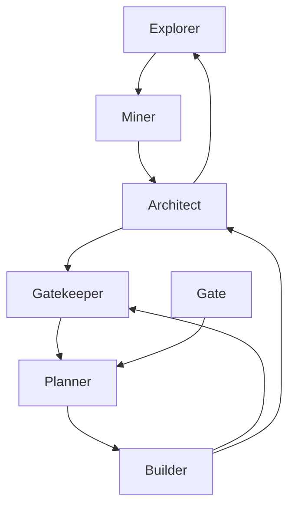
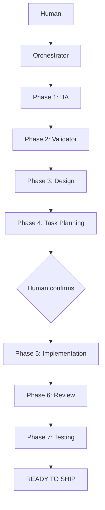
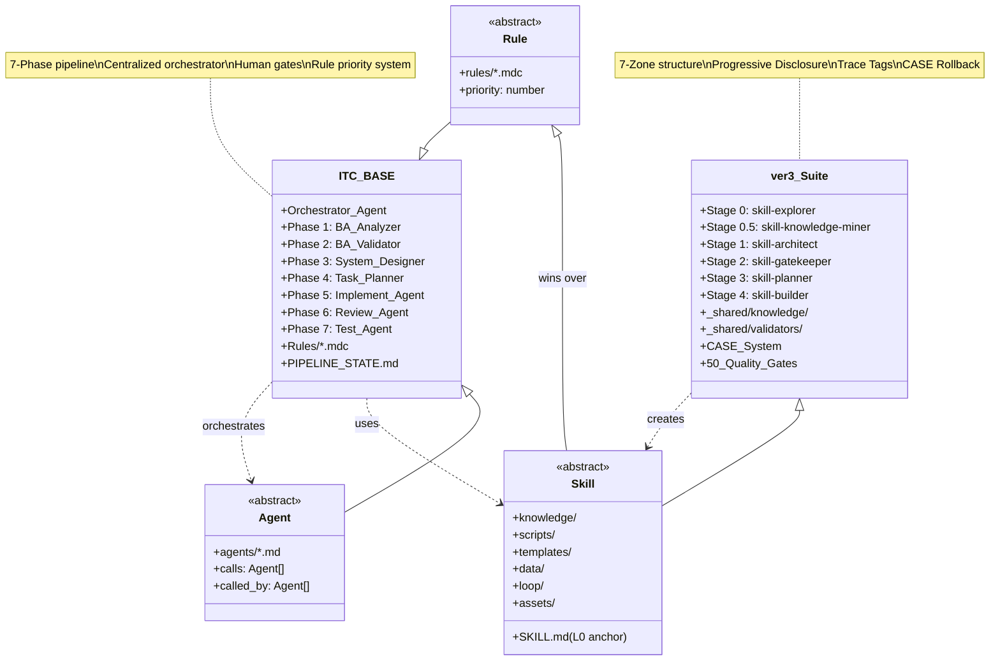

# Dimension 1: Kiến trúc & Layering

## Mô tả Dimension

**Kiến trúc & Layering** là dimension đo thiết bậc phức tạp của hệ thống theo chiều dọc (layering) và các thành phần theo chiều ngang (component/agent separation). Nó trả lời câu hỏi:
- Các thành phần nào tồn tại, chúng đảm nhiệm vai trò gì?
- Layering chính thức là gì, informal là gì?
- Tác nhân nào gọi tác nhân nào, theo thứ tự nào?
- Dependency di chuyển theo hướng nào?

Dimension này quan trọng vì:
1. **Composable** - Thành phần có thể reused không hay chỉ được phép gọi khi nào?
2. **Debuggable** - Khi lỗi xảy ra, trace theo nào để tìm nguồn gốc?
3. **Scalable** - Thêm thành phần mới có phù hợp với architecture hiện tại không?

---

## Side A: ver-3 Suite - Skill Creation Pipeline

### Layer Architecture

```
┌─────────────────────────────────────────────────────────────┐
│  LAYER 4: OUTPUT (Production Skills)                        │
│  .hermes/skills/ | .agents/skills/                          │
├─────────────────────────────────────────────────────────────┤
│  LAYER 3: BUILD (6-Stage Pipeline)                          │
│  skill-explorer → skill-knowledge-miner → skill-architect    │
│              → skill-gatekeeper → skill-planner → skill-builder
├─────────────────────────────────────────────────────────────┤
│  LAYER 2: SHARED INFRASTRUCTURE                              │
│  _shared/knowledge/ | _shared/validators/ | _shared/schemas/ │
├─────────────────────────────────────────────────────────────┤
│  LAYER 1: CONTEXT STATE                                     │
│  .skill-context/{skill-name}/design.md | todo.md | build-log│
└─────────────────────────────────────────────────────────────┘
```

### 7-Zone Internal Structure (per Skill)

| Zone | Thu muc | Purpose |
|------|---------|---------|
| **Core** | `SKILL.md` | L0 anchor: persona, workflow, guardrails |
| **Knowledge** | `knowledge/` | Domain context, guidelines (Tier 2) |
| **Scripts** | `scripts/` | Python/Bash automation |
| **Templates** | `templates/` | Output format templates |
| **Data** | `data/` | Config, schemas, static data |
| **Loop** | `loop/` | Checklists, logs, verification |
| **Assets** | `assets/` | Static files (rarely used) |

### Skill Pipeline Flow

```
Stage 0: skill-explorer
    │ (exploration.md - 7 Golden Standards, SCS score)
    ▼
Stage 0.5: skill-knowledge-miner  
    │ (knowledge/domain-handbook.md)
    ▼
Stage 1: skill-architect
    │ (design.md - Zone Mapping, Mermaid diagrams)
    ▼
Stage 2: skill-gatekeeper
    │ (quality-matrix.yaml - 100+ quality criteria)
    ▼
Stage 3: skill-planner
    │ (todo.md - phased tasks with trace tags)
    ▼
Stage 4: skill-builder
    └── Output: Production skill package
```

### Key Architectural Decisions

1. **Unidirectional Flow**: Mỗi stage chỉ gọi stage tiếp theo, không quay lui
2. **State Ledger**: `.skill-context/{name}/` là persistent state giữa các stage
3. **Progressive Disclosure**: 3-tier loading (Tier 1: boot, Tier 2: conditional, Tier 3: on-demand)
4. **CASE System**: Rollback khi confidence < 70% hoặc FAIL
5. **Anti-Hallucination**: Trace tags bắt buộc cho mỗi task

### Example: Skill Package Output

```
skill-architect/
├── SKILL.md                    # L0 anchor (≤700 tokens)
├── knowledge/
│   ├── architect.md            # Tier 2 domain context
│   └── format-standards.md    # Tier 2 formatting rules
├── scripts/
│   └── validate_skill.py       # Automation
├── templates/
│   └── design.md.template     # Output template
├── data/
│   └── quality-matrix.yaml     # Quality criteria
└── loop/
    └── design-checklist.md     # Verification checklist
```

---

## Side B: ITC-BASE - Feature Development Pipeline

### Layer Architecture

```
┌─────────────────────────────────────────────────────────────┐
│  LAYER 5: ORCHESTRATION (Human + Orchestrator Agent)        │
│  PIPELINE-STATE.md management                               │
├─────────────────────────────────────────────────────────────┤
│  LAYER 4: EXECUTION AGENTS                                  │
│  implement-agent | review-agent | test-agent                │
├─────────────────────────────────────────────────────────────┤
│  LAYER 3: SPECIALIST AGENTS                                 │
│  ba-analyzer | ba-validator | system-designer | task-planner│
├─────────────────────────────────────────────────────────────┤
│  LAYER 2: SKILLS (Reusable Components)                       │
│  skills/ba-analyzer/ | skills/code-reviewer/ | ...          │
├─────────────────────────────────────────────────────────────┤
│  LAYER 1: RULES (Enforcement Layer)                          │
│  rules/coding-standards.mdc | rules/design-standards.mdc     │
└─────────────────────────────────────────────────────────────┘
```

### 7-Phase Agent Pipeline

```
Human/PM
    │
    ▼
┌─────────────────────────────────────────┐
│  Phase 1: REQUIREMENTS                  │ ◄── ba-analyzer (skill)
│  Requirements.md, acceptance-criteria   │
└─────────────────┬───────────────────────┘
                  ▼
┌─────────────────────────────────────────┐
│  Phase 2: VALIDATION GATE               │ ◄── ba-validator (agent)
│  APPROVED / REJECTED / BLOCKED          │
└─────────────────┬───────────────────────┘
                  ▼ (APPROVED only)
┌─────────────────────────────────────────┐
│  Phase 3: DESIGN                        │ ◄── system-designer (skill)
│  data-model.md, api-contract.yaml       │
└─────────────────┬───────────────────────┘
                  ▼
┌─────────────────────────────────────────┐
│  Phase 4: TASK PLANNING                 │ ◄── task-planner (skill)
│  TASKS.md ← Human confirms              │
└─────────────────┬───────────────────────┘
                  ▼
┌─────────────────────────────────────────┐
│  Phase 5: IMPLEMENTATION                │ ◄── implement-agent
│  Source code, Final Build Report        │
└─────────────────┬───────────────────────┘
                  ▼
┌─────────────────────────────────────────┐
│  Phase 6: REVIEW                        │ ◄── review-agent
│  Calls: code-reviewer, security-reviewer │
└─────────────────┬───────────────────────┘
                  ▼
┌─────────────────────────────────────────┐
│  Phase 7: TESTING                       │ ◄── test-agent
│  Playwright E2E, Test Report            │
└─────────────────┬───────────────────────┘
                  ▼
           READY TO SHIP
```

### Agent Registry

| Agent | File | Type | Calls |
|-------|------|------|-------|
| orchestrator-agent | agents/orchestrator-agent.md | Cursor Agent | All agents |
| ba-analyzer | skills/ba-analyzer/SKILL.md | Skill | — |
| ba-validator | agents/ba-validator-agent.md | Agent | — |
| system-designer | skills/system-designer/SKILL.md | Skill | — |
| task-planner | skills/task-planner/SKILL.md | Skill | — |
| implement-agent | agents/implement-agent.md | Agent | solid-architecture, ui-cloner |
| review-agent | agents/review-agent.md | Agent | code-reviewer, security-reviewer |
| test-agent | agents/test-agent.md | Agent | test-writer |

### Rule Priority System (Conflict Resolution)

```
Priority 1: rules/*.mdc          (highest - always wins)
Priority 2: agents/*.md          (overrides skills)
Priority 3: skills/*/SKILL.md    (lowest authority)
```

### Example: File Output Structure

```
docs/[feature]/
├── REQUIREMENTS.md
├── acceptance-criteria.md
├── user-stories.md
├── ambiguities.md
├── data-model.md
├── api-contract.yaml
├── component-tree.md
├── TASKS.md
├── PIPELINE-STATE.md
├── REVIEW-DONE.md
└── TECH-DEBT.md

src/features/[feature]/
├── components/
├── hooks/
├── api/
└── types.ts

tests/features/[feature]/
```

---

## Side-by-Side Comparison

### Architecture Philosophy

| Aspect | ver-3 Suite | ITC-BASE |
|--------|-------------|----------|
| **Primary Focus** | Skill creation lifecycle | Feature development lifecycle |
| **Unit of Work** | Agent Skill | Feature (end-to-end) |
| **Orchestration** | Linear pipeline (Explorer → Builder) | Centralized orchestrator with gates |
| **State Management** | `.skill-context/` directory | `PIPELINE-STATE.md` file |
| **Agent Type** | Meta-agents (design/planning only) | Concrete agents (implement/review/test) |
| **Reusability** | Skills are reusable across projects | Skills + Agents + Rules all reusable |

### Layering Comparison

| Layer | ver-3 Suite | ITC-BASE |
|-------|-------------|----------|
| **L4 (Output)** | Production skills | — (not applicable) |
| **L4 (Execution)** | Build pipeline | Implement/Review/Test agents |
| **L3 (Specialist)** | 6 meta-skills | Specialist agents + skills |
| **L2 (Shared)** | `_shared/` with validators/schemas | Skills library |
| **L1 (State)** | `.skill-context/` | Rules + PIPELINE-STATE |
| **L0 (Base)** | (implicit - Claude Code runtime) | Human + raw requirements |

### Dependency Direction

**ver-3 Suite:**
```
Explorer ──► Miner ──► Architect ──► Gatekeeper ──► Planner ──► Builder
                                                           │
                                                           ▼
                                                    [Production Skill]
```

**ITC-BASE:**
```
Human ──► Orchestrator ──► [BA ──► Validator ──► Designer ──► Planner] ──► Implement ──► Review ──► Test ──► Ship
                              ↑                              │
                              └──────────────────────────────┘
                                   (Human confirms TASKS.md)
```

---

## Advantages & Disadvantages

### ver-3 Suite

| Advantages | Disadvantages |
|------------|---------------|
| **Specialized**: Mỗi skill chỉ làm một việc, chuyên giao rõ ràng | **Limited scope**: Chỉ tạo được skill, không handle feature từ A-Z |
| **Composable**: 7 Zones cho phép mix-and-match theo nhu cầu | **External tools required**: Phụ thuộc vào external validator scripts |
| **Quality gates**: 50 điểm kiểm tra giúp đảm bảo chất lượng | **Complexity**: Nhiều stage có thể chậm hơn simple pipeline |
| **Anti-hallucination**: Trace tags giảm thiểu hallucination | **Learning curve**: Developer cần hiểu rõ các trace tags và stage transitions |
| **Portable**: `_shared/` có thể share giữa nhiều skill | **State explosion**: Nhiều context files cho mỗi skill |

### ITC-BASE

| Advantages | Disadvantages |
|------------|---------------|
| **End-to-end**: Cover full lifecycle từ requirement đến shipped feature | **Monolithic orchestrator**: Tất cả logic tập trung trong orchestrator-agent |
| **Human gates**: Nhiều checkpoint nhận sự chung rất dễ kiểm soát | **Agent mix**: Agent và skill không rõ ràng (implement-agent là agent hay skill?) |
| **Clear file output**: Mỗi phase có file output cụ thể | **No rollback**: Không có CASE system hay rollback khi fail |
| **Rule enforcement**: rules/*.mdc có priority cao nhất | **Tight coupling**: Implement-agent gọi trực tiếp solid-architecture, ui-cloner |
| **Scalable**: Thêm phase/agent mới rất dễ dàng | **Language specific**: Chỉ for TypeScript projects |

---

## Examples from Source Files

### Example 1: Orchestration Pattern

**ver-3 Suite** (`framework.md:113-124`):

Pattern: Linear flow với feedback loop giữa các stage

**ITC-BASE** (`PIPELINE.md:8-101`):

Pattern: Centralized orchestrator với conditional human gates

### Example 2: State Management

**ver-3 Suite** (`framework.md:188-197`):
```
.skill-context/{skill-name}/
├── design.md        # Architect's output
├── todo.md          # Planner's output  
├── build-log.md     # Builder's output
├── resources/       # User-provided domain docs
├── data/            # Rule configs, scoring matrix
└── loop/            # Prior checks, phase logs
```
Pattern: Directory-based state, documents as state

**ITC-BASE** (`orchestrator-agent.md:31-56`):
```markdown
# Pipeline State — [feature-name]
## Phases
| Phase | Agent | Status | Started | Completed |
|---|---|---|---|---|
| 1 — Requirements | ba-analyzer | PENDING | — | — |
...
## Blockers
(none)
## Decisions Log
(none)
```
Pattern: Structured markdown table, single file per feature

### Example 3: Quality Gate

**ver-3 Suite** (`framework.md:209-271`):
```yaml
INT-04: Exit Code Compliance
  must: respect exit codes (0=Pass, 1=Fail, 2=Emergency)
INT-06: Programmatic Rollback Engine
  must: integrate rollback_engine.py for auto-backup
```
Pattern: Automated quality gates với rollback

**ITC-BASE** (`orchestrator-agent.md:62-109`):
```markdown
### Gate 2 → Phase 2 (BA Validation)
Conditions:
- [ ] docs/[feature]/REQUIREMENTS.md exists
- [ ] docs/[feature]/acceptance-criteria.md exists
- [ ] docs/[feature]/ambiguities.md exists
- [ ] docs/[feature]/user-stories.md exists
```
Pattern: Manual checklist verification by orchestrator

---

## Mermaid Class Diagram



---

## Conclusion

### Core Architectural Differences

| Dimension | ver-3 Suite | ITC-BASE |
|-----------|-------------|----------|
| **Philosophy** | "Make a skill" (production factory) | "Ship a feature" (development workflow) |
| **Granularity** | Fine-grained: 6 stages, each with specific output | Coarse-grained: 7 phases, each with multiple agents |
| **Orchestration** | Pipeline (linear) | Orchestrator (hub-and-spoke) |
| **Reuse Model** | Skills as reusable packages | Skills + Agents + Rules all reusable, but agents are more coupled |
| **State** | Distributed (`.skill-context/` per skill) | Centralized (single `PIPELINE-STATE.md` per feature) |
| **Quality** | 50 automated gates, CASE rollback | Gate checklists, no rollback mechanism |
| **Human Interaction** | Gate confirmations between stages | Multiple human checkpoints, especially before Phase 5 |

### When to Use Each

**ver-3 Suite** is better when:
- Goal is to create reusable Agent Skills
- Need high quality with automated quality gates
- Team needs structured skill creation process
- Portability across projects is important

**ITC-BASE** is better when:
- Goal is to ship features end-to-end
- Human oversight at key checkpoints is required
- Team works on TypeScript/React projects
- Need clear file output per phase for audit

### Trade-off Summary

| Trade-off | ver-3 Suite | ITC-BASE |
|-----------|-------------|----------|
| **Flexibility vs Control** | More flexible, less control at runtime | Less flexible, more human control |
| **Speed vs Quality** | Slower (50 gates), higher quality | Faster initial, quality depends on human |
| **Specialization vs Scope** | Highly specialized, narrow scope | General purpose, wider scope |
| **Reuse vs Coupling** | High reuse, low coupling | Medium reuse, higher coupling |

---

## References

### ver-3 Suite
- `/skills/Update-suite/current-suite/ver-3/_shared/knowledge/framework.md:1-276` - Master framework với 7 Zones, pipeline, anti-hallucination
- `/skills/Update-suite/current-suite/ver-3/skill-architect/SKILL.md:1-137` - SKILL.md as L0 anchor pattern
- `/skills/Update-suite/current-suite/ver-3/skill-builder/SKILL.md:1-320` - Builder workflow với Phase 1-5

### ITC-BASE
- `/knowledge/ai-agents/repo/ITC-BASE/PIPELINE.md:1-200` - 7-phase pipeline architecture
- `/knowledge/ai-agents/repo/ITC-BASE/.cursor/agents/orchestrator-agent.md:1-218` - Centralized orchestrator
- `/knowledge/ai-agents/repo/ITC-BASE/workflow.md:1-84` - Developer workflow cheat sheet
- `/knowledge/ai-agents/repo/ITC-BASE/.cursor/rules/coding-standards.mdc:1-62` - Rule priority example

---

## 📖 Glossary (Thuật ngữ)

| Thuật ngữ | Giải thích |
|------------|-------------|
| **Pipeline** | Đường ống xử lý - chuỗi các giai đoạn xử lý công việc theo thứ tự tuyến tính hoặc tuần tự. |
| **Layering** | Phân lớp - kiến trúc tổ chức mã nguồn hoặc tri thức theo chiều dọc để đảm bảo tính độc lập và dễ bảo trì. |
| **Gate** | Cổng kiểm tra - điểm checkpoint kiểm soát chất lượng nơi các sản phẩm đầu ra (artifacts) được thẩm định. |
| **Rollback** | Quay lui - cơ chế tự động hoặc thủ công để phục hồi trạng thái làm việc về một phase ổn định trước đó khi xảy ra sự cố. |
| **Checkpoint** | Điểm kiểm tra - trạng thái công việc được lưu lại để có thể tiếp tục (resume) mà không phải làm lại từ đầu. |
| **Staleness** | Lỗi thời - trạng thái khi checkpoint quá cũ (ví dụ: > 7 ngày) đòi hỏi phải cảnh báo hoặc chạy lại explorer. |
| **Handoff** | Chuyển giao - quá trình bàn giao các artifacts đạt chuẩn từ stage này sang stage kế tiếp. |
| **Feedback Loop** | Vòng phản hồi - cơ chế đẩy thông tin lỗi hoặc đề xuất ngược về các stage trước để tự động điều chỉnh. |
| **CASE System** | Hệ thống CASE - cơ chế quản lý chất lượng toàn diện của ver-3 suite dựa trên 3 trụ cột: PREVENT → DETECT → RECOVER. |
| **Progressive Disclosure** | Tiết lộ lũy tiến - cơ chế nạp bối cảnh/tri thức theo từng tầng (Tiers) trên cơ sở nhu cầu thực tế của task để tối ưu hóa context window và token. |
| **Trace Tag** | Thẻ truy vết - thẻ dạng như `[TỪ DESIGN §N]` dùng để đối chiếu ngược mọi tác vụ lập trình về nguồn gốc thiết kế ban đầu. |
| **Ambiguity** | Sự mơ hồ - các điểm chưa rõ ràng hoặc mâu thuẫn trong yêu cầu nghiệp vụ cần được phát hiện và giải quyết triệt để. |
| **Sandbox** | Môi trường cô lập (Hộp cát) - môi trường chạy mã nguồn độc lập và an toàn (như Docker/gVisor) để kiểm thử sản phẩm. |
| **Rule Hierarchy** | Phân cấp Luật - thứ tự ưu tiên áp dụng các tệp quy định trong hệ thống khi có xung đột (ví dụ: `.mdc` > `agents/` > `skills/`). |
| **Self-refinement** | Tự tinh chỉnh - cơ chế AI tự chạy vòng lặp đánh giá lỗi dựa trên critic engine và tự sửa đổi code cho đến khi đạt chuẩn. |
| **E2E Testing** | Kiểm thử đầu-cuối - quy trình chạy kiểm thử tự động giả lập người dùng thật trên toàn bộ hệ thống từ UI đến DB (như Playwright). |
| **Flaky Test** | Kiểm thử không ổn định - các ca kiểm thử lúc Pass lúc Fail không nhất quán dù không có sự thay đổi nào về mã nguồn hay môi trường. |
| **Orchestration** | Phối hợp quy trình (Đạo diễn) - cơ chế điều phối trung tâm để quản lý vòng đời, trạng thái và sự chuyển giao giữa các tác nhân. |
| **Governance** | Quản trị - cơ chế kiểm soát, phân quyền và phê duyệt tiến trình (đặc biệt là các cổng phê duyệt bắt buộc của con người - Human-in-the-Loop). |
| **Acceptance Criteria** | Tiêu chí nghiệm thu - các điều kiện bắt buộc phải thỏa mãn để một tính năng được coi là hoàn thành hoàn chỉnh. |
| **Portability** | Tính di động - khả năng chuyển đổi hoặc chạy một gói skill trên nhiều môi trường agent runtime khác nhau mà không cần sửa đổi cấu trúc. |
| **Reusability** | Tính tái sử dụng - khả năng sử dụng lại một skill hoặc module cho nhiều dự án khác nhau một cách độc lập. |
| **DoD (Definition of Done)** | Định nghĩa Hoàn thành - danh sách kiểm tra (checklist) tiêu chí chất lượng nghiêm ngặt cho mỗi phase trước khi bàn giao. |
