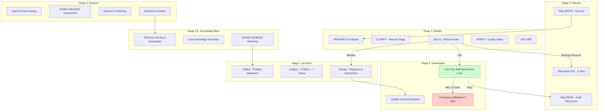
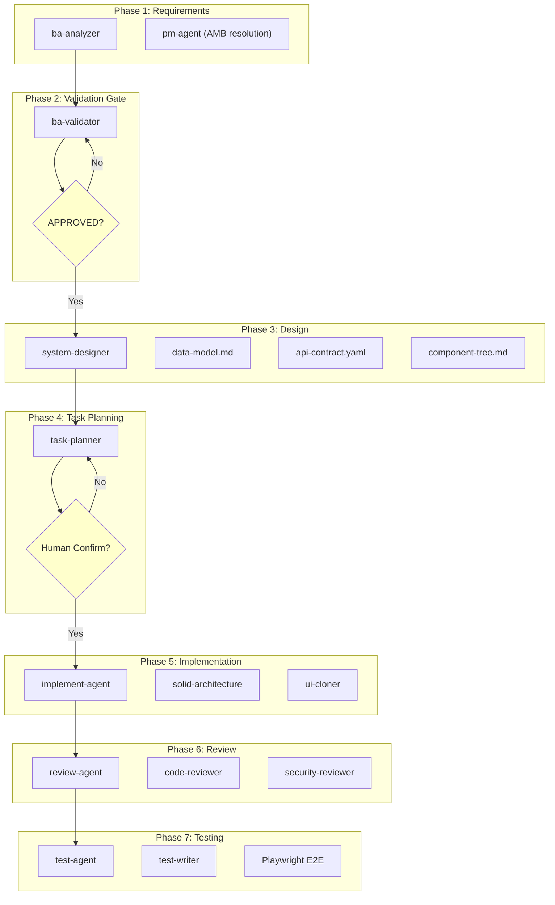

# Dimension 2: Pipeline & Workflow Pattern

## Mô tả Dimension

**Pipeline & Workflow Pattern** là dimension so sánh cách hai hệ thống tổ chức quá trình xử lý công việc theo giai đoạn (stage/phase), điều kiện chuyển tiếp (advancement rules), và hợp đồng chuyển giao (handoff contracts) giữa các agent/skills.

Tiến trình này xác định:
- Số lượng giai đoạn và chức năng mỗi giai đoạn
- Cơ chế điều kiện để tiến lên giai đoạn tiếp theo (gate/checkpoint)
- Cơ chế phản hồi ngược (reverse feedback) khi gặp lỗi
- Vai trò con người trong quá trình kiểm soát

---

## 1. Tổng quan Hai Hệ Thống

### Side A - ver-3 Suite (6-Stage Pipeline)

```
┌─────────────────────────────────────────────────────────────────────┐
│                    6-STAGE CLOSED-LOOP PIPELINE                      │
│                                                                      │
│  Stage 0      Stage 0.5     Stage 1      Stage 2      Stage 3      │
│  Explorer  →  Knowledge  →  Architect →  Gatekeeper →  Planner  → │
│  (explor.)    Miner        (design.)     (quality)     (todo.)      │
│                                                                      │
│       ◀──────────────────────────────────────────────────────────    │
│                        FEEDBACK CLOSED-LOOP                          │
└─────────────────────────────────────────────────────────────────────┘
                              │
                              ▼
                    Stage 4: Builder & Reviewer
```

**5 Cơ Sở Chất Lượng (50 điểm)**: 10 tiêu chí mỗi lớp (Explorer, Architect, Planner, Builder, CASE System).

**CASE System**: PREVENT → DETECT → RECOVER

### Side B - ITC-BASE (7-Phase Pipeline)

```
┌─────────────────────────────────────────────────────────────────────┐
│                    7-PHASE SEQUENTIAL PIPELINE                       │
│                                                                      │
│  Phase 1      Phase 2      Phase 3      Phase 4      Phase 5       │
│  Require-  →  Validation →  Design   →  Task     →  Implement     │
│  ments         Gate           →       Planning         │            │
│                │                              │         │            │
│              Blocked                       Human      Phase 6         │
│              Rejected                    Confirm    Review          │
│                                             │            │         │
│                                             ▼            ▼         │
│                                         Phase 7    Phase 6          │
│                                         Testing    Review           │
└─────────────────────────────────────────────────────────────────────┘
                              │
                              ▼
                    Orchestrator Agent (Central)
```

**3 Artifact Layers**: Agent files, Skill files, Rule files (priority: rules > agents > skills).

---

## 2. So sánh chi tiết theo Stage/Phase

### 2.1 Stage/Phase Entry - Input Contract

| Aspect | Side A (ver-3) | Side B (ITC-BASE) |
|--------|----------------|-------------------|
| **Entry Point** | User cung cấp một ý tưởng/nhu cầu | User cung cấp yêu cầu thô (Jira/Notion/email) |
| **Init Script** | `scripts/init_context.py {skill-name}` | `@orchestrator` tạo `PIPELINE-STATE.md` |
| **Entry Gate** | Không có gate trước Stage 0 | Phase 1 luôn mở (không điều kiện) |
| **State File** | `.skill-context/{skill-name}/` | `docs/[feature]/PIPELINE-STATE.md` |

**Source**: 
- `ver-3/_shared/knowledge/framework.md:97-109` - Stage definitions
- `ITC-BASE/PIPELINE.md:10-101` - Pipeline architecture

### 2.2 Stage 0 vs Phase 1 - Exploration/Requirements

| Aspect | Side A (ver-3) Stage 0 | Side B (ITC-BASE) Phase 1 |
|--------|------------------------|---------------------------|
| **Skill/Agent** | `skill-explorer` | `ba-analyzer` |
| **Output** | `exploration.md` (7 Golden Standards, SCS score) | `REQUIREMENTS.md`, `acceptance-criteria.md`, `user-stories.md`, `ambiguities.md` |
| **Assessment** | 7 Golden Standards: Reusability, Composability, Maintainability, Security, Context Economics, Portability, Reliability | 4 artifacts: requirements, acceptance criteria, user stories, ambiguities |
| **SCS Score** | Tính toán điểm Skill Complexity Score > 3.0 = phân ra micro-skills | Không có |
| **Human Gate** | Không bắt buộc | Phase 1.5: `pm-agent` giải quyết ambiguities |
| **Output Contract** | Schema: `exploration.schema.yaml` | Schema: `req-format.mdc` |

**Source**: 
- `ver-3/skill-explorer/SKILL.md:57-108` - 4-phase workflow
- `ITC-BASE/PIPELINE.md:22-30` - Phase 1 output

### 2.3 Intermediate Stage 0.5 vs None

| Aspect | Side A (ver-3) Stage 0.5 | Side B (ITC-BASE) |
|--------|--------------------------|-------------------|
| **Skill/Agent** | `skill-knowledge-miner` | Không có equivalent |
| **Purpose** | Khai thác sửng, trích xuất tri thức cốt lõi từ resources/ | — |
| **Output** | `knowledge/domain-handbook.md` | — |
| **Method** | Andrej Karpathy's "Think Before Coding" | — |
| **Constraint** | Tuyệt đối không phỏng đoán API endpoint | — |

**Analysis**: Side A có thêm giai đoạn trung gian để đảm bảo tri thức được khai thác chính xác, trong khi Side B không có bước này.

**Source**: `ver-3/skill-knowledge-miner/SKILL.md:52-92` - 4-phase workflow

### 2.4 Stage 1 vs Phase 3 - Design

| Aspect | Side A (ver-3) Stage 1 | Side B (ITC-BASE) Phase 3 |
|--------|------------------------|--------------------------|
| **Skill/Agent** | `skill-architect` | `system-designer` |
| **Output** | `design.md` (10 sections: Problem, Capability, Zone Mapping, Mindmap, Sequence, Interaction, PD, Risks, Questions, Metadata) | `data-model.md`, `api-contract.yaml`, `component-tree.md` |
| **Format** | Markdown + YAML + Mermaid diagrams | Markdown + YAML (OpenAPI) |
| **Zone Mapping** | 7 Zones: Core, Knowledge, Scripts, Templates, Data, Loop, Assets | Không có khái niệm zone |
| **Progressive Disclosure** | 3 tiers: Tier 1 (Mandatory), Tier 2 (Conditional), Tier 3 (On-demand) | Không có PD system |
| **Human Gate** | User confirms sau mỗi phase (Phase 1, 2, 3) | System Designer issues APPROVED status |

**Source**: 
- `ver-3/skill-architect/SKILL.md:77-130` - 3 phases with gates
- `ITC-BASE/PIPELINE.md:41-48` - Phase 3 output

### 2.5 Stage 2 vs Phase 2 - Quality Gate/Validation

| Aspect | Side A (ver-3) Stage 2 | Side B (ITC-BASE) Phase 2 |
|--------|-----------------------|--------------------------|
| **Skill/Agent** | `production-quality-gatekeeper` | `ba-validator` |
| **Mechanism** | 1-10 turn self-refinement loop với `loop_refiner.py` | APPROVED/REJECTED/BLOCKED verdict |
| **Quality Matrix** | `quality-matrix.yaml` (100+ criteria) | Chỉ là verdict không có scoring |
| **Loop** | Programmatic refinement cho đến khi `exit 0` | Một lần xác nhận, có retry |
| **Output** | `data/quality-matrix.yaml` + `evaluation-report.md` | Verdict chính thức |
| **Domain-specific** | 3 domains: creative, dev, llm | Chung chung BA validation |
| **Max Iterations** | 10 turns | Không giới hạn rõ ràng |

**Analysis**: Side A có hệ thống chấm điểm tính chi tiết hơn (1-10 turns), trong khi Side B chỉ có 3 possible verdicts.

**Source**: 
- `ver-3/production-quality-gatekeeper/SKILL.md:59-112` - 5-phase refinement workflow
- `ITC-BASE/PIPELINE.md:32-38` - Phase 2 gate

### 2.6 Stage 3 vs Phase 4 - Planning

| Aspect | Side A (ver-3) Stage 3 | Side B (ITC-BASE) Phase 4 |
|--------|------------------------|--------------------------|
| **Skill/Agent** | `skill-planner` | `task-planner` |
| **Input** | `design.md` + `quality-matrix.yaml` | `data-model.md`, `api-contract.yaml`, `acceptance-criteria.md` |
| **Output** | `todo.md` (6 sections: Pre-requisites, Phase Breakdown, Knowledge, DoD, Notes, Builder Feedback) | `TASKS.md` |
| **Traceability** | `[TỪ DESIGN §N]` tags bắt buộc | Không có trace tag system |
| **Human Gate** | User confirms todo.md | **Human confirms TASKS.md (bắt buộc, không thể bỏ qua)** |
| **Multi-perspective** | 4 perspectives: Domain Audit, Technical, Task Complexity, Traceability | Không có |
| **Micro-skills** | Hỗ trợ recursive micro-skill planning | Không có |
| **Blocker Detection** | `[CẦN LÀM RÕ]` flags | AMB items cần PM resolution |

**Analysis**: Side B yêu cầu human confirmation như một gate bắt buộc, trong khi Side A chỉ cần user confirm.

**Source**: 
- `ver-3/skill-planner/SKILL.md:83-328` - Multi-perspective planning
- `ITC-BASE/PIPELINE.md:50-57` - Phase 4 output

### 2.7 Stage 4 vs Phase 5 - Implementation

| Aspect | Side A (ver-3) Stage 4 | Side B (ITC-BASE) Phase 5 |
|--------|------------------------|--------------------------|
| **Skill/Agent** | `skill-builder` + `production-code-reviewer` | `implement-agent` + `solid-architecture` + `ui-cloner` |
| **Execution** | Phase-driven (Phase 1-5: PREPARE → CLARIFY → BUILD → VERIFY → DELIVER) | Task-level execution trong Composer Agent mode |
| **Checkpoint** | Phase-level checkpoint với resume | Task-level tracking |
| **Placeholder Policy** | < 5 placeholders = PASS, 5-9 = WARNING, 10+ = FAIL | Không có chỉ số |
| **SKILL.md Token Budget** | <= 700 tokens (L0 anchor rule) | Không có |
| **Zone Contract** | Chỉ tạo file trong `design.md §3` | Không có zone contract |
| **Feedback Loop** | Builder → Gatekeeper → Planner → Architect → Explorer | Không có feedback loop ngược |

**Source**: 
- `ver-3/skill-builder/SKILL.md:90-320` - 5-phase build workflow
- `ITC-BASE/PIPELINE.md:59-69` - Phase 5 implementation

### 2.8 Review & Testing

| Aspect | Side A (ver-3) | Side B (ITC-BASE) |
|--------|----------------|-------------------|
| **Review Agent** | `production-code-reviewer` (integrated in Stage 4) | `review-agent` + `code-reviewer` skill + `security-reviewer` |
| **Testing** | Không có giai đoạn test riêng (chỉ là verify phase) | `test-agent` + `test-writer` + Playwright E2E |
| **Test Types** | — | Unit tests (vitest), Integration tests (vitest + supertest), E2E (Playwright) |
| **Security Review** | Chỉ nếu cần thiết | Bắt buộc cho auth/payment/upload |

**Source**: 
- `ver-3/production-code-reviewer/SKILL.md` - Review integration
- `ITC-BASE/PIPELINE.md:71-94` - Phase 6 & 7

---

## 3. Advancement Rules (Điều kiện chuyển tiếp)

### Side A - ver-3: State-Aware Boot + CASE System

```
Boot Sequence:
1. Đọc SKILL.md (Tier 1)
2. Chạy check_status.py → get phase/gates_passed/last_actor
3. Xác định vị trí hiện tại:
   - phase = 0 → Fresh start
   - phase > 0 → Hỏi user: resume or restart?
4. Load Tier 2 files theo explicit triggers
5. Tiếp tục từ checkpoint

Checkpoint Staleness: > 7 ngày = cảnh báo
```

**CASE System Mechanisms**:

| Mechanism | Description |
|-----------|-------------|
| **PREVENT** | State-aware boot + Progressive Disclosure triggers |
| **DETECT** | Gate validators + reverse trace validator |
| **RECOVER** | Rollback procedures + emergency stop |

**Exit Codes**: 0=PASS, 1=FAIL, 2=EMERGENCY

**Source**: `ver-3/_shared/knowledge/case-system.md:23-214` - Full CASE System

### Side B - ITC-BASE: Central Orchestrator + Gate Conditions

```
Orchestrator Decision Loop:
1. Đọc PIPELINE-STATE.md
2. Kiểm tra current phase status
3. Nếu PENDING → Check gate conditions
   - Pass → Call next agent, update state
   - Fail → Report which condition failed, STOP
4. Nếu IN_PROGRESS → Wait for agent report
5. Nếu BLOCKED → Log blocker, notify human, STOP
6. Nếu DONE → Advance to next phase
```

**Gate Conditions Table**:

| Gate | Conditions |
|------|------------|
| Gate 1→2 | REQUIREMENTS.md, acceptance-criteria.md, ambiguities.md, user-stories.md exist |
| Gate 2→3 | All AMB items RESOLVED + ba-validator APPROVED |
| Gate 3→4 | data-model.md, api-contract.yaml exist + APPROVED |
| Gate 4→5 | **Human confirms TASKS.md** (bắt buộc) |
| Gate 5→6 | Build Report CLEAN + no BLOCKED tasks |
| Gate 6→7 | Review Report CLEAN + no BLOCKER issues |

**Source**: `ITC-BASE/.cursor/agents/orchestrator-agent.md:62-110` - Phase gate rules

---

## 4. Handoff Contracts

### Side A - ver-3

**Explorer → Architect** (exploration.md sections):
- §3 Seven Golden Standards Assessment → §2 Capability Map + §8 Risks
- §4 AI Instruction Standards → §3.loop checklists
- §6 Architectural Recommendations → §3 Zone Mapping + §7 PD Plan

**Architect → Planner** (design.md sections):
- §3 Zone Mapping → task breakdown
- §7 Progressive Disclosure → resource audit
- §8 Risks → mitigation tasks

**Planner → Builder** (todo.md):
- Phase tasks with priorities
- Pre-requisites table
- Resource readiness status

### Side B - ITC-BASE

**Handoff Chain**:
```
orchestrator → ba-analyzer → ba-validator → system-designer
→ task-planner → [human confirms] → implement-agent
→ review-agent → test-agent → orchestrator (READY TO SHIP)
```

**Each agent outputs a structured report before next agent is called.**
**Orchestrator validates each report before advancing.**

**Source**: `ITC-BASE/PIPELINE.md:187-196` - Handoff chain

---

## 5. Feedback Closed-Loop

### Side A - ver-3: 4-Hop Reverse Feedback

```
Builder --(1. Phản hồi lỗi tính / Fail loop_refiner)--> Gatekeeper
Gatekeeper --(2. Điều chỉnh danh sách nhiệm vụ)-------> Planner
Builder --(3. Phát hiện điểm nghẽn kiến trúc lớn)-----> Architect
Architect --(4. Đồng bộ hóa lại thiết kế)-------------> Explorer
```

**Analysis**: Đây là **reactive feedback loop** - lỗi phát hiện ở hạ nguồn được đẩy ngược về các trạm trước để tự động điều chỉnh.

**Source**: `ver-3/_shared/knowledge/framework.md:110-126` - Feedback closed-loop diagram

### Side B - ITC-BASE: Human-Mediated Resolution

```
Retry Policy:
- implement-agent (per task): 3 retries → mark BLOCKED, continue
- review-agent (per issue): 3 retries → mark BLOCKED, stop & notify
- test-agent (per test): 3 retries → mark FLAKY, continue suite

Failure Handling:
- Agent reports BLOCKED → Log to PIPELINE-STATE, notify human, STOP
- Gate condition missing file → List missing file + which agent produces it
- Build fails 3 times → Escalate to human
```

**Analysis**: Side B có retry policy nhưng không có automatic feedback loop ngược - lỗi cần human intervention để resolve.

**Source**: `ITC-BASE/.cursor/agents/orchestrator-agent.md:149-168` - Failure handling

---

## 6. Mermaid Diagram: Pipeline Flow Comparison

### Side A - ver-3 (Closed-Loop Pipeline)



### Side B - ITC-BASE (Sequential Pipeline with Gates)



---

## 7. Ưu/Nhược điểm

### Side A - ver-3

| Ưu điểm | Mô tả |
|---------|-------|
| **Feedback Closed-Loop** | Builder có thể trigger lại Gatekeeper, Planner, Architect tự động - lỗi được tự phát hiện và sửa chữa |
| **CASE System** | 3-cơ chế PREVENT/DETECT/RECOVER giúp phòng ngừa lỗi trước khi xảy ra |
| **State-aware Boot** | Có khả năng resume từ checkpoint, tránh làm lại work |
| **Progressive Disclosure** | Tài nguyên được load theo Tier, tối ưu hóa token usage |
| **Traceability** | Tất cả task đều có trace tag về design source |
| **50-Point Quality Gates** | Hệ thống chất lượng chi tiết 50 tiêu chí |
| **Knowledge Miner Stage** | Đảm bảo tri thức được extract chính xác, không phỏng đoán |

| Nhược điểm | Mô tả |
|-----------|-------|
| **Phức tạp cao** | 6 stage + CASE System + 50 criteria = hệ thống rất phức tạp |
| **Không có Testing Stage** | Không có giai đoạn test writing/playwright E2E như Side B |
| **Human Gate yếu** | Chỉ cần user confirm, không bắt buộc như Side B |
| **Security Review không chính thức** | Không có security-reviewer built-in như Side B |

### Side B - ITC-BASE

| Ưu điểm | Mô tả |
|---------|-------|
| **Human Confirmation Gate** | Phase 4 bắt buộc human confirm TASKS.md - đảm bảo human kiểm soát scope |
| **Central Orchestrator** | Một agent duy nhất quản lý state và enforce gates - clear ownership |
| **Playwright E2E Testing** | Có hoàn chỉnh automated E2E testing với Playwright |
| **Security Reviewer** | Built-in OWASP security audit cho auth/payment/upload |
| **Đơn giản hơn** | 7 phase tuần tự, dễ hiểu hơn |
| **PIPELINE-STATE.md** | File tracking trực quan, human có thể đọc để hiểu vị trí hiện tại |

| Nhược điểm | Mô tả |
|-----------|-------|
| **Không có Feedback Loop ngược** | Lỗi cần human intervention, không tự động adjust |
| **Không có Quality Scoring** | Chỉ có APPROVED/REJECTED/BLOCKED, không có điểm số chi tiết |
| **Không có Progressive Disclosure** | Tất cả load cùng một lúc |
| **Không có Zone/Modular Structure** | Skill output không có 7-zone structure như ver-3 |
| **Retry Policy hạn chế** | Chỉ 3 retries rồi phải human escalation |
| **Không có Knowledge Mining stage** | Có thể dẫn đến hallucination nếu resources thin |

---

## 8. Ví dụ thực tế

### Side A - ver-3: Skill Builder workflow

**Source**: `ver-3/skill-builder/SKILL.md:196-211`

```
Phase 3: BUILD (Phase-Driven)
Execute todo.md phase by phase:

- Zone Contract: ONLY create files in design.md §3 (Zone Mapping)
- SKILL.md Writing:
  1. Apply anthropic-skill-standards.md §1-8
  2. YAML frontmatter line 1
  3. Map §7 (PD), §5 (Flow), §6 (Gates)
  4. If 3+ phases → add Tracker Checklist
  5. CLAUDE.md Format: Guardrails in YAML block
  6. Token Budget: Verify ≤700 tokens before proceeding

- Double-Pass: After each phase, refine to check for information loss
- Progress Tracking: Mark tasks done in todo.md only after verified
```

### Side B - ITC-BASE: Orchestrator Decision Loop

**Source**: `ITC-BASE/.cursor/agents/orchestrator-agent.md:113-145`

```
Decision Loop:
START
  │
  ▼
Create PIPELINE-STATE.md
  │
  ▼
Read current PIPELINE-STATE.md
  │
  ▼
┌─────────────────────────────┐
│  Current phase?             │
└─────────────────────────────┘
  │
  ├── PENDING ──→ Check gate conditions
  │                 │
  │               Pass? ──Yes──→ Call next agent
  │                 │              Update PIPELINE-STATE
  │               No  ──────────→ Report which gate condition failed
  │                               Do NOT advance phase
  │
  ├── IN_PROGRESS ──→ Wait for agent report
  │                    Parse report for status
  │
  ├── BLOCKED ──────→ Log blocker to PIPELINE-STATE.md
  │                   Notify human
  │                   STOP — wait for human resolution
  │
  └── DONE ─────────→ Advance to next phase
                       Loop back
```

---

## 9. Kết luận

### Khi nào chọn Side A (ver-3)

- Cần **feedback closed-loop** tự động - lỗi ở build stage được push ngược về architect để adjust
- Cần **quality scoring chi tiết** (1-10 turns, 100+ criteria)
- Cần **Progressive Disclosure** để tối ưu hóa token usage
- Project cần **modular skill structure** (7 Zones)
- Cần **state-aware resume** khi làm việc lớn, phức tạp

### Khi nào chọn Side B (ITC-BASE)

- Cần **human confirmation gate** bắt buộc (đảm bảo human kiểm soát scope)
- Cần **Playwright E2E testing** tự động
- Cần **security review** built-in cho auth/payment/upload
- Team cần **PIPELINE-STATE.md tracking** để hiểu rõ vị trí
- Quy trình **đơn giản hơn**, dễ onboard nhanh

### Key Difference

| Dimension | Side A (ver-3) | Side B (ITC-BASE) |
|-----------|----------------|-------------------|
| **Loop Type** | Closed-loop (reactive feedback) | Sequential (human-mediated) |
| **Quality Mechanism** | Programmatic 1-10 turn refinement | APPROVED/REJECTED/BLOCKED |
| **Human Control** | Confirmation (optional) | **Confirmation (mandatory at Phase 4)** |
| **State Management** | Distributed (CASE System) | Centralized (Orchestrator Agent) |
| **Testing** | Integrated in verify phase | Dedicated Phase 7 + Playwright |
| **Security** | Implicit (sandboxing) | Explicit (security-reviewer skill) |

---

## References

### Side A - ver-3 Suite
- `ver-3/_shared/knowledge/framework.md:97-126` - Pipeline stage definitions + feedback loop
- `ver-3/_shared/knowledge/case-system.md:1-214` - CASE System (PREVENT/DETECT/RECOVER)
- `ver-3/skill-explorer/SKILL.md:57-108` - Stage 0 workflow
- `ver-3/skill-knowledge-miner/SKILL.md:52-92` - Stage 0.5 workflow
- `ver-3/skill-architect/SKILL.md:77-130` - Stage 1 workflow
- `ver-3/production-quality-gatekeeper/SKILL.md:59-112` - Stage 2 self-refinement
- `ver-3/skill-planner/SKILL.md:83-328` - Stage 3 multi-perspective planning
- `ver-3/skill-builder/SKILL.md:90-320` - Stage 4 phase-driven building

### Side B - ITC-BASE
- `ITC-BASE/PIPELINE.md:1-207` - Full pipeline architecture
- `ITC-BASE/workflow.md:1-84` - Developer workflow cheat sheet
- `ITC-BASE/.cursor/agents/orchestrator-agent.md:1-218` - Orchestrator agent spec
- `ITC-BASE/docs/user-admin/PIPELINE-STATE.md:1-46` - Real example of pipeline state

---

## 📖 Glossary (Thuật ngữ)

| Thuật ngữ | Giải thích |
|------------|-------------|
| **Pipeline** | Đường ống xử lý - chuỗi các giai đoạn xử lý công việc theo thứ tự tuyến tính hoặc tuần tự. |
| **Layering** | Phân lớp - kiến trúc tổ chức mã nguồn hoặc tri thức theo chiều dọc để đảm bảo tính độc lập và dễ bảo trì. |
| **Gate** | Cổng kiểm tra - điểm checkpoint kiểm soát chất lượng nơi các sản phẩm đầu ra (artifacts) được thẩm định. |
| **Rollback** | Quay lui - cơ chế tự động hoặc thủ công để phục hồi trạng thái làm việc về một phase ổn định trước đó khi xảy ra sự cố. |
| **Checkpoint** | Điểm kiểm tra - trạng thái công việc được lưu lại để có thể tiếp tục (resume) mà không phải làm lại từ đầu. |
| **Staleness** | Lỗi thời - trạng thái khi checkpoint quá cũ (ví dụ: > 7 ngày) đòi hỏi phải cảnh báo hoặc chạy lại explorer. |
| **Handoff** | Chuyển giao - quá trình bàn giao các artifacts đạt chuẩn từ stage này sang stage kế tiếp. |
| **Feedback Loop** | Vòng phản hồi - cơ chế đẩy thông tin lỗi hoặc đề xuất ngược về các stage trước để tự động điều chỉnh. |
| **CASE System** | Hệ thống CASE - cơ chế quản lý chất lượng toàn diện của ver-3 suite dựa trên 3 trụ cột: PREVENT → DETECT → RECOVER. |
| **Progressive Disclosure** | Tiết lộ lũy tiến - cơ chế nạp bối cảnh/tri thức theo từng tầng (Tiers) trên cơ sở nhu cầu thực tế của task để tối ưu hóa context window và token. |
| **Trace Tag** | Thẻ truy vết - thẻ dạng như `[TỪ DESIGN §N]` dùng để đối chiếu ngược mọi tác vụ lập trình về nguồn gốc thiết kế ban đầu. |
| **Ambiguity** | Sự mơ hồ - các điểm chưa rõ ràng hoặc mâu thuẫn trong yêu cầu nghiệp vụ cần được phát hiện và giải quyết triệt để. |
| **Sandbox** | Môi trường cô lập (Hộp cát) - môi trường chạy mã nguồn độc lập và an toàn (như Docker/gVisor) để kiểm thử sản phẩm. |
| **Rule Hierarchy** | Phân cấp Luật - thứ tự ưu tiên áp dụng các tệp quy định trong hệ thống khi có xung đột (ví dụ: `.mdc` > `agents/` > `skills/`). |
| **Self-refinement** | Tự tinh chỉnh - cơ chế AI tự chạy vòng lặp đánh giá lỗi dựa trên critic engine và tự sửa đổi code cho đến khi đạt chuẩn. |
| **E2E Testing** | Kiểm thử đầu-cuối - quy trình chạy kiểm thử tự động giả lập người dùng thật trên toàn bộ hệ thống từ UI đến DB (như Playwright). |
| **Flaky Test** | Kiểm thử không ổn định - các ca kiểm thử lúc Pass lúc Fail không nhất quán dù không có sự thay đổi nào về mã nguồn hay môi trường. |
| **Orchestration** | Phối hợp quy trình (Đạo diễn) - cơ chế điều phối trung tâm để quản lý vòng đời, trạng thái và sự chuyển giao giữa các tác nhân. |
| **Governance** | Quản trị - cơ chế kiểm soát, phân quyền và phê duyệt tiến trình (đặc biệt là các cổng phê duyệt bắt buộc của con người - Human-in-the-Loop). |
| **Acceptance Criteria** | Tiêu chí nghiệm thu - các điều kiện bắt buộc phải thỏa mãn để một tính năng được coi là hoàn thành hoàn chỉnh. |
| **Portability** | Tính di động - khả năng chuyển đổi hoặc chạy một gói skill trên nhiều môi trường agent runtime khác nhau mà không cần sửa đổi cấu trúc. |
| **Reusability** | Tính tái sử dụng - khả năng sử dụng lại một skill hoặc module cho nhiều dự án khác nhau một cách độc lập. |
| **DoD (Definition of Done)** | Định nghĩa Hoàn thành - danh sách kiểm tra (checklist) tiêu chí chất lượng nghiêm ngặt cho mỗi phase trước khi bàn giao. |
