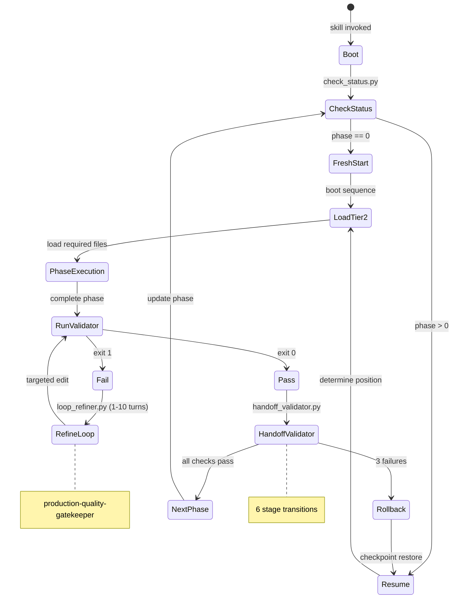
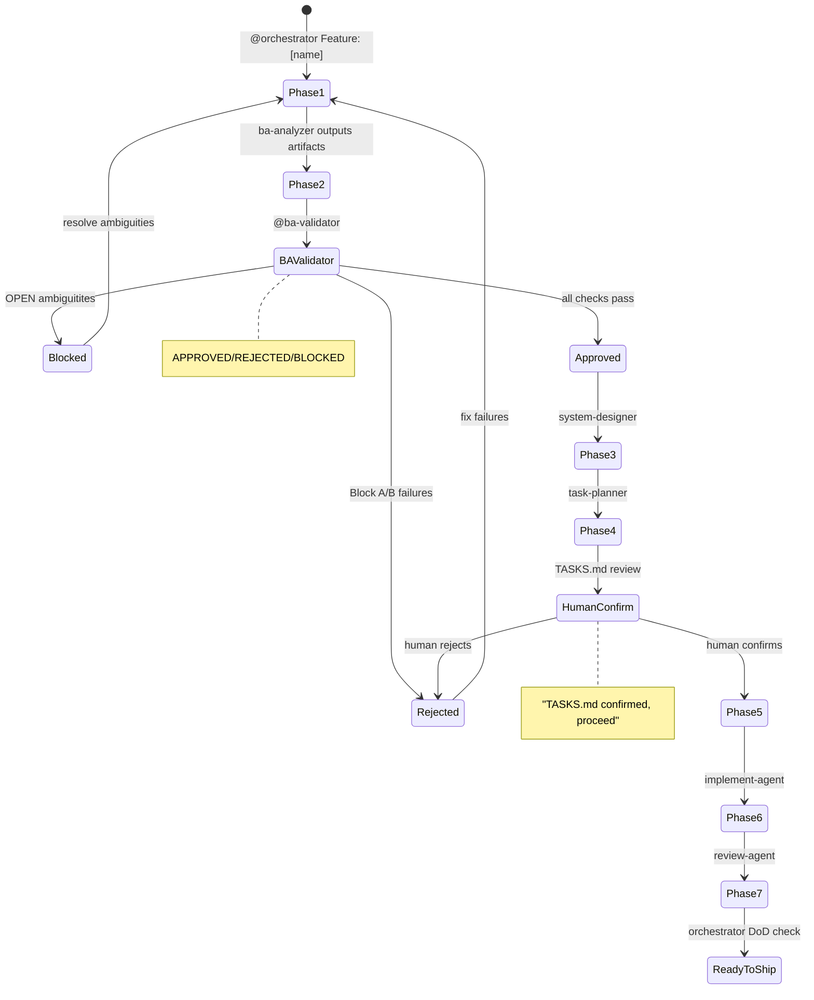

# Dimension 3: Quality Gates & Validation

## Mô tả Dimension

Dimension này so sánh hai hệ thống **Quality Gates & Validation** — cơ chế kiểm soát chất lượng được áp dụng trước, trong và sau quá trình xây dựng artifact:

| Khía cạnh | ver-3 Suite | ITC-BASE |
|-----------|-------------|----------|
| **Gates** | 50-point quality gates (10 per stage A-E) | 3 explicit gates + 1 human confirmation |
| **Validators** | 3 programmatic validators (schema, trace, handoff) | 1 BA validator agent + rule files |
| **Strategy** | PREVENT → DETECT → RECOVER (CASE System) | APPROVED/REJECTED/BLOCKED verdicts |
| **Loop** | 1-10 turn self-refinement | Human-in-the-loop confirmation |

---

## So sánh Chi tiết từng Gate Mechanism

### 1. Gate Architecture & Gate Count

#### ver-3 Suite: 50-Point Master Quality Gates

Framework định nghĩa **50 tiêu chí cổng chất lượng** chia đều cho 5 phân lớp (A-E), mỗi phân lớp 10 tiêu chí:

```
┌──────────────────────────────────────────────────────────────────────┐
│                  50-POINT MASTER QUALITY GATES                        │
│                                                                      │
│  Stage 0 (Explorer)     Stage 1 (Architect)    Stage 2 (Planner)     │
│  ┌─────────────┐       ┌─────────────┐       ┌─────────────┐       │
│  │ EXP-01-10   │       │ ARC-01-10   │       │ PLN-01-10   │       │
│  │ 10 criteria │       │ 10 criteria │       │ 10 criteria │       │
│  └─────────────┘       └─────────────┘       └─────────────┘       │
│                                                                      │
│  Stage 3 (Builder)     CASE System Integration                       │
│  ┌─────────────┐       ┌─────────────┐                               │
│  │ BLD-01-10   │       │ INT-01-10   │                               │
│  │ 10 criteria │       │ 10 criteria │                               │
│  └─────────────┘       └─────────────┘                               │
└──────────────────────────────────────────────────────────────────────┘
```

**Source**: `ver-3/_shared/knowledge/framework.md:210-271`

#### ITC-BASE: 3 Gates + Human Confirmation

PIPELINE.md định nghĩa 3 validation gates rõ ràng:

| Gate | Phase | Verdict | Agent |
|------|-------|---------|-------|
| **Validation Gate** | Phase 2 | APPROVED / REJECTED / BLOCKED | ba-validator |
| **Human Confirmation Gate** | Phase 4 | confirmed / rejected | Human |
| **Definition of Done Gate** | All phases | checklist-based | orchestrator-agent |

**Source**: `ITC-BASE/PIPELINE.md:33-57`

---

### 2. Validators

#### ver-3 Suite: 3 Programmatic Validators

**a) schema_validator.py** (`ver-3/_shared/validators/schema_validator.py:1-286`)
- Validate YAML frontmatter đối chiếu JSON Schema (Draft-07)
- CLI: `python schema_validator.py --schema <schema.yaml> <file.md>`
- Output: YAML với stage, artifact, timestamp, passed, checks list
- Check shape: name, status (pass/fail), error, severity, fix_hint

```python
# Example check structure
checks.append(build_check(
    "Data File Parsing (JSON/YAML/MD)", "pass"
))
```

**b) trace_validator.py** (`ver-3/_shared/validators/trace_validator.py:1-164`)
- Validate 4 trace tag patterns: `[TỪ DESIGN §N]`, `[GỢI Ý BỔ SUNG]`, `[CẦN LÀM RÕ]`, `[TỪ AUDIT TÀI NGUYÊN]`
- Catch known typos: `[CẦU LÀM RÕ]` → should be `[CẦN LÀM RÕ]`
- Output: PASS/FAIL với danh sách invalid tags

**c) handoff_validator.py** (`ver-3/_shared/validators/handoff_validator.py:1-451`)
- Validate handoff readiness giữa 6 stage transitions:
  - `exploration-to-design`
  - `design-to-planner`
  - `planner-to-builder`
  - `builder-to-tester`
  - `tester-to-indexer`
  - `indexer-complete`

```python
# Example: validation cho exploration-to-design
def validate_exploration_to_design(file_path, data):
    checks = []
    lifecycle = data.get("metadata", {}).get("lifecycle_status")
    checks.append(make_check(
        "metadata_lifecycle_status",
        lifecycle == "raw" or lifecycle == "designed",
        error=f"lifecycle_status must be 'raw' or 'designed'..."
    ))
```

#### ITC-BASE: BA Validator Agent + Rule Files

**a) ba-validator-agent** (`ITC-BASE/.cursor/agents/ba-validator-agent.md`)
- Runs checklist A1-A10 (Structure), B1-B4 (Completeness), C1-C3 (Ambiguity), D1-D3 (Cross-reference)
- Issues **APPROVED / REJECTED / BLOCKED** verdicts
- BLOCKED if any OPEN ambiguity exists (Phase 3 cannot start)
- Decision logic có flowchart rõ ràng

```
Any OPEN AMB items? ──Yes──→ BLOCKED
                              List all OPEN AMBs
                              Notify human to resolve
                              Stop
  │ No
  ▼
Any Block A or B failures? ──Yes──→ REJECTED
  │ No
  ▼
All checks PASS ──→ APPROVED
```

**b) Rule Files** (`ITC-BASE/.cursor/rules/*.mdc`)
- `req-format.mdc` — Requirements format rules R1-R8
- `design-standards.mdc` — Design standards A1-A4, D1-D3
- `coding-standards.mdc` — TS-1, TS-2, TS-3, R-1-R-4, API-1-API-3, SEC-1-SEC-3
- `definition-of-done.mdc` — Phase DoD checklists
- Rule hierarchy: `rules/*.mdc` > `agents/*.md` > `skills/*.SKILL.md`

---

### 3. CASE System vs Orchestrator Agent

#### ver-3: PREVENT → DETECT → RECOVER

**Source**: `ver-3/_shared/knowledge/case-system.md:1-271`

```
┌─────────────────────────────────────────────────────────────┐
│                    CASE SYSTEM                               │
│                                                              │
│   PREVENT        →        DETECT         →        RECOVER     │
│   State-aware        Gate validators         Rollback         │
│   boot + PD         + reverse              procedures       │
│   triggers          trace                                    │
└─────────────────────────────────────────────────────────────┘
```

**PREVENT**:
- State-aware boot: chạy `check_status.py` trước khi làm gì
- Progressive Disclosure triggers cụ thể (không "load when needed")

**DETECT**:
- Gate validators với machine-checkable checklists
- Reverse trace integrity check
- Placeholder density < 5%

**RECOVER**:
- Rollback triggers: user rejects, validation fails 3 times, emergency
- Checkpoint resume với staleness guard (> 7 days warning)

#### ITC-BASE: Orchestrator Agent + Phase-based Gates

**Source**: `ITC-BASE/PIPELINE.md:9-100`

```
orchestrator → ba-analyzer → ba-validator → system-designer
→ task-planner → [human confirms] → implement-agent
→ review-agent → test-agent → orchestrator (READY TO SHIP)
```

- Orchestrator quản lý state, enforce gates, handle failures
- orchestrator-agent chạy automated gate checks:
  ```bash
  grep -r "console.log" src/ server/     → must return 0 results
  grep -r "TODO\|FIXME" src/ server/     → must return 0 results
  grep -r "localhost" src/ server/       → warn only
  ```

---

### 4. Self-Refinement Loop

#### ver-3: production-quality-gatekeeper (1-10 turn loop)

**Source**: `ver-3/production-quality-gatekeeper/SKILL.md:67-112`

```
Phase 1: Initialize & Context Scan
Phase 2: Execute Refinement Loop (Turns 1-10)
  └─ Step A: Run loop_refiner.py
  └─ Step B: Evaluate Verdict (exit 0 = PASS, exit 1 = FAIL)
  └─ Step C: Targeted Edit (chỉ sửa phần failed)
Phase 3: Emergency Mitigation (if Turn 10 reached)
Phase 4: Compile Evaluation Report
Phase 5: Handoff & Delivery
```

**loop_refiner.py** (`ver-3/production-quality-gatekeeper/scripts/loop_refiner.py:1-100+`)
- Domain-specific critics: creative (30 criteria), dev, llm
- CR-1.01: Act structure check
- CR-1.02: Hook sentence check
- CR-1.03: Paragraph pacing (max 150 words/para)
- ... và nhiều criteria khác

#### ITC-BASE: Human-in-the-loop

- Không có automated self-refinement loop
- Human confirmation gate trước Phase 5: user phải gõ `TASKS.md confirmed, proceed`
- @ba-validator loop đến khi nhận APPROVED

---

### 5. Ambiguity Resolution

#### ver-3: [CẦN LÀM RÕ] trace tags + rollback

- Tasks có `[CẦN LÀM RÕ]` mark blocker
- Planner tạo task để resolve trước khi tiếp tục
- Rollback nếu ambiguity không resolved sau 3 attempts

#### ITC-BASE: Dedicated Ambiguity Resolution Gate

**Source**: `ITC-BASE/docs/user-admin/ambiguities.md`

- `ambiguities.md` chứa tất cả AMB items với:
  - Question, Asked by, Date, Status
  - Answer (sau khi resolved)
- **BLOCKED** gate nếu bất kỳ AMB nào OPEN khi chuyển sang Phase 3
- Example: AMB-001 đến AMB-020 đã resolved, mỗi item có:
  ```
  Question: [nội dung]
  Asked by: ba-analyzer
  Date: 2026-04-20
  Status: RESOLVED
  Answer: [chi tiết]
  ```

---

### 6. Handoff Validation

#### ver-3: handoff_validator.py (6 transitions)

**Source**: `ver-3/_shared/validators/handoff_validator.py:118-385`

| Stage Transition | Key Checks |
|-----------------|------------|
| exploration-to-design | lifecycle_status, tech_risks >= 3, Prompt Injection analyzed |
| design-to-planner | folder_structure >= 3 files, path safety, mitigation_map |
| planner-to-builder | unique task IDs, DAG dependencies resolved, trace tags format |
| builder-to-tester | SKILL.md exists, token budget <= 1200 words, modular structure |
| tester-to-indexer | confidence_score >= 85%, semantic_placeholder_density = 0% |
| indexer-complete | registry_updated |

#### ITC-BASE: File Output Map + Cross-reference

**Source**: `ITC-BASE/PIPELINE.md:162-193`

```
docs/[feature]/
├── REQUIREMENTS.md          ← Phase 1
├── acceptance-criteria.md   ← Phase 1
├── user-stories.md          ← Phase 1
├── ambiguities.md           ← Phase 1
├── data-model.md            ← Phase 3
├── api-contract.yaml        ← Phase 3
├── component-tree.md         ← Phase 3
├── TASKS.md                 ← Phase 4
├── PIPELINE-STATE.md        ← orchestrator (all phases)
├── REVIEW-DONE.md           ← Phase 6
└── TECH-DEBT.md            ← Phase 6
```

- BA Validator cross-checks:
  - D1: Every AC-ID in REQUIREMENTS.md exists in acceptance-criteria.md
  - D2: Every US-ID in acceptance-criteria.md exists in user-stories.md
  - D3: No orphan ACs

---

## Mermaid Diagram: State Machine Comparison

### ver-3: CASE System State Machine



### ITC-BASE: Phase Gate State Machine



---

## Examples thực tế

### ver-3: Schema Validation Output

```yaml
# schema_validator.py output
stage: schema_validation
artifact: exploration.md
timestamp: 2026-06-03T10:00:00Z
passed: false
checks:
  - name: "Schema: metadata"
    status: fail
    error: "'lifecycle_status' is a required property"
    severity: error
    fix_hint: "Add required properties: lifecycle_status"
  - name: "Schema: technical_risks"
    status: fail
    error: "technical_risks must have at least 3 items"
    severity: error
    fix_hint: "Add more items to technical_risks array"
```

### ITC-BASE: BA Validation Report

```
=== BA VALIDATION REPORT ===
Feature: user-admin
Timestamp: 2026-04-20

Block A — Structure:
  A1 User Story format:     ✅ PASS
  A2 Specific actor:        ✅ PASS
  A3 Testable ACs:          ✅ PASS
  A4 No vague words:        ✅ PASS
  A5 AC coverage (3 types):  ✅ PASS
  A6 ID format:              ✅ PASS
  A7 No orphan ACs:         ✅ PASS
  A8 AMB format complete:   ✅ PASS
  A9 Out of Scope section:  ✅ PASS
  A10 DoD present:           ✅ PASS

Block B — Completeness:
  B1 user-stories.md:        ✅ EXISTS
  B2 Min 2 ACs per US:      ✅ PASS
  B3 No duplicate ACs:       ✅ PASS
  B4 AC count ≥ US × 3:      ✅ PASS

Block C — Ambiguities:
  OPEN items: 0              ✅ CLEAR
  RESOLVED items: 20         ✅ All have answers

Block D — Cross-reference:
  D1 AC refs valid:          ✅ PASS
  D2 US refs valid:          ✅ PASS
  D3 No orphan ACs:          ✅ PASS

──────────────────────────────
VERDICT: ✅ APPROVED
```

---

## Ưu điểm & Nhược điểm

### ver-3 Suite

| Ưu điểm | Nhược điểm |
|---------|-------------|
| 50 criteria rõ ràng, cover đầy đủ từ exploration đến deployment | Phức tạp, overhead cao cho project nhỏ |
| CASE System PREVENT-DETECT-RECOVER chặt chẽ | Nhiều script phải maintain (schema_validator, trace_validator, handoff_validator) |
| Self-refinement loop 1-10 turn tự động hoá cao | loop_refiner.py domain-specific, khó mở rộng |
| Reverse trace integrity chống hallucination | Exit codes 0/1/2 có thể gây confusion |
| Progressive Disclosure rõ ràng (Tier 1/2/3) | Không có human confirmation gate trong flow |
| Placeholder density enforcement (< 5%) | |

### ITC-BASE

| Ưu điểm | Nhược điểm |
|---------|-------------|
| Human confirmation gate kiểm soát scope hiệu quả | Không tự động — phụ thuộc human |
| BA validator đơn giản, dễ hiểu (A1-D3 checklist) | Không có programmatic self-refinement loop |
| Rule files (.mdc) version control được | Rule hierarchy phức tạp (mdc > agents > skills) |
| Ambiguity resolution gate chặt chẽ (BLOCKED if OPEN) | Grep-based automated checks có false positives |
| Orchestrator-agent centralize state management | Definition of Done checklist dài (117 lines) |
| Playwright E2E testing tích hợp | Không có trace tag standard → khó trace nguồn gốc |

---

## Trade-offs

| Aspect | ver-3 Approach | ITC-BASE Approach |
|--------|----------------|-------------------|
| **Automation vs Human Control** | High automation (1-10 turn loop) | Human-in-the-loop (TASKS.md confirmed) |
| **Gate Granularity** | 50 fine-grained criteria | 3 explicit gates + DoD checklist |
| **Traceability** | Trace tags chuẩn hoá (`[TỪ DESIGN §N]`) | File-based cross-reference only |
| **Recovery Mechanism** | Automated rollback + checkpoint | Manual fix + re-run pipeline |
| **Complexity** | Higher (3 validators + CASE System) | Lower (1 validator agent + orchestrator) |
| **Speed** | Faster for large projects (automated) | Slower for small projects (human delays) |

---

## Conclusion

### Khi nào chọn ver-3 Suite

- Project lớn, phức tạp, cần nhiều automation
- Yêu cầu trace tag chuẩn hoá để chống hallucination
- Cần rollback tự động khi quality fails
- Progressive disclosure giúp quản lý context

### Khi nào chọn ITC-BASE

- Project vừa và nhỏ, human review là acceptable
- Cần unambiguous requirements trước khi design (AMB gate)
- Dễ đọc, dễ debug, dễ customize
- Rule files (.mdc) có thể version control dễ dàng

### Key Difference

> **ver-3** thiên về **machine-checkable prevention** (PREVENT-DETECT-RECOVER), trong khi **ITC-BASE** thiên về **human-verified validation** (APPROVED/REJECTED/BLOCKED + human confirmation).

ver-3 phù hợp cho AI agent pipeline cần tự động hoá cao; ITC-BASE phù hợp cho human-in-the-loop development workflow nơi quality control tập trung vào human judgment.

---

## References

- `ver-3/_shared/knowledge/framework.md:209-271` — 50-Point Master Quality Gates Specification
- `ver-3/_shared/knowledge/case-system.md:1-271` — CASE System (PREVENT-DETECT-RECOVER)
- `ver-3/_shared/validators/schema_validator.py:1-286` — Schema validation
- `ver-3/_shared/validators/trace_validator.py:1-164` — Trace tag validation
- `ver-3/_shared/validators/handoff_validator.py:1-451` — Handoff validation
- `ver-3/production-quality-gatekeeper/SKILL.md:1-121` — Self-refinement loop
- `ver-3/production-quality-gatekeeper/scripts/loop_refiner.py:1-100+` — Quality critic engine
- `ITC-BASE/PIPELINE.md:1-200` — Agent Pipeline Architecture
- `ITC-BASE/.cursor/agents/ba-validator-agent.md:1-155` — BA Validator Agent
- `ITC-BASE/.cursor/rules/definition-of-done.mdc:1-131` — Definition of Done checklists
- `ITC-BASE/docs/user-admin/ambiguities.md:1-286` — Ambiguity resolution example

---

## 📖 Glossary (Thuật ngữ)

| Thuật ngữ | Giải thích |
|------------|-------------|
| **Pipeline** | Đường ống xử lý - chuỗi các giai đoạn xử lý công việc theo thứ tự tuyến tính hoặc tuần tự. |
| **Layering** | Phân lớp - kiến trúc tổ chức mã nguồn hoặc tri thức theo chiều dọc để đảm bảo tính độc lập và dễ bảo trì. |
| **Gate** | Cổng kiểm tra - điểm checkpoint kiểm soát chất lượng nơi các sản phẩm đầu ra (artifacts) được thẩm định. |
| **Rollback** | Quay lui - cơ chế tự động hoặc thủ công để phục hồi trạng thái làm việc về một phase ổn định trước đó khi xảy ra sự cố. |
| **Checkpoint** | Điểm kiểm tra - trạng thái công việc được lưu lại để có thể tiếp tục (resume) mà không phải làm lại từ đầu. |
| **Staleness** | Lỗi thời - trạng thái khi checkpoint quá cũ (ví dụ: > 7 ngày) đòi hỏi phải cảnh báo hoặc chạy lại explorer. |
| **Handoff** | Chuyển giao - quá trình bàn giao các artifacts đạt chuẩn từ stage này sang stage kế tiếp. |
| **Feedback Loop** | Vòng phản hồi - cơ chế đẩy thông tin lỗi hoặc đề xuất ngược về các stage trước để tự động điều chỉnh. |
| **CASE System** | Hệ thống CASE - cơ chế quản lý chất lượng toàn diện của ver-3 suite dựa trên 3 trụ cột: PREVENT → DETECT → RECOVER. |
| **Progressive Disclosure** | Tiết lộ lũy tiến - cơ chế nạp bối cảnh/tri thức theo từng tầng (Tiers) trên cơ sở nhu cầu thực tế của task để tối ưu hóa context window và token. |
| **Trace Tag** | Thẻ truy vết - thẻ dạng như `[TỪ DESIGN §N]` dùng để đối chiếu ngược mọi tác vụ lập trình về nguồn gốc thiết kế ban đầu. |
| **Ambiguity** | Sự mơ hồ - các điểm chưa rõ ràng hoặc mâu thuẫn trong yêu cầu nghiệp vụ cần được phát hiện và giải quyết triệt để. |
| **Sandbox** | Môi trường cô lập (Hộp cát) - môi trường chạy mã nguồn độc lập và an toàn (như Docker/gVisor) để kiểm thử sản phẩm. |
| **Rule Hierarchy** | Phân cấp Luật - thứ tự ưu tiên áp dụng các tệp quy định trong hệ thống khi có xung đột (ví dụ: `.mdc` > `agents/` > `skills/`). |
| **Self-refinement** | Tự tinh chỉnh - cơ chế AI tự chạy vòng lặp đánh giá lỗi dựa trên critic engine và tự sửa đổi code cho đến khi đạt chuẩn. |
| **E2E Testing** | Kiểm thử đầu-cuối - quy trình chạy kiểm thử tự động giả lập người dùng thật trên toàn bộ hệ thống từ UI đến DB (như Playwright). |
| **Flaky Test** | Kiểm thử không ổn định - các ca kiểm thử lúc Pass lúc Fail không nhất quán dù không có sự thay đổi nào về mã nguồn hay môi trường. |
| **Orchestration** | Phối hợp quy trình (Đạo diễn) - cơ chế điều phối trung tâm để quản lý vòng đời, trạng thái và sự chuyển giao giữa các tác nhân. |
| **Governance** | Quản trị - cơ chế kiểm soát, phân quyền và phê duyệt tiến trình (đặc biệt là các cổng phê duyệt bắt buộc của con người - Human-in-the-Loop). |
| **Acceptance Criteria** | Tiêu chí nghiệm thu - các điều kiện bắt buộc phải thỏa mãn để một tính năng được coi là hoàn thành hoàn chỉnh. |
| **Portability** | Tính di động - khả năng chuyển đổi hoặc chạy một gói skill trên nhiều môi trường agent runtime khác nhau mà không cần sửa đổi cấu trúc. |
| **Reusability** | Tính tái sử dụng - khả năng sử dụng lại một skill hoặc module cho nhiều dự án khác nhau một cách độc lập. |
| **DoD (Definition of Done)** | Định nghĩa Hoàn thành - danh sách kiểm tra (checklist) tiêu chí chất lượng nghiêm ngặt cho mỗi phase trước khi bàn giao. |
