# Dimension 4: Rollback & Error Recovery

## Mô tả Dimension

Error recovery là quan trọng vì các hệ thống phát triển agent đều gặp tình huống thất bại: validation thất bại, confidence giảm, design bị corrupt, hoặc pipeline bị dừng giữa chừng. Nếu hệ thống không có cơ chế phục hồi rõ ràng, work bị mất hoàn toàn hoặc phải làm lại từ đầu.

**Why it matters:**
- Skill pipeline thường chạy nhiều stage, mỗi stage phụ thuộc vào output của stage trước
- Một lỗi ở Stage 3 (Design) mà không có rollback sẽ yêu cầu rebuild từ Stage 0
- Không có checkpoint resume, developer mất context và phải đọc lại toàn bộ history
- Linear pipeline (không có branch) bị tấn công "cascade failure" - lỗi ở Phase 6 làm mất toàn bộ công việc Phase 1-5

---

## Chi tiết so sánh

### Side A: CASE System (ver-3)

**Three-mechanism framework: PREVENT → DETECT → RECOVER**
a
| Mechanism | Implementation | File Reference |
|-----------|---------------|----------------|
| PREVENT | State-aware boot đọc `status` block từ `design.md` frontmatter trước khi bắt đầu | `check_status.py:56-117` |
| PREVENT | Progressive Disclosure trigger chỉ nạp file khi có điều kiện cụ thể (VD: `WHEN: confidence < 70%`) | `case-system.md:60-74` |
| DETECT | Machine-checkable gate validators với checklist cụ thể | `case-system.md:80-134` |
| DETECT | Reverse trace kiểm tra coherence giữa các phase (VD: Zone Mapping phải trace to Pain Point) | `case-system.md:136-154` |
| RECOVER | `rollback_engine.py` revert `design.md` status block về phase trước đó | `rollback_engine.py:39-119` |
| RECOVER | Checkpoint resume kiểm tra staleness (>7 days = warning) | `check_status.py:40-54` |

**Rollback Triggers:**
```
| Trigger                          | Action                              |
|----------------------------------|-------------------------------------|
| confidence < 70%                 | Tạo rollback_request.yaml, archive  |
| Validation FAIL 3 lần            | Stop and report                     |
| User rejects gate output          | Rollback to previous phase          |
| Emergency: design corrupted      | Restore from last valid checkpoint  |
```

**Staleness Policy:**
- < 7 days: continue from checkpoint
- 7-30 days: warning + review todo.md
- > 30 days: force restart from Stage 0

**State Ledger:**
`.skill-context/{skill-name}/` persistent state giữa các stage stateless:
- `design.md` chứa frontmatter status block
- `todo.md` chứa task DAG
- `build-log.md` chứa build evidence

**Feedback Closed-Loop:**
```
Builder errors → Gatekeeper → Planner adjust → Architect redesign → Explorer restart
```

### Side B: ITC-BASE (Linear Pipeline)

**Architecture: Sequential 7-Phase Pipeline**

```
Phase 1 (Requirements) → Phase 2 (Validation Gate) → Phase 3 (Design)
    → Phase 4 (Task Planning) → Phase 5 (Implementation)
    → Phase 6 (Review) → Phase 7 (Testing) → READY TO SHIP
```

| Characteristic | ITC-BASE | ver-3 CASE System |
|----------------|----------|-------------------|
| Rollback mechanism | **Không có** | Có (rollback_engine.py) |
| Checkpoint resume | **Không có** | Có (check_status.py) |
| Staleness policy | **Không có** | Có (7/30 days tiers) |
| Automated detection | Chỉ human confirmation gate | Machine-checkable validators |
| State persistence | PIPELINE-STATE.md (Orchestrator) | .skill-context/{name}/ (per skill) |
| Failure recovery path | Human giám sát - không có recovery | Automated rollback + notification |
| Phase dependency | Tuyến tính | Reverse trace kiểm tra |

**PIPELINE-STATE.md** chỉ là output của Orchestrator, không có checkpoint schema. PIPELINE.md mô tả:
> "Each agent MUST output a structured report before the next agent is called. The orchestrator validates each report before advancing the phase."

Nhưng không có `rollback` hay `resume` - nếu Phase 6 thất bại, toàn bộ work vẫn còn đó dở dang, nhưng không có cơ chế phục hồi.

---

## Mermaid Diagram

```mermaid
flowchart TD
    %% CASE System Rollback Flow
    subgraph CASE["CASE System (ver-3)"]
        A1([Start]) --> B1{check_status.py}
        B1 --> |phase > 0| C1{Stale > 7d?}
        C1 --> |Yes| D1[Warning + review todo.md]
        C1 --> |No| E1[Resume from checkpoint]
        B1 --> |fresh_start| F1[Load Tier 2 files]
        F1 --> G1{confidence < 70%?}
        G1 --> |Yes| H1[Rollback to previous phase]
        G1 --> |No| I1[Continue execution]
        
        H1 --> J1[rollback_engine.py --to-phase N]
        J1 --> K1[Archive + backup context]
        K1 --> L1[Notify developer]
        
        I1 --> M1{Validation FAIL?}
        M1 --> |3x| N1[Stop + report]
        M1 --> |No| O1[Next phase]
    end

    %% ITC-BASE Linear Flow
    subgraph ITCBASE["ITC-BASE Pipeline"]
        P1([Start]) --> P2[Phase 1: Requirements]
        P2 --> P3[Phase 2: BA Validator]
        P3 --> |APPROVED| P4[Phase 3: Design]
        P3 --> |REJECTED| P5[Human must re-submit]
        P4 --> P6[Phase 4: Task Planning]
        P6 --> |Human confirm| P7[Phase 5: Implementation]
        P7 --> P8[Phase 6: Review]
        P8 --> P9[Phase 7: Testing]
        P9 --> P10([READY TO SHIP])
        
        P8 -.-> |"No rollback<br/>if Phase 6 fails"| P11([Work may be lost<br/>or must be redone])
    end

    style CASE fill:#e6f3ff,stroke:#0066cc
    style ITCBASE fill:#fff3e6,stroke:#cc6600
    style H1 fill:#ffcccc
    style J1 fill:#ffcccc
    style P11 fill:#ffcccc
```



---

## Ví dụ cụ thể từ File Thật

### Ví dụ 1: rollback_engine.py (ver-3)

```python
# rollback_engine.py:39-77
def rollback_to_phase(context_path, target_phase, trigger_backup=True):
    # ...
    current_phase = status.get('phase', 0)
    print(f"Current phase is: {current_phase}, requesting rollback to phase: {target_phase}")
    
    if target_phase >= current_phase:
        print(f"ERROR: Cannot rollback to a phase >= current phase")
        return False
        
    # Revert status
    status['phase'] = target_phase
    
    # Revert gates passed list
    gates = []
    if target_phase >= 1:
        gates.append(1)
    if target_phase >= 2:
        gates.append(2)
    if target_phase >= 3:
        gates.append(3)
    status['gates_passed'] = gates
    
    # Update metadata
    status['last_actor'] = 'rollback_engine'
    status['updated'] = datetime.now(timezone.utc).isoformat()
```

**Điểm mạnh:** Backup tự động, revert phase + gates, chỉ cho phép rollback về phase nhỏ hơn.

### Ví dụ 2: check_status.py staleness (ver-3)

```python
# check_status.py:40-54
def check_staleness(updated_str, max_days=7):
    now = datetime.now(timezone.utc)
    age = (now - updated).days
    
    if age < max_days:
        return {"stale": False, "age_days": age}
    elif age < 30:
        return {"stale": True, "age_days": age, "level": "warning"}
    else:
        return {"stale": True, "age_days": age, "level": "danger"}
```

**Điểm mạnh:** 3-tier staleness policy (continue / warning / danger).

### Ví dụ 3: ITC-BASE - Không có recovery path (workflow.md)

```
workflow.md:20-26
## Phase 2 — Validate
@ba-validator Feature: [ten feature]
Lặp lại đến khi nhận được APPROVED.
```

```
workflow.md:48-49
## Phase 4 — Task planning
Review TASKS.md, rồi gõ "TASKS.md confirmed, proceed"
```

**Vấn đề:** "Lặp lại đến khi nhận được APPROVED" nhưng không có số lần thử tối đa, không có automatic rollback. Nếu requirements bị lỗi, developer phải sửa thủ công rồi submit lại.

### Ví dụ 4: ITC-BASE PIPELINE.md - Chỉ mô tả forward flow

```python
# PIPELINE.md:195-196
Each agent MUST output a structured report before the next agent is called.
The orchestrator validates each report before advancing the phase.
```

**Không có mention của:** rollback, resume, checkpoint, recovery path.

---

## Ưu/Nhược điểm cụ thể

### CASE System (ver-3)

| | |
|---|---|
| **Ưu điểm** | Rollback engine có backup, revert phase + gates |
| | Staleness policy 3 tiers, không bị stuck với stale work |
| | Confidence-based trigger (rollback khi confidence < 70%) |
| | State ledger .skill-context/ persistent giữa stateless sessions |
| | Trace validator bắt trace tag typos, ngăn chặn hallucination |
| **Nhược điểm** | Phức tạp hơn - nhiều cơ chế cần quản lý |
| | Rollback chỉ revert status block, không revert file content (chỉ backup) |
| | Checkpoint resume phụ thuộc vào frontmatter chính xác |

### ITC-BASE

| | |
|---|---|
| **Ưu điểm** | Đơn giản, tùy chỉnh |
| | Human confirmation gate ở Phase 4 cho phép kiểm soát scope |
| | Orchestrator quản lý PIPELINE-STATE.md nhưng không cần validator phức tạp |
| **Nhược điểm** | Không có rollback - lỗi ở Phase 6 mất toàn bộ work Phase 1-5 |
| | Không có staleness policy - work có thể bị abandon |
| | Không có checkpoint resume - phải đọc lại toàn bộ history |
| | "Lặp lại đến khi APPROVED" nhưng không có số lần thử tối đa |
| | Feedback closed-loop phụ thuộc vào human, không tự động |

---

## Conclusion

**ver-3 CASE System** cung cấp một hệ thống phục hồi hoàn chỉnh với 3-mechanism (PREVENT/DETECT/RECOVER), rollback engine có backup, staleness policy 3-tier, và confidence-based triggers. Hệ thống này phù hợp cho môi trường skill phức tạp, nhiều stage, cần tính năng đảm bảo chất lượng tự động.

**ITC-BASE** có pipeline đơn giản với human confirmation gates, nhưng thiếu hoàn toàn cơ chế rollback và error recovery. Nếu thành phần nào đó thất bại ở giữa pipeline, developer phải can thiệp thủ công và có thể mất progress.

**Trade-off:** ver-3 trao đổi độ phức tạp của hệ thống để lấy độ an toàn và khả năng phục hồi; ITC-BASE đơn giản hơn nhưng yêu cầu developer phải quản lý lỗi thủ công.

**Khi nào dùng CASE System:** Skill dài, nhiều stage, confidence-based quality gates, cần automated recovery.

**Khi nào dùng ITC-BASE:** Pipeline ngắn, human oversight cao, developer sẵn sàng can thiệp thủ công khi gặp lỗi.

---

## 📖 Glossary (Thuật ngữ)

| Thuật ngữ | Giải thích |
|------------|-------------|
| **Pipeline** | Đường ống xử lý - chuỗi các giai đoạn xử lý công việc theo thứ tự tuyến tính hoặc tuần tự. |
| **Layering** | Phân lớp - kiến trúc tổ chức mã nguồn hoặc tri thức theo chiều dọc để đảm bảo tính độc lập và dễ bảo trì. |
| **Gate** | Cổng kiểm tra - điểm checkpoint kiểm soát chất lượng nơi các sản phẩm đầu ra (artifacts) được thẩm định. |
| **Rollback** | Quay lui - cơ chế tự động hoặc thủ công để phục hồi trạng thái làm việc về một phase ổn định trước đó khi xảy ra sự cố. |
| **Checkpoint** | Điểm kiểm tra - trạng thái công việc được lưu lại để có thể tiếp tục (resume) mà không phải làm lại từ đầu. |
| **Staleness** | Lỗi thời - trạng thái khi checkpoint quá cũ (ví dụ: > 7 ngày) đòi hỏi phải cảnh báo hoặc chạy lại explorer. |
| **Handoff** | Chuyển giao - quá trình bàn giao các artifacts đạt chuẩn từ stage này sang stage kế tiếp. |
| **Feedback Loop** | Vòng phản hồi - cơ chế đẩy thông tin lỗi hoặc đề xuất ngược về các stage trước để tự động điều chỉnh. |
| **CASE System** | Hệ thống CASE - cơ chế quản lý chất lượng toàn diện của ver-3 suite dựa trên 3 trụ cột: PREVENT → DETECT → RECOVER. |
| **Progressive Disclosure** | Tiết lộ lũy tiến - cơ chế nạp bối cảnh/tri thức theo từng tầng (Tiers) trên cơ sở nhu cầu thực tế của task để tối ưu hóa context window và token. |
| **Trace Tag** | Thẻ truy vết - thẻ dạng như `[TỪ DESIGN §N]` dùng để đối chiếu ngược mọi tác vụ lập trình về nguồn gốc thiết kế ban đầu. |
| **Ambiguity** | Sự mơ hồ - các điểm chưa rõ ràng hoặc mâu thuẫn trong yêu cầu nghiệp vụ cần được phát hiện và giải quyết triệt để. |
| **Sandbox** | Môi trường cô lập (Hộp cát) - môi trường chạy mã nguồn độc lập và an toàn (như Docker/gVisor) để kiểm thử sản phẩm. |
| **Rule Hierarchy** | Phân cấp Luật - thứ tự ưu tiên áp dụng các tệp quy định trong hệ thống khi có xung đột (ví dụ: `.mdc` > `agents/` > `skills/`). |
| **Self-refinement** | Tự tinh chỉnh - cơ chế AI tự chạy vòng lặp đánh giá lỗi dựa trên critic engine và tự sửa đổi code cho đến khi đạt chuẩn. |
| **E2E Testing** | Kiểm thử đầu-cuối - quy trình chạy kiểm thử tự động giả lập người dùng thật trên toàn bộ hệ thống từ UI đến DB (như Playwright). |
| **Flaky Test** | Kiểm thử không ổn định - các ca kiểm thử lúc Pass lúc Fail không nhất quán dù không có sự thay đổi nào về mã nguồn hay môi trường. |
| **Orchestration** | Phối hợp quy trình (Đạo diễn) - cơ chế điều phối trung tâm để quản lý vòng đời, trạng thái và sự chuyển giao giữa các tác nhân. |
| **Governance** | Quản trị - cơ chế kiểm soát, phân quyền và phê duyệt tiến trình (đặc biệt là các cổng phê duyệt bắt buộc của con người - Human-in-the-Loop). |
| **Acceptance Criteria** | Tiêu chí nghiệm thu - các điều kiện bắt buộc phải thỏa mãn để một tính năng được coi là hoàn thành hoàn chỉnh. |
| **Portability** | Tính di động - khả năng chuyển đổi hoặc chạy một gói skill trên nhiều môi trường agent runtime khác nhau mà không cần sửa đổi cấu trúc. |
| **Reusability** | Tính tái sử dụng - khả năng sử dụng lại một skill hoặc module cho nhiều dự án khác nhau một cách độc lập. |
| **DoD (Definition of Done)** | Định nghĩa Hoàn thành - danh sách kiểm tra (checklist) tiêu chí chất lượng nghiêm ngặt cho mỗi phase trước khi bàn giao. |
