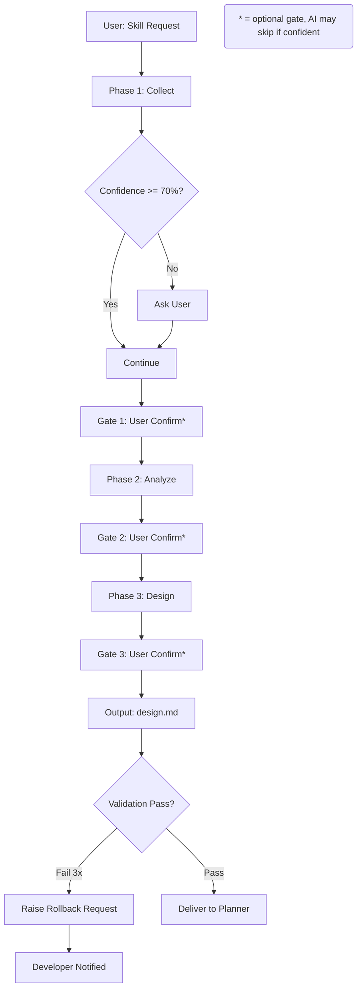

# Dimension 5: Human-in-the-Loop & Governance

## Mô tả Dimension

**Human-in-the-Loop & Governance** là một trong những dimension quan trọng nhất của hệ thống, đảm bảo rằng các quyết định quan trọng được người con người xem xét và phê duyệt, đồng thời có cơ chế điều khiển ngược (rollback) khi cần thiết. Điểm khác biệt chính giữa hai hệ thống là:

- **Side A (ver-3 suite)**: Tiến trình tự động hoàn toàn, confidence declaration là cơ chế tự đánh giá chính mình
- **Side B (ITC-BASE)**: Human confirmation gates bắt buộc tại nhiều điểm trong pipeline, có sự tham gia của PM/human

---

## So Sánh Chi Tiết

### 1. Chế Độ Nhập Liệu (Input Source)

| Aspect | Side A (ver-3 suite) | Side B (ITC-BASE) |
|--------|---------------------|-------------------|
| **Nguồn nhập liệu chính** | User cung cấp skill-name + pain point | Human/PM cung cấp raw requirement tại Phase 1 |
| **AI tự động** | AI hoàn toàn tự thu thập thông tin | AI chỉ là processing layer |
| **Người xác nhận** | User confirm sau mỗi gate (tùy chọn) | Human confirm TASKS.md bắt buộc trước Phase 5 |
| **PM Agent** | Không có | Có (@pm-agent) để resolve ambiguities |

**Nhận xét**: Side B có structured input process với human ở trung tâm, trong khi Side A để AI làm việc tuyến tính hơn nhưng vẫn có user confirm gates.

### 2. Human Confirmation Gates

#### Side A (ver-3 suite) — Conditional Gates

```
Phase 1 (Collect) → Gate 1: User confirm (tóm tắt pain point)
Phase 2 (Analyze) → Gate 2: User confirm (3 Pillars + 7 Zones)
Phase 3 (Design)  → Gate 3: User confirm (diagrams + interaction points)
```

- Gates là **tùy chọn về phía AI** (AI stop để confirm nhưng user có thể skip)
- Confidence < 70% → AI phải hỏi user (tự động)
- Developer chỉ được thông báo khi rollback trigger

#### Side B (ITC-BASE) — Mandatory Gates

```
Phase 1 → Phase 2: BA Validator phải approve
Phase 2 → Phase 3: Tất cả ambiguities phải RESOLVED
Phase 4 → Phase 5: Human confirm TASKS.md BẮT BUỘC
Phase 5 → Phase 6: Review report phải CLEAN
Phase 6 → Phase 7: Review phải pass
```

**Điều khác biệt quan trọng**: Side B có Gate 5 (Phase 4 → Phase 5) là **hard gate** - `workflow.md:49` nói rõ:

> "Review TASKS.md, rồi gõ `TASKS.md confirmed, proceed` — đây là gate bắt buộc."

### 3. Chế Độ Phân Quyền (Scope Control)

| Aspect | Side A (ver-3 suite) | Side B (ITC-BASE) |
|--------|---------------------|-------------------|
| **Developer scope control** | Không có cơ chế rõ ràng | Developer control tại Phase 4 Task Planning |
| **AI có vượt scope?** | Có khả năng (placeholder filenames) | Không, vì TASKS.md đã được human confirm |
| **Thay đổi scope giữa chừng** | AI tự quyết định | Phải tạo TASK mới, not tự động |

**Side A** có tình huống `must_not: use_placeholder_filenames_in_zone_mapping` nhưng không có cơ chế ngăn chặn developer tự thêm scope mới.

**Side B** có `TASKS.md confirmed` làm hard gate, developer phải explicitly confirm scope trước khi code.

### 4. Luật Hiện Hành (Rule Hierarchy)

#### Side A (ver-3 suite)

Không có structured rule hierarchy rõ ràng. Các rules nằm rải rác trong:

- SKILL.md frontmatter (yaml)
- workflow.md (phase instructions)
- guardrails.md (G1-G7)

Trace tags là cơ chế primary để liên kết nội dung:
- `[TỪ DESIGN §N]` — tham chiếu tới section
- `[TỪ AUDIT TÀI NGUYÊN]` — tham chiếu tới nguồn
- `[CẦN LÀM RÕ]` / `[GỢI Ý BỔ SUNG]` — flags cho developer

#### Side B (ITC-BASE)

Có rule hierarchy rõ ràng, được mô tả trong `PIPELINE.md:201-206`:

```
1. rules/*.mdc files — highest authority (always wins)
2. agents/*.md files — overrides skills
3. skills/*/SKILL.md files — lowest authority
```

Đây là **critical difference**: khi xung đột xảy ra, ITC-BASE có quy tắc rõ ràng để giải quyết.

### 5. Rollback và Recovery

#### Side A (ver-3 suite)

Rollback được mô tả trong `case-system.md:160-189`:

| Trigger | Action |
|---------|--------|
| User rejects gate output | Rollback to previous phase |
| Validation fails 3 times | Stop and report |
| Emergency: design corrupted | Restore from checkpoint |

Rollback engine (`rollback_engine.py`) cho phép revert về bất kỳ phase nào (0-3).

**Điểm yếu**: Chỉ có developer được notify khi rollback trigger. AI không tự động rollback.

#### Side B (ITC-BASE)

Retry policy rõ ràng trong `orchestrator-agent.md:161-168`:

| Agent | Max retries | On final failure |
|-------|-------------|------------------|
| implement-agent (per task) | 3 | Mark task BLOCKED, continue other tasks |
| review-agent (per issue) | 3 | Mark issue BLOCKED, stop and notify |
| test-agent (per test) | 3 | Mark test FLAKY, continue suite |

**Điểm mạnh**: BLOCKED state kéo human vào quá trình, không tự động retry mà không thông báo.

### 6. Proactive Safeguards

#### Side A (ver-3 suite)

CASE System với 3 cơ chế:
- **PREVENT**: State-aware boot, explicit PD triggers
- **DETECT**: Gate validators + reverse trace
- **RECOVER**: Rollback procedures

Trace validator (`trace_validator.py`) kiểm tra 4 valid patterns:
- `[TỪ DESIGN §N]`
- `[GỢI Ý BỔ SUNG]`
- `[CẦN LÀM RÕ]`
- `[TỪ AUDIT TÀI NGUYÊN]`

#### Side B (ITC-BASE)

Nhiều safeguards hơn:
- `ambiguities.md` với AMB items phải RESOLVED trước Phase 2
- `@pm-agent` autonomous resolution (không hỏi dev)
- `definition-of-done.mdc` với checklist đầy đủ cho mỗi phase
- Automated grep checks trước READY TO SHIP (`PIPELINE.md:119-130`)

---

## Mermaid Diagram — Governance Flow

### Side A (ver-3 suite) — Automated with Optional Human Gates



### Side B (ITC-BASE) — Human-Gated Pipeline

```mermaid
flowchart TD
    A[Human/PM: Raw Requirement] --> B[Phase 1: Requirements]
    B --> C[ambiguities.md created]
    C --> D[@pm-agent resolves AMB]
    D --> E{All AMB Resolved?}
    E -->|No| F[BLOCKED - Notify Human]
    E -->|Yes| G[Phase 2: BA Validation]
    G --> H{BA APPROVED?}
    H -->|No| I[BLOCKED - Fix Requirements]
    H -->|Yes| J[Phase 3: Design]
    J --> K[Phase 4: Task Planning]
    K --> L[TASKS.md created]
    L --> M{Human Confirms TASKS.md?}
    M -->|No| N[BLOCKED - Scope Review]
    M -->|Yes| O[Phase 5: Implementation]
    O --> P[Phase 6: Review]
    P --> Q{0 BLOCKERS?}
    Q -->|No| R[BLOCKED - Fix Issues]
    Q -->|Yes| S[Phase 7: Testing]
    S --> T[READY TO SHIP]
    
    style M fill:#ff9999
    style O fill:#99ff99
```

---

## Ví Dụ Cụ Thể

### Ví Dụ 1: Trace Tag Validation (Side A)

Từ `trace_validator.py:10-13`:
```
4 valid patterns:
  1. [TỪ DESIGN §N]       — regex: ^\[TỪ DESIGN §[0-9]+(\.[0-9]+)?\]$
  2. [GỢI Ý BỔ SUNG]
  3. [CẦN LÀM RÕ]
  4. [TỪ AUDIT TÀI NGUYÊN]
```

Pattern này đảm bảo mỗi nội dung đều có nguồn gốc trace được.

### Ví Dụ 2: Mandatory TASKS.md Confirmation (Side B)

Từ `workflow.md:48-49`:
```
Review TASKS.md, rồi gõ `TASKS.md confirmed, proceed`
— đây là gate bắt buộc.
```

Đây là **hard gate** không thể skip. Developer phải explicitly confirm scope.

### Ví Dụ 3: Ambiguities Resolution (Side B)

Từ `pm-agent.md:52-58`:
```
Principle 2 — Always answer, never defer
Every AMB must be resolved. Never write:
  - "Need to ask PM" ❌
  - "Depends on requirement" ❌
  - "Not enough information to decide" ❌
```

PM agent phải tự quyết định, không hỏi human, đảm bảo pipeline không bị đình trệ.

### Ví Dụ 4: Confidence-Based Gate (Side A)

Từ `case-system.md:37-40`:
```
Confidence >85% → Skip to Zone Mapping
Confidence 70-85% → Activate K=8 chains
Confidence <70% → Quay lại Phase 1
```

Đây là self-assessment mechanism, không cần human confirmation.

---

## Ưu Điểm và Nhược Điểm

### Side A (ver-3 suite)

| Ưu điểm | Nhược điểm |
|---------|-----------|
| Nhanh chóng, không bị chặn bởi nhiều confirmation gates | Không có hard human gate — AI có thể đi chệnh sai |
| Confidence declaration cho phép AI tự đánh giá | Không có rule hierarchy rõ ràng |
| Progressive Disclosure giảm complexity | Trace tags có thể bị typo (validator cần phát hiện) |
| Rollback có sẵn cho recovery | Scope control phụ thuộc vào developer discipline |
| Nhẹ, phù hợp cho personal use | Không có PM agent để resolve ambiguities |

### Side B (ITC-BASE)

| Ưu điểm | Nhược điểm |
|---------|-----------|
| Human gates chặn đoạn sai lầm ngay từ đầu | Chậm hơn — nhiều confirmation points |
| Rule hierarchy rõ ràng giải quyết xung đột | Phức tạp hơn, nhiều files và agents |
| PM agent xử lý ambiguities autonomous | Overhead cho project nhỏ |
| Automated grep checks đảm bảo chất lượng | Khó bảo trì nếu không quen workflow |
| DoD checklist đầy đủ cho mỗi phase | |

---

## Kết Luận

**Hai hệ thống đại diện cho hai triết lý khác nhau về governance:**

| Criteria | Side A (ver-3) | Side B (ITC-BASE) |
|----------|----------------|-------------------|
| **Philosophy** | Trust AI, human oversight on request | Human in the loop, gates mandatory |
| **Speed** | Fast (automated progression) | Slower (multiple human gates) |
| **Safety** | Confidence-based self-assessment | Hard human confirmation |
| **Scalability** | Good for personal/skilled users | Good for team/regulated environments |
| **Flexibility** | High (self-managed scope) | Low (strict phase gates) |

**Khi nào dùng nào:**

- **Side A (ver-3)**: Khi cần nhanh chóng, developer có kinh nghiệm, project nhỏ/cá nhân
- **Side B (ITC-BASE)**: Khi cần chất lượng cao, team collaboration, regulated environment, project lớn

**Ghi chú**: Side A có thể tăng tốc độ bằng cách tăng confidence threshold, nhưng mất đi safety. Side B có thể giảm overhead bằng cách skip optional PM checks, nhưng nên giữ hard TASKS.md gate vì nó là điểm cuối cùng để control scope trước khi implementation bắt đầu.

---

## References

### Side A (ver-3 suite)
- `/skills/Update-suite/current-suite/ver-3/_shared/knowledge/case-system.md` — PREVENT/DETECT/RECOVER mechanisms
- `/skills/Update-suite/current-suite/ver-3/_shared/validators/trace_validator.py` — Trace tag validation
- `/skills/Update-suite/current-suite/ver-3/_shared/validators/rollback_engine.py` — Rollback procedures
- `/skills/Update-suite/current-suite/ver-3/skill-architect/SKILL.md:14-15` — ask_when_confidence_below_70_percent
- `/skills/Update-suite/current-suite/ver-3/skill-architect/policy/workflow.md` — Phase gates (G1-G3)

### Side B (ITC-BASE)
- `/knowledge/ai-agents/repo/ITC-BASE/workflow.md:49` — TASKS.md confirmation gate
- `/knowledge/ai-agents/repo/ITC-BASE/PIPELINE.md:201-206` — Rule hierarchy
- `/knowledge/ai-agents/repo/ITC-BASE/.cursor/agents/orchestrator-agent.md:93-97` — Gate 5 mandatories
- `/knowledge/ai-agents/repo/ITC-BASE/.cursor/agents/pm-agent.md:52-58` — Ambiguities resolution principles
- `/knowledge/ai-agents/repo/ITC-BASE/.cursor/rules/definition-of-done.mdc` — DoD checklists

---

## 📖 Glossary (Thuật ngữ)

| Thuật ngữ | Giải thích |
|------------|-------------|
| **Pipeline** | Đường ống xử lý - chuỗi các giai đoạn xử lý công việc theo thứ tự tuyến tính hoặc tuần tự. |
| **Layering** | Phân lớp - kiến trúc tổ chức mã nguồn hoặc tri thức theo chiều dọc để đảm bảo tính độc lập và dễ bảo trì. |
| **Gate** | Cổng kiểm tra - điểm checkpoint kiểm soát chất lượng nơi các sản phẩm đầu ra (artifacts) được thẩm định. |
| **Rollback** | Quay lui - cơ chế tự động hoặc thủ công để phục hồi trạng thái làm việc về một phase ổn định trước đó khi xảy ra sự cố. |
| **Checkpoint** | Điểm kiểm tra - trạng thái công việc được lưu lại để có thể tiếp tục (resume) mà không phải làm lại từ đầu. |
| **Staleness** | Lỗi thời - trạng thái khi checkpoint quá cũ (ví dụ: > 7 ngày) đòi hỏi phải cảnh báo hoặc chạy lại explorer. |
| **Handoff** | Chuyển giao - quá trình bàn giao các artifacts đạt chuẩn từ stage này sang stage kế tiếp. |
| **Feedback Loop** | Vòng phản hồi - cơ chế đẩy thông tin lỗi hoặc đề xuất ngược về các stage trước để tự động điều chỉnh. |
| **CASE System** | Hệ thống CASE - cơ chế quản lý chất lượng toàn diện của ver-3 suite dựa trên 3 trụ cột: PREVENT → DETECT → RECOVER. |
| **Progressive Disclosure** | Tiết lộ lũy tiến - cơ chế nạp bối cảnh/tri thức theo từng tầng (Tiers) trên cơ sở nhu cầu thực tế của task để tối ưu hóa context window và token. |
| **Trace Tag** | Thẻ truy vết - thẻ dạng như `[TỪ DESIGN §N]` dùng để đối chiếu ngược mọi tác vụ lập trình về nguồn gốc thiết kế ban đầu. |
| **Ambiguity** | Sự mơ hồ - các điểm chưa rõ ràng hoặc mâu thuẫn trong yêu cầu nghiệp vụ cần được phát hiện và giải quyết triệt để. |
| **Sandbox** | Môi trường cô lập (Hộp cát) - môi trường chạy mã nguồn độc lập và an toàn (như Docker/gVisor) để kiểm thử sản phẩm. |
| **Rule Hierarchy** | Phân cấp Luật - thứ tự ưu tiên áp dụng các tệp quy định trong hệ thống khi có xung đột (ví dụ: `.mdc` > `agents/` > `skills/`). |
| **Self-refinement** | Tự tinh chỉnh - cơ chế AI tự chạy vòng lặp đánh giá lỗi dựa trên critic engine và tự sửa đổi code cho đến khi đạt chuẩn. |
| **E2E Testing** | Kiểm thử đầu-cuối - quy trình chạy kiểm thử tự động giả lập người dùng thật trên toàn bộ hệ thống từ UI đến DB (như Playwright). |
| **Flaky Test** | Kiểm thử không ổn định - các ca kiểm thử lúc Pass lúc Fail không nhất quán dù không có sự thay đổi nào về mã nguồn hay môi trường. |
| **Orchestration** | Phối hợp quy trình (Đạo diễn) - cơ chế điều phối trung tâm để quản lý vòng đời, trạng thái và sự chuyển giao giữa các tác nhân. |
| **Governance** | Quản trị - cơ chế kiểm soát, phân quyền và phê duyệt tiến trình (đặc biệt là các cổng phê duyệt bắt buộc của con người - Human-in-the-Loop). |
| **Acceptance Criteria** | Tiêu chí nghiệm thu - các điều kiện bắt buộc phải thỏa mãn để một tính năng được coi là hoàn thành hoàn chỉnh. |
| **Portability** | Tính di động - khả năng chuyển đổi hoặc chạy một gói skill trên nhiều môi trường agent runtime khác nhau mà không cần sửa đổi cấu trúc. |
| **Reusability** | Tính tái sử dụng - khả năng sử dụng lại một skill hoặc module cho nhiều dự án khác nhau một cách độc lập. |
| **DoD (Definition of Done)** | Định nghĩa Hoàn thành - danh sách kiểm tra (checklist) tiêu chí chất lượng nghiêm ngặt cho mỗi phase trước khi bàn giao. |
