# Dimension 6: Security & Testing

## Mô tả Dimension

**Security & Testing** là dimension thứ 6 trong hệ thống so sánh hai hệ thống:

- **Side A**: ver-3 suite (`/skills/Update-suite/current-suite/ver-3/`)
- **Side B**: ITC-BASE (`/knowledge/ai-agents/repo/ITC-BASE/`)

Dimension này tập trung vào:

- Security audit approach (static vs runtime)
- Test coverage strategy (schema-based vs behavior-based)
- Verification methodology (sandbox vs E2E)
- Integration of security specialist vs generic code review

---

## 1. Security Approach

### Side A — ver-3 Suite

**Security là 1 trong 7 Golden Standards**, nhưng không có security-reviewer chuyên biệt trong pipeline.

```
7 Golden Standards:
  1. Reusability
  2. Composability
  3. Maintainability
  4. Security          ← chỉ là 1 trong 7, không chuyên hóa
  5. Context Economics
  6. Portability
  7. Reliability
```

**Security ở đâu:**

- `skill-explorer/knowledge/security-standards.md` (STG0-KNOW-02) — định nghĩa prompt injection prevention, Docker sandboxing
- `production-code-reviewer` — duyệt code theo Google standards, có labeled comments (`Must Fix:`, `FYI:`, `Nit:`, `Optional:`)
- `production-code-reviewer` chạy `code_auditor.py` để static audit cyclomatic complexity, function lengths, docstring coverage, try/except violations

**giới hạn:**

- Không có security-reviewer skill riêng
- Security review là phần nhỏ trong code review tổng hợp
- Không có OWASP checklist chuyên dụng
- Không có runtime security verification

**ví dụ từ file thực tế:**

`skill-explorer/knowledge/security-standards.md:14-27` định nghĩa Prompt Injection prevention:

```markdown
# Structured Tool Use (Function Calling)
- Rule: Tuyệt đối không ghép chuỗi (string concatenation) đầu vào của người dùng 
  trực tiếp vào trong nội dung lệnh terminal.

# Strict XML Boundaries
<external_input>
[Nội dung tài liệu thô hoặc mã nguồn cào quét]
</external_input>
```

`production-code-reviewer/SKILL.md:14-22` — static audit:

```markdown
must:
  - execute scripts/code_auditor.py on the target file to capture static metrics
  - write constructive, respectful review comments explaining 'why' issues occur
  - separate blocking issues from minor suggestions using standard labels: 
    Nit:, FYI:, Optional:, Must Fix:
```

---

### Side B — ITC-BASE

**Security là 1 phạm vi chuyên biệt với security-reviewer skill riêng.**

Pipeline ITC-BASE có `security-reviewer` skill (`.cursor/skills/security-reviewer/SKILL.md`) được gọi tự động trong Phase 6 khi có auth/payment/upload features.

**Security reviewer invocation:**

`workflow.md:79-83`:

```markdown
Auth / payment feature phải chạy thêm trước khi tạo PR:
@security-reviewer @src/features/[feature]/
```

**security-reviewer SKILL.md coverage:**

- OWASP-1 đến OWASP-10 audit checklist
- Severity classification: CRITICAL, HIGH, MEDIUM, LOW, INFO
- Output format chuẩn hóa với action items

`security-reviewer/SKILL.md:45-110`:

```markdown
### OWASP-1 — Broken Access Control
- [ ] Is every protected endpoint checking auth middleware?
- [ ] Is role/permission checked at the service layer, not just middleware?

### OWASP-2 — Cryptographic Failures
- [ ] Passwords hashed with bcrypt (min cost 12) or argon2? Never MD5/SHA1.
- [ ] Tokens generated with `crypto.randomUUID()` or `crypto.randomBytes()`?
```

**Security output format:**

`security-reviewer/SKILL.md:124-170`:

```
=== SECURITY REVIEW REPORT ===
Verdict:
  APPROVED — no CRITICAL or HIGH findings
  REQUEST CHANGES — N CRITICAL, N HIGH must be fixed before merge

Action: @review-agent should incorporate CRITICAL and HIGH findings
        as BLOCKER-level issues.
```

---

## 2. Testing Approach

### Side A — ver-3 Suite

**Schema-based verification, không có E2E testing framework trong pipeline.**

```
Stage 4: Tester → chạy sandbox Docker/gVisor
Stage 5: Indexer → sinh verification.md (PASS/FAIL)
```

**Verification strategy:**

- `production-quality-gatekeeper` chạy `loop_refiner.py` để validate output
- `verification.md` ghi nhận PASS/FAIL từ sandbox
- Schema-based validation (không phải runtime behavior)

**giới hạn:**

- Không có E2E testing framework
- Không có Playwright integration
- Test coverage based on schema validation, not actual behavior
- Không có test-agent autonomous loop

**ví dụ từ file thực tế:**

`production-quality-gatekeeper/SKILL.md:80-92`:

```markdown
Execute the following programmatic loop iteratively:
1. Step A: Execute Validator: 
   python3 ${CLAUDE_SKILL_DIR}/scripts/loop_refiner.py 
     --domain <creative|dev|llm> 
     --input <path_to_draft_file> 
     --turn <current_turn_number>
2. Step B: Evaluate Verdict:
   - If the script exits with 0 (PASS): The draft is flawless!
```

---

### Side B — ITC-BASE

**Runtime behavior verification qua Playwright E2E tests.**

```
Phase 6: review-agent (goi code-reviewer + security-reviewer)
Phase 7: test-agent + test-writer → Playwright E2E tests
```

**Test Responsibility Boundary** (`PIPELINE.md:147-159`):

| Test type | Written by | Run by | Framework |
|---|---|---|---|
| Unit tests | test-writer SKILL | test-agent (vitest) | Vitest |
| Integration tests | test-writer SKILL | test-agent (vitest) | Vitest + supertest |
| E2E tests | test-agent | test-agent | Playwright |

**test-writer SKILL.md:30-34**:

```markdown
### Step 4 — Generate E2E Tests (Playwright)
Each User Story must have at least 1 E2E test
covering the full happy path from UI to DB.
```

**test-agent** (`agents/test-agent.md:40-86`):

```
Decision Loop:
START → Read and analyze all context files
      → Derive test cases (see rules below)
      → Build test plan before writing any code
      → Generate Playwright test files
      → Run: npx playwright test tests/features/[feature]/
      → All tests pass? → YES → Output Final Report
      → NO → Read failure output → Auto-fix test or source code
      → Attempt < 3? → YES → Re-run tests
      → NO → Mark test as FLAKY → Continue to next test
```

**E2E test structure** (`test-agent.md:123-133`):

```
tests/
└── features/
    └── [feature]/
        ├── [feature]-happy-path.spec.ts
        ├── [feature]-error-cases.spec.ts
        ├── [feature]-edge-cases.spec.ts
        └── [feature]-regression.spec.ts
```

---

## 3. Mermaid Diagram — Testing Pyramid & Security Audit Flow

```mermaid
%%{init: {'theme': 'base'}}%%
graph TB
    subgraph "Side A — ver-3 Suite"
        A1[Schema Validation<br/>loop_refiner.py]
        A2[Static Audit<br/>code_auditor.py]
        A3[Google-style<br/>Code Review]
        A4[Docker/gVisor<br/>Sandbox]
        A5[verification.md<br/>PASS/FAIL]
        
        A1 --> A2 --> A3 --> A4 --> A5
    end
    
    subgraph "Side B — ITC-BASE"
        B1[Test-writer<br/>Unit + Integration]
        B2[Review-agent<br/>code-reviewer]
        B3[security-reviewer<br/>OWASP audit]
        B4[test-agent<br/>Playwright E2E]
        B5[Final Report<br/>READY TO SHIP]
        
        B1 --> B2 --> B3 --> B4 --> B5
    end
```



---

## 4. So Sánh Chi Tiết

### 4.1 Security Audit

| Aspect | Side A (ver-3) | Side B (ITC-BASE) |
|---|---|---|
| Security reviewer | Generic — part of code review | Dedicated `security-reviewer` skill |
| OWASP coverage | No | Yes — 10 categories |
| Severity classification | `Must Fix/FYI/Nit/Optional` | `CRITICAL/HIGH/MEDIUM/LOW/INFO` |
| Trigger mechanism | Manual (not in pipeline) | Automatic for auth/payment/upload |
| Output | review-report.md | SECURITY REVIEW REPORT |
| Runtime verification | No | No (static only, but deeper scope) |
| Integration with pipeline | production-code-reviewer | review-agent Phase 6 |

**So sánh:**

- Side A: Security là part of generic code review — phù hợp cho general codebase health
- Side B: Security chuyên biệt hơn — OWASP checklist, severity classification rõ ràng, auto-trigger cho sensitive features

### 4.2 Testing Strategy

| Aspect | Side A (ver-3) | Side B (ITC-BASE) |
|---|---|---|
| Test type | Schema-based validation | Runtime behavior (vitest + Playwright) |
| Test writer | N/A (quality gate auto-validates) | `test-writer` skill |
| Test runner | `loop_refiner.py` (schema check) | `test-agent` autonomous loop |
| Unit tests | No (focus on output validation) | Yes (vitest) |
| Integration tests | No | Yes (vitest + supertest) |
| E2E tests | No | Yes (Playwright) |
| Flaky test handling | N/A | Yes — mark and continue |
| Test derivation | N/A | From AC + error cases + edge cases |
| Verification target | SKILL.md schema compliance | Actual behavior from UI to DB |

### 4.3 Verification Methodology

| Aspect | Side A (ver-3) | Side B (ITC-BASE) |
|---|---|---|
| Verification type | Schema-based (static) | Runtime behavior (dynamic) |
| Sandbox | Docker/gVisor (for code execution) | No sandbox (real environment) |
| Tool | `loop_refiner.py`, `code_auditor.py` | Playwright, vitest |
| Confidence | Medium (matches schema) | High (actual runtime behavior) |
| Speed | Fast (no execution) | Slow (E2E runs) |
| False positives | Low (strict schema) | Possible (flaky tests) |
| Test coverage scope | Limited to schema | Full pyramid (unit/integration/E2E) |

---

## 5. Ưu/Nhược Điểm

### Side A — ver-3 Suite

**Ưu điểm:**

| # | Ưu điểm | Giải thích |
|---|---|---|
| 1 | Nhanh — không cần chạy E2E | Schema validation là quá trình static, không có execution overhead |
| 2 | Deterministic | Output chỉ phụ thuộc vào schema, không có flaky test |
| 3 | Tích hợp sẵn — Docker sandboxing | Sẵn có hướng dẫn Docker/gVisor cho code execution |
| 4 | Google-style review có cấu trúc | `Must Fix/FYI/Nit/Optional` label rõ ràng, reviewer biết rõ mức độ nghiên cứu |
| 5 | Reusable quality gate | `production-quality-gatekeeper` có thể apply cho nhiều domain (creative/dev/llm) |

**Nhược điểm:**

| # | Nhược điểm | Giải thích |
|---|---|---|
| 1 | Không có E2E testing | Không xác minh được runtime behavior thực tế |
| 2 | Security không chuyên biệt | security-reviewer không tồn tại, security là part of generic review |
| 3 | Chỉ kiểm tra structure, không kiểm tra hành vi | Schema match nhưng logic có thể sai |
| 4 | Không có autonomous test loop | Không có test-agent tự động chạy và fix flaky tests |
| 5 | Verification phụ thuộc vào script quality | `loop_refiner.py` chỉ tốt như nội dung schema |

### Side B — ITC-BASE

**Ưu điểm:**

| # | Ưu điểm | Giải thích |
|---|---|---|
| 1 | Runtime behavior verification | Playwright E2E xác minh được UI-to-DB flow thực sự |
| 2 | Full test pyramid | Unit + integration + E2E — bao phủ đầy đủ |
| 3 | Security có chuyên gia | `security-reviewer` với OWASP 10 categories |
| 4 | Autonomous test loop | `test-agent` có decision loop, auto-fix, và flaky handling |
| 5 | Flaky test management rõ ràng | `test-agent.md:76-81` — mark flaky và notify human |
| 6 | Auto-trigger security cho sensitive features | `workflow.md:79-83` — auth/payment/upload tự động gọi security-reviewer |

**Nhược điểm:**

| # | Nhược điểm | Giải thích |
|---|---|---|
| 1 | Chậm — E2E mất thời gian | Playwright test chạy chậm hơn nhiều so với schema check |
| 2 | Có thể có flaky tests | Runtime environment có nhiều biến động hơn static analysis |
| 3 | Environment dependency | `test-agent.md:12-26` cần `node`, `playwright` — nếu không có thì stop |
| 4 | Overkill cho small changes | E2E full suite for every CL là quá nhiều đối với small fix |
| 5 | Skill separation overhead | test-writer + test-agent + review-agent + security-reviewer nhiều agents |

---

## 6. Schema-Based vs Runtime Behavior Verification

### Giải thích kỹ thuật

**Schema-based verification (Side A):**

```
Input: SKILL.md / design.md / output artifact
  ↓
Validator: loop_refiner.py / code_auditor.py
  ↓
Check: frontmatter present?, sections correct?, placeholders?, YAML valid?
  ↓
Output: PASS/FAIL + feedback.yaml
```

- **What it checks**: Structure, format, completeness, naming conventions
- **What it misses**: Logic errors, actual behavior, runtime failures
- **Example**: Một function `calculateTax()` return sai giá trị nhưng vẫn PASS schema vì nó đúng format

**Runtime behavior verification (Side B):**

```
Input: Source code + acceptance-criteria.md
  ↓
test-writer: Generate unit/integration tests
test-agent: Generate Playwright E2E tests
  ↓
Run: vitest + npx playwright test
  ↓
Output: Passed/Failed/Flaky test results
```

- **What it checks**: Actual execution result, UI behavior, API responses
- **What it misses**: Structure compliance (can PASS behavior nhưng có tech debt)
- **Example**: `calculateTax()` return đúng giá trị → E2E pass

### Trade-off

| | Schema-based | Runtime behavior |
|---|---|---|
| Speed | Fast | Slow |
| Confidence (behavior) | Low | High |
| Confidence (structure) | High | Low |
| Maintenance | Low | High (flaky tests) |
| Initial cost | Low | High (setup Playwright) |
| Ongoing cost | Low | Medium-High |

---

## 7. Kết Luận

**Two different philosophies on Security & Testing maturity:**

**Side A (ver-3)** — **Correctness via Structure**

- Tập trung vào schema compliance và static analysis
- Phù hợp cho: skill development, prompt engineering, document production
- Giới hạn: không xác minh được runtime behavior

**Side B (ITC-BASE)** — **Correctness via Execution**

- Tập trung vào runtime behavior và E2E testing
- Phù hợp cho: full-stack application development, production code
- Giới hạn: chậm hơn, có flaky test risk

**Recommendation:**

- **ver-3** nên bổ sung `security-reviewer` skill chuyên biệt (callback từ ITC-BASE)
- **ver-3** nên bổ sung Playwright E2E testing cho Stage 4 (Tester)
- **ITC-BASE** nên giữ nguyên runtime approach vì nó phù hợp với application development
- **ITC-BASE** có thể học cách từ ver-3 về structured review labeling (`Must Fix/FYI/Nit/Optional`)

**Tổng hợp:**

| Aspect | Winner | Lý do |
|---|---|---|
| Security depth | Side B | Dedicated OWASP reviewer |
| Test coverage | Side B | Full pyramid + E2E |
| Speed | Side A | Schema check nhanh hơn E2E |
| Determinism | Side A | Không flaky tests |
| Production readiness | Side B | Runtime behavior verified |
| Skill development | Side A | Schema validation đủ cho skill authoring |

---

## 8. References

### Side A (ver-3)

- `skills/Update-suite/current-suite/ver-3/production-code-reviewer/SKILL.md:14-22` — static audit requirements
- `skills/Update-suite/current-suite/ver-3/production-code-reviewer/knowledge/google-standards.md` — Google review guidelines
- `skills/Update-suite/current-suite/ver-3/skill-explorer/knowledge/security-standards.md:1-49` — prompt injection + Docker sandboxing
- `skills/Update-suite/current-suite/ver-3/production-quality-gatekeeper/SKILL.md:80-92` — loop_refiner.py validation

### Side B (ITC-BASE)

- `knowledge/ai-agents/repo/ITC-BASE/workflow.md:79-83` — security-reviewer invocation
- `knowledge/ai-agents/repo/ITC-BASE/PIPELINE.md:147-159` — Test Responsibility Boundary table
- `knowledge/ai-agents/repo/ITC-BASE/.cursor/skills/security-reviewer/SKILL.md:1-182` — full OWASP audit
- `knowledge/ai-agents/repo/ITC-BASE/.cursor/skills/test-writer/SKILL.md:1-50` — test-writer workflow
- `knowledge/ai-agents/repo/ITC-BASE/.cursor/agents/test-agent.md:1-215` — autonomous test loop
- `knowledge/ai-agents/repo/ITC-BASE/.cursor/agents/review-agent.md:1-210` — review + security integration

---

## 📖 Glossary (Thuật ngữ)

| Thuật ngữ | Giải thích |
|------------|-------------|
| **Pipeline** | Đường ống xử lý - chuỗi các giai đoạn xử lý công việc theo thứ tự tuyến tính hoặc tuần tự. |
| **Layering** | Phân lớp - kiến trúc tổ chức mã nguồn hoặc tri thức theo chiều dọc để đảm bảo tính độc lập và dễ bảo trì. |
| **Gate** | Cổng kiểm tra - điểm checkpoint kiểm soát chất lượng nơi các sản phẩm đầu ra (artifacts) được thẩm định. |
| **Rollback** | Quay lui - cơ chế tự động hoặc thủ công để phục hồi trạng thái làm việc về một phase ổn định trước đó khi xảy ra sự cố. |
| **Checkpoint** | Điểm kiểm tra - trạng thái công việc được lưu lại để có thể tiếp tục (resume) mà không phải làm lại từ đầu. |
| **Staleness** | Lỗi thời - trạng thái khi checkpoint quá cũ (ví dụ: > 7 ngày) đòi hỏi phải cảnh báo hoặc chạy lại explorer. |
| **Handoff** | Chuyển giao - quá trình bàn giao các artifacts đạt chuẩn từ stage này sang stage kế tiếp. |
| **Feedback Loop** | Vòng phản hồi - cơ chế đẩy thông tin lỗi hoặc đề xuất ngược về các stage trước để tự động điều chỉnh. |
| **CASE System** | Hệ thống CASE - cơ chế quản lý chất lượng toàn diện của ver-3 suite dựa trên 3 trụ cột: PREVENT → DETECT → RECOVER. |
| **Progressive Disclosure** | Tiết lộ lũy tiến - cơ chế nạp bối cảnh/tri thức theo từng tầng (Tiers) trên cơ sở nhu cầu thực tế của task để tối ưu hóa context window và token. |
| **Trace Tag** | Thẻ truy vết - thẻ dạng như `[TỪ DESIGN §N]` dùng để đối chiếu ngược mọi tác vụ lập trình về nguồn gốc thiết kế ban đầu. |
| **Ambiguity** | Sự mơ hồ - các điểm chưa rõ ràng hoặc mâu thuẫn trong yêu cầu nghiệp vụ cần được phát hiện và giải quyết triệt để. |
| **Sandbox** | Môi trường cô lập (Hộp cát) - môi trường chạy mã nguồn độc lập và an toàn (như Docker/gVisor) để kiểm thử sản phẩm. |
| **Rule Hierarchy** | Phân cấp Luật - thứ tự ưu tiên áp dụng các tệp quy định trong hệ thống khi có xung đột (ví dụ: `.mdc` > `agents/` > `skills/`). |
| **Self-refinement** | Tự tinh chỉnh - cơ chế AI tự chạy vòng lặp đánh giá lỗi dựa trên critic engine và tự sửa đổi code cho đến khi đạt chuẩn. |
| **E2E Testing** | Kiểm thử đầu-cuối - quy trình chạy kiểm thử tự động giả lập người dùng thật trên toàn bộ hệ thống từ UI đến DB (như Playwright). |
| **Flaky Test** | Kiểm thử không ổn định - các ca kiểm thử lúc Pass lúc Fail không nhất quán dù không có sự thay đổi nào về mã nguồn hay môi trường. |
| **Orchestration** | Phối hợp quy trình (Đạo diễn) - cơ chế điều phối trung tâm để quản lý vòng đời, trạng thái và sự chuyển giao giữa các tác nhân. |
| **Governance** | Quản trị - cơ chế kiểm soát, phân quyền và phê duyệt tiến trình (đặc biệt là các cổng phê duyệt bắt buộc của con người - Human-in-the-Loop). |
| **Acceptance Criteria** | Tiêu chí nghiệm thu - các điều kiện bắt buộc phải thỏa mãn để một tính năng được coi là hoàn thành hoàn chỉnh. |
| **Portability** | Tính di động - khả năng chuyển đổi hoặc chạy một gói skill trên nhiều môi trường agent runtime khác nhau mà không cần sửa đổi cấu trúc. |
| **Reusability** | Tính tái sử dụng - khả năng sử dụng lại một skill hoặc module cho nhiều dự án khác nhau một cách độc lập. |
| **DoD (Definition of Done)** | Định nghĩa Hoàn thành - danh sách kiểm tra (checklist) tiêu chí chất lượng nghiêm ngặt cho mỗi phase trước khi bàn giao. |
