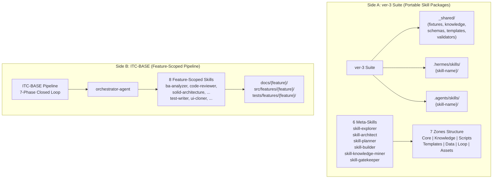
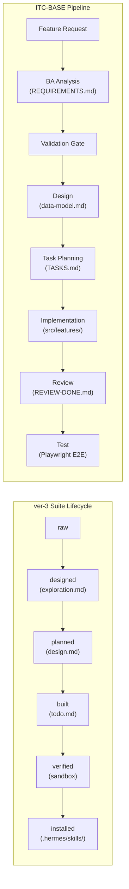

# Dimension 7: Skill Portability & Reusability

## Mô tả Dimension

**Portability** là khả năng một hệ thống skill có thể được chuyển đổi giữa các môi trường runtime (Claude Code instances, thư mục .hermes/skills/, .agents/skills/) mà không cần sửa đổi cấu trúc bên trong.

**Reusability** là khả năng một skill có thể được sử dụng lại cho nhiều dự án, nhiều ngành nghề khác nhau, hoặc nhiều nhóm người dùng khác nhau mà không phụ thuộc vào ngữ cảnh dự án cụ thể.

**Tại sao quan trọng:**
- Một hệ thống chỉ có portability mà không có reusability => chỉ có thể di chuyển nhưng không thể áp dụng cho nhiều use case
- Một hệ thống chỉ có reusability mà không có portability => phải rewrite lại mỗi khi chuyển môi trường
- Skill system tốt cần cả hai: có thể mang đi (portable) và sử dụng cho nhiều bài toán (reusable)

---

## So sánh chi tiết: 7 Zones vs Feature-Scoped Outputs

### Side A: ver-3 Suite — Universal Skill Package System

#### Cấu trúc 7 Zones (từ _shared/knowledge/framework.md)

```
Zone Contract (framework.md §1):
| Zone       | Folder      | Purpose                          | Required |
|------------|-------------|----------------------------------|----------|
| Core       | SKILL.md    | Orchestration, persona, workflow | Always   |
| Knowledge  | knowledge/  | References, standards, guidelines| Usually  |
| Scripts    | scripts/    | Executable automation            | As needed|
| Templates  | templates/  | Output format templates          | As needed|
| Data       | data/       | Config, static data, schemas     | As needed|
| Loop       | loop/       | Checklists, logs, test cases      | Usually  |
| Assets     | assets/     | Images, icons, static files       | Rarely   |
```

#### Portable Knowledge Base (_shared/)

```
ver-3/_shared/
├── fixtures/       # Test fixtures, reusable across skills
├── knowledge/      # framework.md, case-system.md, format-standards.md
├── schemas/        # exploration.schema.yaml, design.schema.yaml, todo.schema.yaml
├── templates/     # Shared output templates
└── validators/     # check_status.py, handoff_validator.py, trace_validator.py
```

Được tham chiếu từ bất kỳ skill nào qua đường dẫn tương đối:
- Từ SKILL.md: `../_shared/knowledge/framework.md`
- Từ knowledge/*.md: `../../_shared/knowledge/framework.md`

#### Skill Lifecycle (framework.md §5)

```
Stage 0: skill-explorer      → exploration.md
Stage 0.5: skill-knowledge-miner → knowledge/domain-handbook.md
Stage 1: skill-architect     → design.md
Stage 2: skill-gatekeeper    → data/quality-matrix.yaml
Stage 3: skill-planner       → todo.md
Stage 4: skill-builder       → skill package (.hermes/skills/{name}/)
```

#### Semantic Versioning (framework.md §8)

```
MAJOR.MINOR.PATCH
- MAJOR: Breaking changes (output format, workflow)
- MINOR: Backward-compatible (new features)
- PATCH: Bug fixes, documentation
```

#### Installable Locations

Skill được cài đặt tại:
- `.hermes/skills/{skill-name}/` — Hermes runtime
- `.agents/skills/{skill-name}/` — Antigravity runtime

#### Ví dụ: skill-builder/SKILL.md

```yaml
---
name: skill-builder
description: "Senior Implementation Engineer. Thực thi design.md và todo.md."
disable-model-invocation: true
user-invocable: true
---

# Boot Sequence (skill-builder/SKILL.md:34-42)
1. Read SKILL.md (this file)
2. Load global suite config from `.skill-context/suite_config.yaml`
3. Check Stage 3.5 Quality Gate
4. Read `../_shared/knowledge/framework.md`
5. Read `../_shared/knowledge/case-system.md`
6. Verify current phase and checkpoint
```

Key portability features:
- `${CLAUDE_SKILL_DIR}` cho path substitution (skill-builder/SKILL.md:17)
- Zone Mapping chỉ định file cần tạo, không cho phép thêm file ngoài (skill-builder/SKILL.md:24)
- Progressive Disclosure: Tier 1 (boot), Tier 2 (conditional), Tier 3 (on-demand)

---

### Side B: ITC-BASE — Project-Specific Feature Pipeline

#### Feature-Scoped Directory Structure

```
ITC-BASE/
├── docs/
│   └── [feature]/
│       ├── REQUIREMENTS.md
│       ├── acceptance-criteria.md
│       ├── user-stories.md
│       ├── ambiguities.md
│       ├── data-model.md
│       ├── api-contract.yaml
│       ├── component-tree.md
│       └── TASKS.md
├── src/features/[feature]/    ← Output cứ như thế này
│   ├── components/
│   ├── services/
│   └── ...
└── .cursor/skills/           ← 8 skills feature-scoped
```

#### 8 Skills trong ITC-BASE

| Skill              | File                          | Purpose                    |
|-------------------|-------------------------------|----------------------------|
| ba-analyzer       | skills/ba-analyzer/SKILL.md   | Parse raw requirements     |
| code-reviewer     | skills/code-reviewer/SKILL.md | On-demand code review      |
| solid-architecture| skills/solid-architecture/SKILL.md | SOLID + patterns     |
| system-designer   | skills/system-designer/SKILL.md | Design data model + API |
| task-planner      | skills/task-planner/SKILL.md | Break design into tasks    |
| test-writer       | skills/test-writer/SKILL.md  | Unit + integration tests   |
| ui-cloner         | skills/ui-cloner/SKILL.md    | Pixel-perfect UI           |
| security-reviewer | skills/security-reviewer/SKILL.md | OWASP security audit |

#### PIPELINE.md — 7-Phase Closed-Loop

```
PIPELINE.md:10-101
Human/PM → ORCHESTRATOR → PHASE 1: BA → PHASE 2: VALIDATE GATE
→ PHASE 3: DESIGN → PHASE 4: TASK PLANNING → PHASE 5: IMPLEMENT
→ PHASE 6: REVIEW → PHASE 7: TEST → READY TO SHIP
```

#### File Output Map (PIPELINE.md:162-183)

```
docs/[feature]/*    ← Phase 1-4 output (requirements, design, tasks)
src/features/[feature]/  ← Phase 5 output (source code)
tests/features/[feature]/ ← Phase 5+7 output (tests)
```

Output bị ràng buộc chỉ được tạo trong thư mục `docs/[feature]/` hoặc `src/features/[feature]/` — không có khái niệm "portable skill package".

#### Skill Usage Pattern

Skills được gọi trực tiếp trong Cursor Chat:
```
@ba-analyzer [paste raw requirement]
@solid-architecture @TASKS.md
@code-reviewer [paste diff]
```

Skills nằm trong `.cursor/skills/` — chỉ hoạt động trong Cursor Composer Agent mode.

---

## Mermaid Diagram: Package vs Feature-Scoped



### Lifecycle Comparison



---

## Ưu/Nhược điểm cụ thể

### ver-3 Suite (Side A)

| Tiêu chí               | Đánh giá | Chi tiết                                                                 |
|------------------------|----------|--------------------------------------------------------------------------|
| **Portability**        | Rất cao  | Cài đặt được ở .hermes/skills/ hoặc .agents/skills/, sử dụng ${CLAUDE_SKILL_DIR} cho path-agnostic code |
| **Reusability**        | Rất cao  | 7 Zones structure áp dụng cho bất kỳ skill nào; _shared/ là portable KB giữa các skill |
| **Composability**      | Rất cao  | Mỗi skill có thể gọi skill khác qua `_shared/`; sub-skills được build riêng biệt |
| **Versioning**         | Có       | Semantic versioning trong YAML frontmatter (MAJOR.MINOR.PATCH) |
| **Lifecycle clarity**  | Rất rõ   | 6-stage pipeline rõ ràng: raw → designed → planned → built → verified → installed |
| **Learning curve**     | Cao      | Cần hiểu 7 Zones, CASE System, 50 quality gates, trace tags, PD tiers   |
| **Setup effort**      | Trung bình| Cần có .skill-context/ state ledger, _shared/ validators, schemas         |
| **Project-agnostic**   | Hoàn toàn| Không có dữ liệu đặc thù của dự án nào trong skill package              |

**Minh chứng từ file thực tế:**

`_shared/knowledge/framework.md:11-23` — 7 Zones chỉ định rõ:
```
| Zone | Folder | Purpose | Required |
| Core | SKILL.md | Orchestration, persona, workflow | Always |
```

`_shared/knowledge/framework.md:169-183` — Semantic versioning:
```
MAJOR.MINOR.PATCH
- MAJOR: Breaking changes (output format, workflow)
- MINOR: Backward-compatible (new features)
- PATCH: Bug fixes, documentation
```

`skill-builder/SKILL.md:17` — Path substitution:
```
must: "read `.skill-context/suite_config.yaml` at startup to determine the physical destination path (`runtime_dest`) dynamically"
```

### ITC-BASE (Side B)

| Tiêu chí               | Đánh giá | Chi tiết                                                                 |
|------------------------|----------|--------------------------------------------------------------------------|
| **Portability**        | Thấp     | Skills chỉ hoạt động trong Cursor Composer Agent; output gắn liền với feature cụ thể |
| **Reusability**        | Thấp     | Skills thiết kế cho 1 pipeline dự án; không thể áp dụng cho dự án khác   |
| **Composability**      | Trung bình| Skills gọi nhau qua orchestrator-agent, nhưng ràng buộc với pipeline này |
| **Versioning**         | Không có | Không có versioning scheme cho skills                                   |
| **Lifecycle clarity**  | Trung bình| 7-phase pipeline rõ ràng, nhưng chỉ cho 1 dự án                        |
| **Learning curve**     | Thấp     | Chỉ cần hiểu workflow.md là hướng dẫn nhanh                             |
| **Setup effort**      | Thấp      | Không cần cấu hình gì thêm; chỉ cần @mention skills                     |
| **Project-agnostic**   | Không    | Output đi thẳng vào `src/features/[feature]/` — project-specific       |

**Minh chứng từ file thực tế:**

`PIPELINE.md:162-183` — Output ràng buộc:
```
docs/[feature]/
    ├── REQUIREMENTS.md     ← ba-analyzer
    ├── acceptance-criteria.md ← ba-analyzer
    ...
src/features/[feature]/   ← implement-agent
tests/features/[feature]/ ← test-writer + test-agent
```

`ba-analyzer/SKILL.md:76-81` — Output path:
```
Create 3 files:
1. `docs/requirements/REQUIREMENTS.md`
2. `docs/requirements/acceptance-criteria.md`
3. `docs/requirements/ambiguities.md`
```

---

## Bảng so sánh cuối cùng

| Dimension                | ver-3 Suite (A)  | ITC-BASE (B)     | Winner |
|-------------------------|------------------|------------------|--------|
| **Portability**         | Rất cao          | Thấp             | A      |
| **Reusability**         | Rất cao          | Thấp             | A      |
| **Composability**       | Rất cao          | Trung bình       | A      |
| **Versioning**          | Có (semantic)    | Không có         | A      |
| **Lifecycle clarity**   | Rất rõ (6-stage) | Trung bình (7-phase) | A  |
| **Learning curve**      | Cao              | Thấp             | B      |
| **Setup effort**       | Trung bình       | Thấp             | B      |
| **Project-agnostic**   | Hoàn toàn        | Không            | A      |

---

## Kết luận

**ver-3 Suite** là một hệ thống **universal skill authoring system** — được thiết kế để tạo ra các skill package có thể:
- Di chuyển giữa các Claude Code instances (portable)
- Được sử dụng cho bất kỳ dự án nào (reusable)
- Được lập trình theo 7 Zones structure chuẩn hóa
- Được versioning và xử lý qua 6-stage pipeline chặt chẽ

Trade-off: Độ phức tạp cao hơn (50 quality gates, CASE System, 7 Zones, PD tiers), cần nhiều setup ban đầu.

**ITC-BASE** là một **project-specific feature pipeline** — tuyến tính hơn nhưng chỉ phù hợp khi:
- Một dự án đơn lẻ cần xử lý feature từ A đến Z
- Team đã quen với Cursor Composer Agent workflow
- Không cần mang skill đi sử dụng ở nơi khác

Trade-off: Skills không thể sử dụng lại, output gắn liền với feature cụ thể, không có versioning hay portability.

**Recommendation:**
- Sử dụng **ver-3 Suite** khi xây dựng Master Skill Suite cần reuse giữa nhiều dự án
- Sử dụng **ITC-BASE** khi chỉ cần một pipeline xử lý feature cụ thể trong 1 dự án

---

## Tham chiếu

### Side A (ver-3 Suite)
- `/home/steve/Work-space/deep_work_by_steve/skills/Update-suite/current-suite/ver-3/_shared/knowledge/framework.md` — 7 Zones, Pipeline, Semantic Versioning
- `/home/steve/Work-space/deep_work_by_steve/skills/Update-suite/current-suite/ver-3/skill-builder/SKILL.md` — Path substitution, Zone Mapping contract
- `/home/steve/Work-space/deep_work_by_steve/skills/Update-suite/current-suite/ver-3/_shared/` — Portable knowledge base (fixtures/, knowledge/, schemas/, templates/, validators/)

### Side B (ITC-BASE)
- `/home/steve/Work-space/deep_work_by_steve/knowledge/ai-agents/repo/ITC-BASE/PIPELINE.md` — 7-phase pipeline, File Output Map
- `/home/steve/Work-space/deep_work_by_steve/knowledge/ai-agents/repo/ITC-BASE/workflow.md` — Developer workflow shortcut
- `/home/steve/Work-space/deep_work_by_steve/knowledge/ai-agents/repo/ITC-BASE/.cursor/skills/ba-analyzer/SKILL.md` — Feature-specific output path
- `/home/steve/Work-space/deep_work_by_steve/knowledge/ai-agents/repo/ITC-BASE/.cursor/skills/code-reviewer/SKILL.md` — On-demand review skill
- `/home/steve/Work-space/deep_work_by_steve/knowledge/ai-agents/repo/ITC-BASE/.cursor/skills/solid-architecture/SKILL.md` — SOLID enforcement skill

---

## 📖 Glossary (Thuật ngữ)

| Thuật ngữ | Giải thích |
|------------|-------------|
| **Pipeline** | Đường ống xử lý - chuỗi các giai đoạn xử lý công việc theo thứ tự tuyến tính hoặc tuần tự. |
| **Layering** | Phân lớp - kiến trúc tổ chức mã nguồn hoặc tri thức theo chiều dọc để đảm bảo tính độc lập và dễ bảo trì. |
| **Gate** | Cổng kiểm tra - điểm checkpoint kiểm soát chất lượng nơi các sản phẩm đầu ra (artifacts) được thẩm định. |
| **Rollback** | Quay lui - cơ chế tự động hoặc thủ công để phục hồi trạng thái làm việc về một phase ổn định trước đó khi xảy ra sự cố. |
| **Checkpoint** | Điểm kiểm tra - trạng thái công việc được lưu lại để có thể tiếp tục (resume) mà không phải làm lại từ đầu. |
| **Staleness** | Lỗi thời - trạng thái khi checkpoint quá cũ (ví dụ: > 7 ngày) đòi hỏi phải cảnh báo hoặc chạy lại explorer. |
| **Handoff** | Chuyển giao - quá trình bàn giao các artifacts đạt chuẩn từ stage này sang stage kế tiếp. |
| **Feedback Loop** | Vòng phản hồi - cơ chế đẩy thông tin lỗi hoặc đề xuất ngược về các stage trước để tự động điều chỉnh. |
| **CASE System** | Hệ thống CASE - cơ chế quản lý chất lượng toàn diện của ver-3 suite dựa trên 3 trụ cột: PREVENT → DETECT → RECOVER. |
| **Progressive Disclosure** | Tiết lộ lũy tiến - cơ chế nạp bối cảnh/tri thức theo từng tầng (Tiers) trên cơ sở nhu cầu thực tế của task để tối ưu hóa context window và token. |
| **Trace Tag** | Thẻ truy vết - thẻ dạng như `[TỪ DESIGN §N]` dùng để đối chiếu ngược mọi tác vụ lập trình về nguồn gốc thiết kế ban đầu. |
| **Ambiguity** | Sự mơ hồ - các điểm chưa rõ ràng hoặc mâu thuẫn trong yêu cầu nghiệp vụ cần được phát hiện và giải quyết triệt để. |
| **Sandbox** | Môi trường cô lập (Hộp cát) - môi trường chạy mã nguồn độc lập và an toàn (như Docker/gVisor) để kiểm thử sản phẩm. |
| **Rule Hierarchy** | Phân cấp Luật - thứ tự ưu tiên áp dụng các tệp quy định trong hệ thống khi có xung đột (ví dụ: `.mdc` > `agents/` > `skills/`). |
| **Self-refinement** | Tự tinh chỉnh - cơ chế AI tự chạy vòng lặp đánh giá lỗi dựa trên critic engine và tự sửa đổi code cho đến khi đạt chuẩn. |
| **E2E Testing** | Kiểm thử đầu-cuối - quy trình chạy kiểm thử tự động giả lập người dùng thật trên toàn bộ hệ thống từ UI đến DB (như Playwright). |
| **Flaky Test** | Kiểm thử không ổn định - các ca kiểm thử lúc Pass lúc Fail không nhất quán dù không có sự thay đổi nào về mã nguồn hay môi trường. |
| **Orchestration** | Phối hợp quy trình (Đạo diễn) - cơ chế điều phối trung tâm để quản lý vòng đời, trạng thái và sự chuyển giao giữa các tác nhân. |
| **Governance** | Quản trị - cơ chế kiểm soát, phân quyền và phê duyệt tiến trình (đặc biệt là các cổng phê duyệt bắt buộc của con người - Human-in-the-Loop). |
| **Acceptance Criteria** | Tiêu chí nghiệm thu - các điều kiện bắt buộc phải thỏa mãn để một tính năng được coi là hoàn thành hoàn chỉnh. |
| **Portability** | Tính di động - khả năng chuyển đổi hoặc chạy một gói skill trên nhiều môi trường agent runtime khác nhau mà không cần sửa đổi cấu trúc. |
| **Reusability** | Tính tái sử dụng - khả năng sử dụng lại một skill hoặc module cho nhiều dự án khác nhau một cách độc lập. |
| **DoD (Definition of Done)** | Định nghĩa Hoàn thành - danh sách kiểm tra (checklist) tiêu chí chất lượng nghiêm ngặt cho mỗi phase trước khi bàn giao. |
