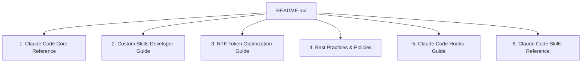

# Claude Code Knowledge Index

> **Version:** 1.0.0 | **Updated:** 2026-05-28
> **Workspace:** Personal AI Skill Lab - Suite Upgrade Arena (`skills/Update-suite/`)

Welcome to the **Claude Code Knowledge Base** built within `.claude/knowledge/`. This directory serves as a high-fidelity reference for human developers and agentic AI systems working with Claude Code and custom skill pipelines.

---

## 🗺️ Map of Knowledge

This knowledge repository is categorized into six specialized modules:

### 1. 📘 [Core Reference](./claude_code_core.md)
*   **Core Commands**: Deep dive into slash commands (`/compact`, `/clear`, `/doctor`, etc.).
*   **Keyboard Shortcuts**: Fast interactive keys (`Tab`, `Ctrl+C`, `Ctrl+L`).
*   **Settings Configuration**: Deep-dive into `.claude/settings.json` permissions matrix.
*   **Context Management**: Handling token limits, session resets, and active memories.

### 2. 🛠️ [Custom Skills Developer Guide](./custom_skills.md)
*   **7-Zone Architecture**: Architectural skeleton of modular capabilities.
*   **Dynamic Triggers**: Frontmatter triggers and context gating filters.
*   **Instruction Engineering**: Rules for imperative tone and "zero placeholders".
*   **Sync Workflows**: Pushing skills from rebuilding factories to runtime layers.

### 3. ⚡ [RTK Token Optimization Guide](./token_optimization_rtk.md)
*   **Token Bloat Prevention**: Eliminating noisy log lines, large unmodified diffs, and warning stack traces.
*   **Hook Integration**: The automated `git status` -> `rtk git status` hook mechanism.
*   **Meta Commands**: Usage guides for `rtk gain`, `rtk discover`, and `rtk proxy`.

### 4. 🛡️ [Best Practices & Operational Policies](./best_practices.md)
*   **Sandbox Isolation**: Rules for Docker/gVisor script isolation (Stage 4 Tester).
*   **Agentic Safety**: Safe operations in `bypassPermissions` mode.
*   **Commit Protocol**: Structured semantics for git commits and auto-push actions.
*   **Recovery Playbooks**: Resolving out-of-memory states, rate limits, and network blockades.

### 5. 🪝 [Claude Code Hooks Guide](./hooks/hooks.md)
*   **Architecture & Types**: Detailed specifications of command, HTTP, MCP, prompt, and agent hooks.
*   **Core & Workflow Events**: In-depth JSON schema and decision controls for session, tool, and system lifecycle events.
*   **Advanced Capabilities**: Practical configurations for LLM-based prompt/agent verifiers and non-blocking background async hooks.
*   **Security & Diagnostics**: Best practices for shell scripting safety, Windows PowerShell, and debug log extraction.

### 6. 🔧 [Claude Code Skills Reference](./skills.md)
*   **Bundled Skills**: Deep dive into the bundled commands (`/run`, `/verify`, `/run-skill-generator`).
*   **Getting Started & Lifecycle**: Writing your first skill, execution scopes, and bottom-up/nested monorepo discovery.
*   **Configuration & Variables**: Complete specification of frontmatter properties and dynamic string substitutions.
*   **Advanced Patterns**: Shell command pre-processing, Allowed-tools permission gates, context forking, and visibility overrides.
*   **Visual Web Interfaces**: Automated Python interactive HTML visualization scripting and browser execution.
*   **Troubleshooting**: Diagnosing trigger issues and resolving description truncation (listing char budgets).

---

## 🏷️ Custom Rules Activation & Loading
To ensure Claude Code automatically reads and prioritizes this knowledge:
1.  Make sure `.claude/settings.json` is initialized.
2.  Consult these files immediately upon detecting a task involving **Custom Skills development**, **Git operations**, or **Token budget constraints**.
