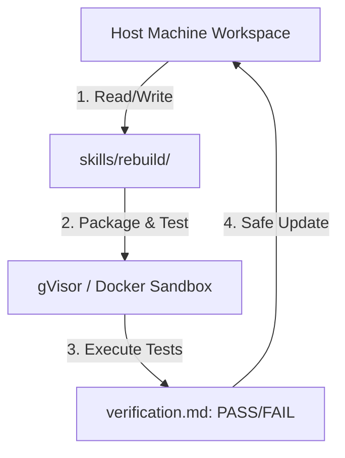

# Claude Code Best Practices & Operational Policies

> **Version:** 1.0.0 | **Updated:** 2026-05-28
> **Scope:** Sandbox security, execution pipelines, error handling, and commit protocols.

---

## 1. Sandbox Isolation & Security (Stage 4 Tester)

When building or updating custom skills, running external scripts (e.g., node, python, bash) carries inherent system risks. We enforce strict sandbox isolation rules during the test validation phase.



### Sandbox Standards:
*   **Host Isolation**: NEVER execute unverified test scripts, database migrations, or third-party builds directly on your host machine.
*   **Docker Containerization**: Always wrap tests inside a Docker container (ideally secured by gVisor runtime) to prevent host compromise.
*   **Zero Leakage**: Ensure network boundaries inside the sandbox prevent external scraping or prompt-injection data leaks.

---

## 2. Agentic Workflow Execution

To maximize productivity under high-autonomy sessions, configure Claude Code with highly responsive settings.

### Standard Configuration:
As defined in `settings.json`, set:
```json
"permissions": {
  "defaultMode": "bypassPermissions"
}
```

> [!CAUTION]
> In `bypassPermissions` mode, Claude will execute terminal commands without prompting for user confirmation.
> **Mandatory Safeguard**: Always keep a separate terminal open with `git diff` or monitor file state to revert unintended edits instantly using `git checkout` or `/undo`.

---

## 3. Git Commit & Push Protocol

Maintaining a clean git history is crucial for collaborative AI-Developer teams. Follow the transparent commit flow:

1.  **Analyze Diffs**: Run `rtk git status` followed by `/review` inside Claude Code to identify modified file boundaries.
2.  **Commit Message Structure**: Construct semantic commit messages strictly detailing the exact zones changed:
    ```bash
    rtk git commit -m "feat(skill-architect): implement 7-zone validation logic"
    ```
3.  **Safe Auto-push**: Once changes are validated, perform a push to upstream:
    ```bash
    rtk git push
    ```

---

## 4. Troubleshooting & Error Recovery

If Claude Code encounters rate limits, connection drops, or tool execution errors, follow the **CASE System Recovery Protocols**:

### A. Context Bloat / Out of Memory
*   **Symptom**: Model takes over 30 seconds to respond, cost raises significantly, or responses become shallow.
*   **Resolution**: Run `/compact` to summarize history or `/clear` to wipe active memory while keeping core file indices intact.

### B. Tool Execution Failure
*   **Symptom**: Commands return empty, shell output is truncated, or a tool times out.
*   **Resolution**:
    1. Run `/doctor` to verify system diagnostics.
    2. Test if RTK is overly aggressive by using `rtk proxy <cmd>` to bypass compression.
    3. Verify network configurations if making API calls.

### C. gVisor Sandbox Failure
*   **Symptom**: Docker container crashes, permissions denied inside the sandbox.
*   **Resolution**: Check container storage allocation, user permissions mapping, and ensure the test schema matches standard template guidelines in `skills/rebuild/_shared/`.
