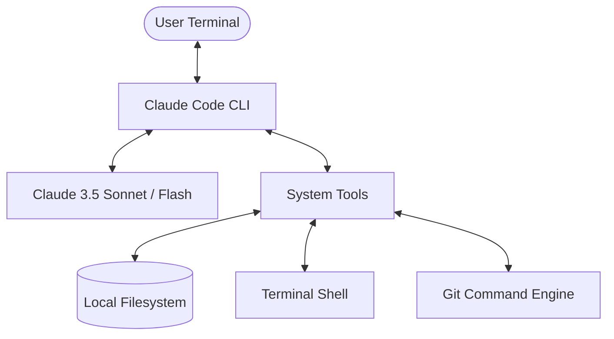
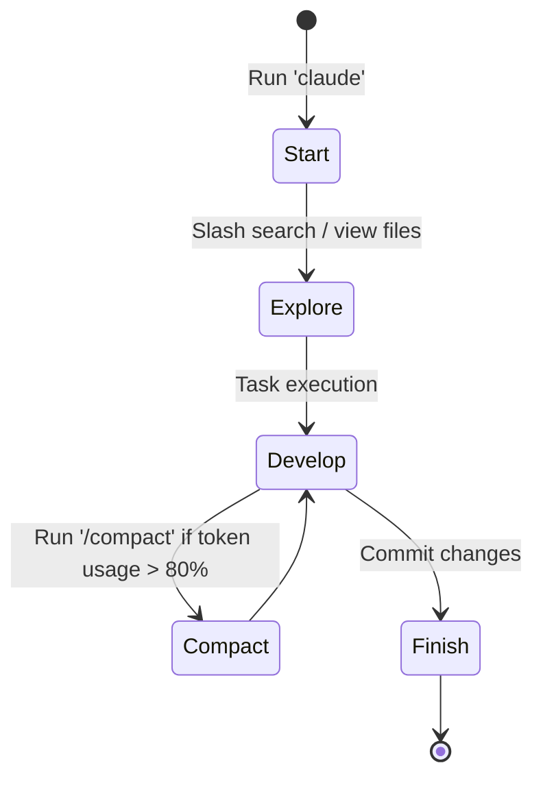

# Claude Code Core Reference

> **Version:** 1.0.0 | **Updated:** 2026-05-28
> **Scope:** Core architecture, commands, configuration, and controls for Claude Code.

---

## 1. Overview & Architecture

**Claude Code** is an agentic, terminal-based AI coding assistant developed by Anthropic. Unlike traditional chat interfaces, Claude Code runs directly in your local environment, allowing it to inspect the filesystem, run commands, analyze git histories, and execute tests directly with user-approved permissions.



### Core Execution Flow:
1. **Context Initialization**: Scans workspace for `.claude/` settings, `CLAUDE.md`, and active git status.
2. **Intent Analysis**: Parses user prompt to determine if it requires file reads, edits, command execution, or general explanation.
3. **Tool Dispatch & Loop**: Executes local filesystem tools or commands, evaluates outcomes, and recursively decides on next actions.
4. **User Confirmation**: Prompts for terminal commands or file changes unless configured in `bypassPermissions` mode.

---

## 2. Slash Commands Reference

Slash commands allow you to control the session directly without sending prompts to the LLM, saving significant token costs.

| Command | Description | Best Use Case |
| :--- | :--- | :--- |
| `/bug` | Report a bug in Claude Code to Anthropic | When encountering unexpected crashes or tool errors. |
| `/clear` | Clear the screen and reset session context history | To free up token context and start a fresh coding task. |
| `/compact` | Compact the conversation history to save tokens | Keep the memory of files read but discard long command outputs. |
| `/cost` | Display cumulative token usage and cost for the session | Audit API consumption. |
| `/doctor` | Run diagnostic check on environment, tools, and connection | Troubleshooting tool failures or missing dependencies. |
| `/exit` or `/quit` | Terminate the active Claude Code session | Exit the interactive shell cleanly. |
| `/help` | Display interactive help menu and documentation | Quick lookup of commands and keyboard shortcuts. |
| `/init` | Initialize Claude Code configuration in current workspace | Bootstrapping a new project with default settings. |
| `/reset` | Hard reset the conversation, clearing all history and state | When switching to a completely unrelated feature. |
| `/review` | Initiates a code review of the current changes (diff) | Before preparing a commit or PR. |
| `/search` | Semantic search across the workspace | Finding files or functions by descriptive intent. |
| `/undo` | Revert the last file change made by Claude Code | Safe recovery from an incorrect edit. |

---

## 3. Keyboard Shortcuts

Using keyboard shortcuts optimizes terminal interaction and session control.

> [!TIP]
> Use `Ctrl+C` to interrupt a running command or stop Claude mid-generation without exiting the program.

*   `Tab`: Auto-complete file paths, commands, and options.
*   `Up` / `Down` Arrow: Navigate command history (repl).
*   `Ctrl + L`: Clear the visible terminal screen (keeps session context intact).
*   `Ctrl + D`: Send End-Of-File (EOF) to exit the shell.
*   `Ctrl + C`: Cancel running command execution or stop current streaming response.

---

## 4. Configuration Matrix (`.claude/settings.json`)

The `.claude/settings.json` file controls permission levels and agentic execution behavior.

```json
{
  "permissions": {
    "defaultMode": "bypassPermissions"
  },
  "theme": "dark",
  "editor": "vim",
  "autoApproveCommands": [
    "git status",
    "npm run test"
  ]
}
```

### Permission Modes (`defaultMode`):
*   `ask`: Default mode. Prompts the user before running ANY terminal command or making file modifications.
*   `bypassPermissions`: Automatically approves all actions. Highly recommended for automated pipelines, CI/CD integrations, or advanced hands-off developer agent sessions.

> [!WARNING]
> Only use `bypassPermissions` in safe, isolated workspaces (like a local playground or Docker container) since it allows Claude to run arbitrary terminal commands without validation.

---

## 5. Session Life-cycle Management

To maintain long-term efficiency and keep costs low, follow these context hygiene principles:



1.  **Context Bloat**: As sessions grow, the context window fills with command outputs and raw logs.
2.  **Compacting**: Run `/compact` to summarize the history, reducing token overhead by up to 70% while keeping crucial file knowledge.
3.  **Resetting**: If you switch tasks entirely, run `/reset` or `/clear` to start fresh.
