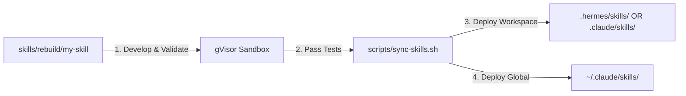

# Claude Code Custom Skills Developer Guide

> **Version:** 1.0.0 | **Updated:** 2026-05-28
> **Scope:** Architecture, authoring standards, dynamic triggers, and life-cycle management for Claude Code custom skills.

---

## 1. What is a Claude Code Skill?

A **Skill** in Claude Code is a modular capability package designed to extend Claude's core intelligence for highly specific tasks. Unlike standard prompts, a skill provides:
1.  **Strict Context Windows**: Structured constraints that only activate under exact scenario triggers.
2.  **Tool-Level Bindings**: Guidance on how to choose, chain, and execute available tools (e.g., git, ripgrep, custom script execution).
3.  **Local Execution Isolation**: Integrated environment safety practices.

In the **Master Skill Suite** framework, every skill is structured using the **7-Zone Architecture**:

```text
skills/rebuild/{skill-name}/
├── SKILL.md                 ← L0 Anchor (Frontmatter, Rules, Routing Map)
├── knowledge/               ← Domain-specific curated details & policies
├── scripts/                 ← Local automation scripts (python, bash, node)
├── templates/               ← Structural output templates (Markdown/YAML)
├── data/                    ← Reference assets, configurations, schemas
├── loop/                    ← Evaluation/Refinement feedback loops
└── assets/                  ← Visual wireframes or mockups
```

---

## 2. Dynamic Activation & Context Gating

Claude Code dynamically matches active workspace files and user query intents against the metadata defined in each skill's `YAML Frontmatter`.

```yaml
---
name: skill-name-kebab-case
description: "A very clear, single-sentence summary of what this skill does."
version: "1.0.0"
tags: ["domain", "action", "technology"]
when_to_use:
  - "User explicitly asks to: 'run task X' or 'audit Y'"
  - "Working on files matching: '**/src/components/**/*.tsx'"
  - "Faced with errors matching: 'TypeScript Error TS2322'"
---
```

### Context Gating Rules:
*   **Zero Noise**: Skills are NOT loaded into memory unless the `when_to_use` trigger criteria are satisfied. This preserves the L0 token budget.
*   **Incremental Disclosure**: Keep `SKILL.md` strictly under **700 tokens**. Transfer dense reference guides, command lists, and edge cases to the skill's local `knowledge/` directory, loading them dynamically only when active.

---

## 3. Writing Robust Instructions

Avoid passive explanations. Claude Code operates best under authoritative, action-oriented directives.

> [!IMPORTANT]
> **Authoring Conventions:**
> *   Use the **imperative mood** ("Do X", "Never write Y") rather than passive voice ("Y should be avoided").
> *   Define clear **Failure Gates**: Instruct Claude exactly what constitutes a failure and when it must stop and request human intervention.
> *   Enforce the **Zero Placeholder Rule**: Forbid the generation of `// TODO`, `pass`, or mock logic in the final output code.

### Instruction Standard Block:
```xml
<instructions>
  <rule id="zero_placeholder">
    NEVER output placeholder code (such as '// TODO', 'mock()', or 'pass'). If an implementation detail is missing, query the workspace or pause execution.
  </rule>
  <rule id="safety_first">
    When executing commands via 'run_command', always verify paths against the active workspace CWD. Do NOT escape the repository boundaries.
  </rule>
</instructions>
```

---

## 4. Skill Deployment Workflows

Since Claude Code runtime directories can be volatile or read-only, always follow the **Canonical Factory Sync Pattern**:



### Installation Targets:
1.  **Workspace-level Skills**: Located in `./.claude/skills/`. Loaded only when running Claude Code within this specific repository.
2.  **Global User-level Skills**: Located in `~/.claude/skills/`. Available across all workspaces on the host machine.

---

## 5. The CASE Quality Standard

To ensure production-grade reliability, all custom skills must survive the **CASE System** (Confidence-Aware Skill Execution) check:

*   **Ambiguity Scan**: Active Explorer stage checks for undefined variables or conflicting business rules.
*   **Confidence Scoring**: If confidence drops below **70%**, execution halts to prevent silent failures.
*   **Sandbox Isolation**: All execution scripts and test cases must be validated inside a sandboxed Docker/gVisor container before sync.
*   **Registration Ledger**: Rebuilt skills must update `.skill-context/registry/README.md` and declare their status to `llms.txt`.
