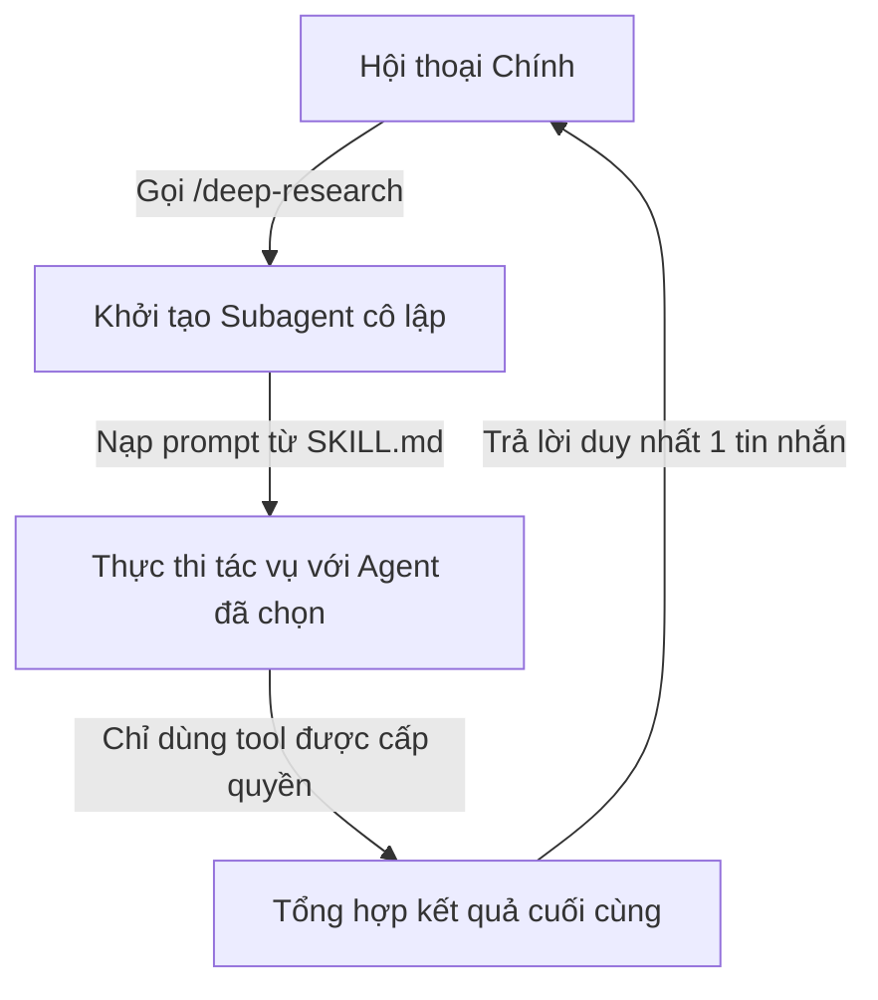

# 🛠️ Các Mô hình Hướng dẫn Nâng cao & Phân quyền

> **Cấp độ tài liệu:** L2 Playbook & Operational Rules

Phần này tài liệu hóa các tính năng nâng cao của Claude Code nhằm xây dựng các skill tự động hóa thông minh, an toàn và tối ưu hóa tài nguyên token.

---

## 1. Cơ chế Nhúng Ngữ cảnh Động (Dynamic Context Injection)

Nhờ tính năng này, bạn có thể thực thi các lệnh shell hệ thống để lấy dữ liệu thực tế và điền trực tiếp vào prompt của Claude trước khi gửi đi. 

### Cú pháp Thực thi

*   **Dạng Nội dòng (Inline form):** Sử dụng cú pháp `` !`lệnh` `` ở đầu dòng hoặc sau khoảng trắng.
    *   Ví dụ: `Thông tin nhánh: !`git branch --show-current``
*   **Dạng Khối (Block form):** Dùng khối code rào đóng mở bằng `` ```! `` cho các lệnh nhiều dòng.
    *   Ví dụ:
        ````markdown
        ## Trạng thái Môi trường
        ```!
        node --version
        git status --short
        ```
        ````

### Chính sách Bảo mật của Hệ thống
Để vô hiệu hóa tính năng chạy lệnh shell tự động này trong các dự án dùng chung (tránh nguy cơ độc hại), bạn có thể khai báo trong file cấu hình cài đặt:

```json
{
  "disableSkillShellExecution": true
}
```
Khi bật cấu hình này, mọi lệnh động sẽ bị thay thế bằng chuỗi `[shell command execution disabled by policy]`. Cài đặt này cực kỳ hiệu quả khi triển khai ở cấp độ **Managed Settings** (nơi người dùng thông thường không có quyền ghi đè).

---

## 2. Kích hoạt Cô lập trong Subagent (Context Forking)

Khi bạn muốn thực thi một tác vụ nặng, chuyên biệt mà không làm ô nhiễm cửa sổ hội thoại chính, hãy sử dụng cơ chế cô lập ngữ cảnh thông qua trường `context: fork`.

```yaml
---
name: deep-research
description: Thực hiện nghiên cứu sâu về một thành phần mã nguồn
context: fork
agent: Explore
---
Nghiên cứu kỹ lưỡng về module $ARGUMENTS:
1. Quét tìm các tệp liên quan bằng Grep.
2. Đọc mã nguồn và phân tích luồng dữ liệu.
```

### Cơ chế hoạt động của Context Forking



<instructions>
must:
  - Khai báo `context: fork` chỉ thực sự có ý nghĩa khi skill chứa các chỉ dẫn nhiệm vụ (Task Content) rõ ràng. Nếu skill chỉ chứa tài liệu tham chiếu tĩnh, subagent sẽ kết thúc ngay lập tức mà không sinh ra kết quả có giá trị.
  - Sử dụng các agent tối ưu hóa bộ nhớ như `Explore` hoặc `Plan` để bỏ qua việc nạp file `CLAUDE.md` và `git status`, giúp giảm tối đa chi phí token khởi động.
</instructions>

---

## 3. Quản lý Quyền hạn & Phê duyệt Công cụ (Allowed Tools)

Để Claude hoạt động mượt mà không cần liên tục hỏi xin phép người dùng khi chạy các tác vụ lặp đi lặp lại, hãy sử dụng trường `allowed-tools`:

```yaml
---
name: git-helper
allowed-tools: Bash(git add *) Bash(git commit *) Bash(git status)
---
```

> [!CAUTION]
> **Rủi ro bảo mật:** Các dự án tải từ Internet về có thể chứa các skill tự cấp quyền hệ thống rộng lớn trong `.claude/skills/`. Bạn **bắt buộc** phải review kỹ thư mục này trước khi nhấn nút "Trust" cho dự án trong Claude Code.

---

## 4. Kiểm soát Kích hoạt & Khả năng Hiển thị

Hệ thống cho phép cấu hình chi tiết quyền kích hoạt của người dùng và mô hình thông qua YAML frontmatter:

| Khai báo cấu hình | Bạn có thể gọi | Claude có thể gọi | Cách nạp vào bối cảnh |
| :--- | :--- | :--- | :--- |
| **Mặc định** | Có | Có | Chỉ nạp mô tả sơ lược ở đầu, nạp đầy đủ khi được kích hoạt. |
| **`disable-model-invocation: true`** | Có | Không | Giấu kín mô tả, chỉ nạp đầy đủ khi bạn chủ động gõ lệnh gọi. |
| **`user-invocable: false`** | Không | Có | Ẩn khỏi menu gõ `/`. Chỉ nạp khi Claude tự nhận thấy cần thiết. |

---

## 5. Cơ chế Đóng gói Context (Skill Content Lifecycle)

Khi một skill được kích hoạt, toàn bộ nội dung của nó sẽ được nạp vào phiên làm việc dưới dạng một tin nhắn tĩnh và duy trì ở đó. 

### Quy tắc Thu gọn Ngữ cảnh (Context Compaction)
Khi cuộc hội thoại quá dài dẫn đến tràn bộ nhớ, cơ chế tự động dọn dẹp (auto-compaction) sẽ hoạt động theo quy tắc sau:
1.  Hệ thống sẽ giữ lại tối đa **5,000 tokens** đầu tiên của mỗi skill đang hoạt động.
2.  Tổng dung lượng dành cho toàn bộ các skill được giữ lại sau khi thu gọn là **25,000 tokens**.
3.  Thứ tự giữ lại sẽ đi từ skill được kích hoạt gần đây nhất ngược về trước. Các skill quá cũ hoặc ít dùng sẽ bị loại bỏ hoàn toàn khỏi bộ nhớ.

---

## 6. Ghi đè Cấu hình Hiển thị tại Địa phương (skillOverrides)

Nếu bạn không muốn hoặc không thể chỉnh sửa tệp `SKILL.md` gốc (ví dụ: skill dùng chung của dự án lớn), bạn có thể ghi đè hiển thị cục bộ trong tệp cấu hình cá nhân `.claude/settings.local.json` qua thuộc tính `skillOverrides`:

```json
{
  "skillOverrides": {
    "legacy-system-context": "name-only",
    "deploy-staging": "off"
  }
}
```

Các giá trị ghi đè được hỗ trợ bao gồm:
*   `"on"`: Hiển thị đầy đủ tên và mô tả cho cả người và mô hình.
*   `"name-only"`: Chỉ cung cấp tên lệnh, ẩn mô tả để tiết kiệm token budget.
*   `"user-invocable-only"`: Ẩn hoàn toàn đối với Claude, chỉ hiển thị cho bạn gõ gọi thủ công.
*   `"off"`: Vô hiệu hóa hoàn toàn skill này trên hệ thống của bạn.
