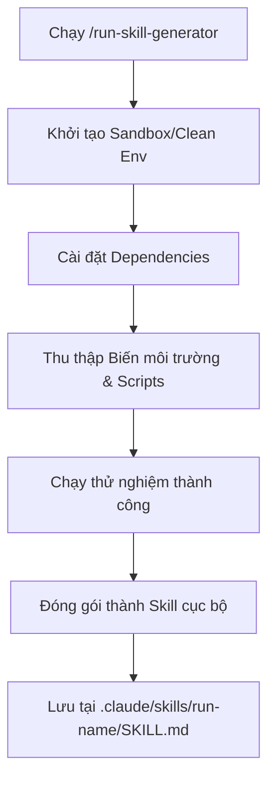

# 🧰 Cẩm nang Bundled Skills (Skill đi kèm)

> **Cấp độ tài liệu:** L1 Core Reference
> **Phiên bản tối thiểu:** Claude Code v2.1.145+

Bundled Skills là bộ công cụ prompt-based được tích hợp sẵn trong mọi phiên làm việc của Claude Code. Khác với các lệnh tích hợp thông thường chạy logic tĩnh, các skill này hướng dẫn Claude thông qua các prompt chi tiết để tự động hóa và điều phối công việc bằng cách sử dụng linh hoạt các tool hệ thống. Bạn có thể kích hoạt chúng bằng cách gõ `/` kèm theo tên skill.

---

## 1. Bộ ba Skill Khởi chạy và Kiểm chứng Ứng dụng

Khi thực hiện thay đổi mã nguồn, thay vì chỉ dựa vào kiểm thử tự động (tests) hay kiểm tra kiểu dữ liệu (type checks), bộ ba skill này hoạt động cùng nhau để chạy ứng dụng thực tế và xác minh tính đúng đắn của thay đổi trực tiếp trên runtime:

| Skill | Mục đích | Cách hoạt động |
| :--- | :--- | :--- |
| **`/run`** | Khởi chạy và điều khiển ứng dụng để xem thay đổi hoạt động thực tế. | Tự động phân tích dự án để tìm lệnh khởi chạy, thiết lập môi trường và chạy thử. |
| **`/verify`** | Build và khởi chạy ứng dụng để xác nhận thay đổi mã nguồn thực hiện đúng chức năng, không cần chạy toàn bộ test suite. | Chạy quy trình build, chạy thử các luồng bị ảnh hưởng để kiểm chứng nhanh. |
| **`/run-skill-generator`** | Huấn luyện và ghi lại công thức build/chạy ứng dụng cho `/run` và `/verify`. | Ghi lại chính xác cách cài đặt, biến môi trường và script khởi chạy rồi đóng gói thành skill cục bộ. |

---

## 2. Cơ chế Tự động Phán đoán (Inference Mechanics)

Mặc định, `/run` và `/verify` có thể hoạt động ngay lập tức **không cần cấu hình trước**. Hệ thống sẽ tự động phán đoán (infer) phương thức khởi chạy dựa trên:
*   **Loại ứng dụng:** CLI (Command Line Interface), Web Server, TUI (Terminal User Interface), hoặc Browser-driven app.
*   **Tệp tin cấu hình:** Quét tìm tệp tin `README.md`, `package.json`, `Makefile`, `docker-compose.yml`, v.v.

<context>
> [!NOTE]
> Sự phán đoán tự động này có thể thiếu độ tin cậy trong các dự án phức tạp cần:
> *   Thiết lập Database hoặc khởi động container chạy nền.
> *   Nạp các tệp biến môi trường `.env` đặc thù.
> *   Thiết lập phiên đồ họa hoặc cổng mạng tùy chỉnh.
> *   Quy trình Build đa tầng (Multi-step build).
</context>

---

## 3. Quy trình Đóng gói Công thức với `/run-skill-generator`

Để khắc phục giới hạn của cơ chế phán đoán tự động, hãy chạy `/run-skill-generator` một lần duy nhất cho mỗi dự án (hoặc khi quy trình build/launch thay đổi). 

### Luồng Hoạt động (Workflow Graph)

### Hướng dẫn Sử dụng và Ghi chép Công thức

<instructions>
must:
  - Chỉ nên chạy `/run-skill-generator` trong môi trường làm việc sạch, đảm bảo các biến môi trường cần thiết được khai báo đầy đủ.
  - Sau khi generator chạy thành công và tạo tệp tại `.claude/skills/run-<name>/`, bạn **phải** commit thư mục này vào Git để toàn bộ team và các agent khác có thể tái sử dụng.
  - Khi có bất kỳ thay đổi nào trong `package.json`, `Makefile` hoặc cơ chế build, bắt buộc phải chạy lại `/run-skill-generator` để cập nhật công thức.
</instructions>

Khi skill khởi chạy đã được đóng gói:
1.  Mọi lệnh `/run` hoặc `/verify` tiếp theo sẽ bỏ qua bước phán đoán tự động và đọc trực tiếp từ công thức đã lưu.
2.  Các subagent hoặc các AI agent khác khi tham gia phát triển dự án sẽ tự động nạp công thức này để tương tác với runtime ứng dụng mà không cần hỏi lại nhà phát triển.
