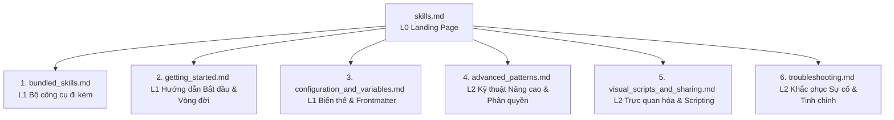

# 🛠️ Mở rộng Năng lực Claude với Skills

> **Cấp độ tài liệu:** L0 Anchor Guide / Constitution
> **Mục tiêu:** Định hướng, phân vùng tri thức và thiết lập quy ước bắt buộc cho hệ sinh thái Agent Skills của Claude Code.

Skill là cơ chế cốt lõi để mở rộng năng lực của Claude trong Claude Code. Bằng cách thiết lập tệp `SKILL.md` kèm theo các hướng dẫn, Claude sẽ nạp nó vào hộp công cụ hành vi. Claude sẽ tự động sử dụng skill khi nhận thấy sự phù hợp với ngữ cảnh hội thoại, hoặc bạn có thể kích hoạt trực tiếp bằng lệnh `/tên-skill`.

Khác với tệp `CLAUDE.md` tĩnh luôn bị nạp vào mọi turn hội thoại gây lãng phí bộ nhớ, nội dung chi tiết của một skill **chỉ được tải khi thực sự được gọi**. Nhờ đó, việc lưu trữ các quy trình lớn, tài liệu tham khảo chi tiết hầu như không tiêu tốn token của bạn cho đến khi cần thiết.

---

## 🗺️ Bản đồ Phân vùng Tri thức (Knowledge Map)

Hệ thống tài liệu hướng dẫn Skill đã được mô-đun hóa thành các phân vùng kiến thức chuyên biệt độc lập giúp tối ưu hóa việc tra cứu và nạp ngữ cảnh tự động cho Agent:



### 1. 🧰 [Bundled Skills (Bộ công cụ đi kèm)](./bundled_skills.md)
*   **Chạy & Xác minh ứng dụng**: Chi tiết bộ ba `/run`, `/verify`, và `/run-skill-generator` để kiểm chứng mã nguồn thực tế.
*   **Cơ chế Phán đoán**: Cách thức phán đoán tự động dựa trên loại hình dự án.

### 2. 🚀 [Bắt đầu & Vòng đời của Skill](./getting_started.md)
*   **Xây dựng Skill đầu tiên**: Hướng dẫn step-by-step thiết lập và chạy thử skill `summarize-changes`.
*   **Phạm vi lưu trữ**: Phân biệt và quản lý thứ tự ưu tiên của các cấp độ skill (Enterprise, Personal, Project, Plugin).
*   **Khám phá Động**: Cơ chế tự động watch và nạp skill trong monorepo.

### 3. ⚙️ [Cấu hình & Biến thay thế động](./configuration_and_variables.md)
*   **Mô hình dữ liệu**: Phân loại nội dung tham chiếu (Reference) và nội dung nhiệm vụ (Task).
*   **YAML Frontmatter**: Bảng đặc tả chi tiết 16 trường cấu hình.
*   **Biến thay thế**: Cách sử dụng `$ARGUMENTS`, `$N`, `${CLAUDE_SKILL_DIR}` để viết các lệnh động.

### 4. 🛡️ [Kỹ thuật Hướng dẫn Nâng cao & Phân quyền](./advanced_patterns.md)
*   **Nhúng Ngữ cảnh Động**: Sử dụng lệnh shell để lấy dữ liệu thực tế.
*   **Cô lập Subagent (Fork)**: Chạy skill trong môi trường riêng biệt để tiết kiệm context.
*   **Phân quyền Công cụ**: Quản lý an toàn hệ thống thông qua `allowed-tools` và `skillOverrides`.

### 5. 📊 [Biểu diễn Trực quan & Chia sẻ Skill](./visual_scripts_and_sharing.md)
*   **Giao diện trực quan**: Mô hình sinh tệp HTML tương tác để hiển thị dữ liệu hoặc sơ đồ.
*   ** visualize.py**: Mã nguồn Python chuẩn phân tích và trực quan hóa cấu trúc codebase.

### 6. 🔍 [Chẩn đoán & Khắc phục Sự cố](./troubleshooting.md)
*   **Lỗi kích hoạt**: Giải quyết lỗi skill không chạy hoặc tự động chạy quá nhiều.
*   **Tràn Budget Mô tả**: Các tham số tinh chỉnh `skillListingBudgetFraction` và xử lý cảnh báo từ `/doctor`.

---

## 🛡️ Bộ Quy tắc Cứng của Lập trình viên Skill (Constitution)

<instructions>
must:
  - Mọi skill mới được tạo trong dự án phải được thiết kế theo cấu trúc thư mục chuẩn 7 Zones (SKILL.md, template, ví dụ, scripts, data).
  - Tệp SKILL.md chính phải được giữ ngắn gọn dưới 500 dòng. Các thông tin spec chi tiết hoặc ví dụ cồng kềnh bắt buộc phải tách ra các file hỗ trợ và dẫn link.
  - Khi thiết lập các công việc có thể thay đổi hệ thống hoặc triển khai (như deploy, push code), bắt buộc phải khai báo disable-model-invocation: true để ngăn Claude tự động chạy.
  - Luôn sử dụng biến môi trường ${CLAUDE_SKILL_DIR} để tham chiếu đường dẫn tuyệt đối của các script bổ trợ đi kèm nhằm đảm bảo tính tái sử dụng trên mọi máy.
must_not:
  - Không được hardcode các đường dẫn tuyệt đối cá nhân (như /home/username) trong file SKILL.md hoặc script bổ trợ.
  - Không nhồi nhét tài liệu tham khảo cồng kềnh trực tiếp vào thân SKILL.md làm phình token budget.
</instructions>

---

## 🏷️ Quy trình Tương tác của Agent (Agent Protocol)

```yaml
agent_protocol:
  before_analyzing_skills:
    - Đọc hiểu tệp hiến pháp skills.md này để nắm được bản đồ định tuyến.
    - Dựa trên nhu cầu công việc thực tế, chủ động nạp thêm các tệp L1/L2 liên quan bằng cơ chế load_when_needed dưới đây.
  before_creating_skill:
    - Xác định phạm vi lưu trữ phù hợp (Personal vs Project).
    - Tạo đầy đủ frontmatter YAML kèm trường 'description' chứa các từ khóa kích hoạt rõ ràng.
  before_final_response:
    - Đảm bảo tất cả các đường dẫn liên kết giữa các tài liệu trong skills/ là liên kết tương đối cục bộ hoạt động tốt.
    - Báo cáo rõ ràng: summary_of_changes + zones_affected + routing_updated.
```

---

## 🗺️ Bản đồ Nạp Ngữ cảnh Động (Load When Needed)

```yaml
load_when_needed:
  bundled_skills_reference: "./bundled_skills.md"
  getting_started_and_lifecycle: "./getting_started.md"
  frontmatter_and_substitutions: "./configuration_and_variables.md"
  advanced_patterns_and_forking: "./advanced_patterns.md"
  visual_output_and_scripting: "./visual_scripts_and_sharing.md"
  troubleshooting_and_budget: "./troubleshooting.md"
  xml_semantic_formatting_tags: "./xml_tags_standards.yaml"
```
