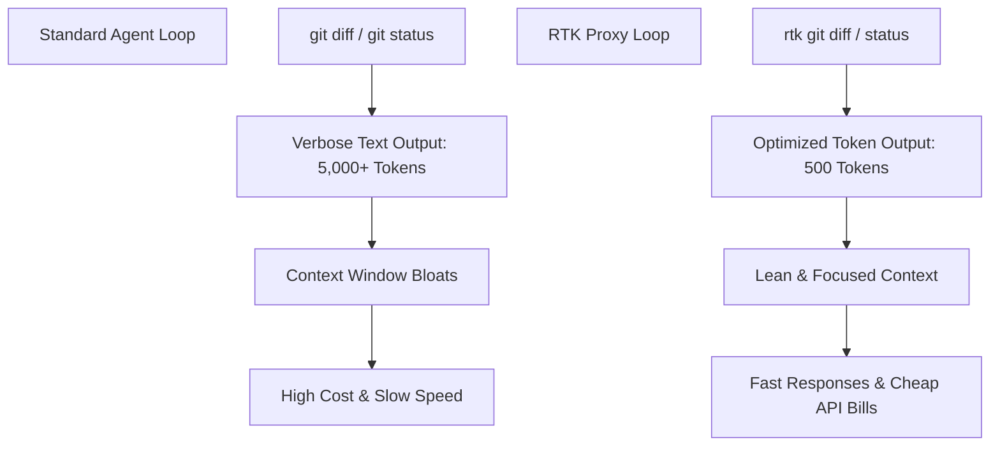

# Claude Code & RTK Token Optimization Guide

> **Version:** 2.0.0 | **Updated:** 2026-05-28
> **Scope:** Integration of RTK (Rust Token Killer) CLI proxy with Claude Code for 60-90% token savings during development cycles.

---

## 1. The Token Bloat Problem in Agentic Loops

Claude Code operates as an autonomous agent, making repeated round-trips to the Anthropic API. Every single filesystem read, git status check, or test execution appends verbose logs, formatting markers, and redundant workspace structure to the conversational memory.



Without filtering, typical developer operations consume substantial tokens:
*   A raw `git diff` on a mid-sized branch can easily consume **5,000 to 15,000 tokens** due to boilerplate modifications and irrelevant chunks.
*   Running a test suite with detailed tracebacks adds repetitive standard library stack frames.

---

## 2. RTK (Rust Token Killer) Architecture

**RTK** acts as a lightweight CLI proxy layer inserted between your terminal execution engine (like Claude Code's shell execution tool) and the underlying OS shell. It intercepts command requests and applies advanced AST, syntax, and diff parsing to strip away informational noise before the output is returned to Claude Code.

### Key Optimization Mechanisms:
1.  **AST-Based Diff Compression**: Strips unmodified code lines from git diffs, retaining only high-significance modified hunks and import contexts.
2.  **Repetitive Noise Elimination**: Condenses repeating trace lines, identical compiler warnings, and standard log outputs into numerical frequencies (e.g., `[... 45 lines of identical database warnings omitted ...]`).
3.  **Semantic Truncation**: Truncates highly verbose command outputs (like a long `npm install` log) into minimal status confirmations.

---

## 3. Hook-Based Transparent Usage

You do NOT need to manually run `rtk` commands for every dev task. The **Claude Code hook** automatically rewrites target CLI invocations inside the background execution layer:

$$\text{User/Agent Command: } \texttt{git status} \quad\longrightarrow\quad \text{Interception Hook: } \texttt{rtk git status}$$

| Raw Command | Hook Translation | Token Savings | Rationale |
| :--- | :--- | :--- | :--- |
| `git status` | `rtk git status` | ~75% | Removes untracked binary assets and summarizes modifications. |
| `git diff` | `rtk git diff` | ~85% | Filters out unmodified functions and keeps strictly mutated hunks. |
| `git log -n 10` | `rtk git log -n 10`| ~60% | Strips verbose commit details like PGP signatures or system merges. |

---

## 4. Meta Command Reference

For advanced operations, diagnostics, and debugging, use the direct `rtk` meta-commands:

### 1. `rtk gain`
Analyzes your current session and displays token savings analytics.
```bash
rtk gain
```
*Output includes total saved tokens, API cost reductions in USD, and a breakdown of savings per tool category.*

### 2. `rtk gain --history`
Shows a chronological command history log accompanied by their respective compression ratios and saved token metrics.
```bash
rtk gain --history
```

### 3. `rtk discover`
Analyzes previous Claude Code execution history in the active workspace to detect missed optimization opportunities or recommend custom filtering rules.
```bash
rtk discover
```

### 4. `rtk proxy <cmd>`
Executes the raw command directly *without* applying any token filters or compression algorithms. Use this command solely for debugging when you suspect RTK is stripping away crucial error data.
```bash
rtk proxy "npm run test"
```

---

## 5. Token Hygiene Rules for Steve's Workspace

When working within this personal AI Skill Lab, always adhere to these rules:

> [!IMPORTANT]
> **Workspace Verification Hook:**
> Before initializing intensive tasks, verify RTK installation by running:
> ```bash
> rtk --version
> ```
> If the command fails or shows a generic Rust tool name collision (e.g., Rust Type Kit), halt immediately and request guidance.

*   **Avoid Raw Log Dumps**: Never dump complete raw logs (like full server logs) directly into files read by Claude. Always route them through an optimized `rtk` filter or truncate them manually.
*   **Compact Promptly**: When a session reaches high complexity, execute the `/compact` slash command to leverage Claude Code's internal context summarizing features alongside RTK's output compression.
*   **Targeted Diff Analysis**: Prefer using specific branch diffs rather than full repo checks. E.g., `git diff master...feature-branch` instead of `git diff`.
