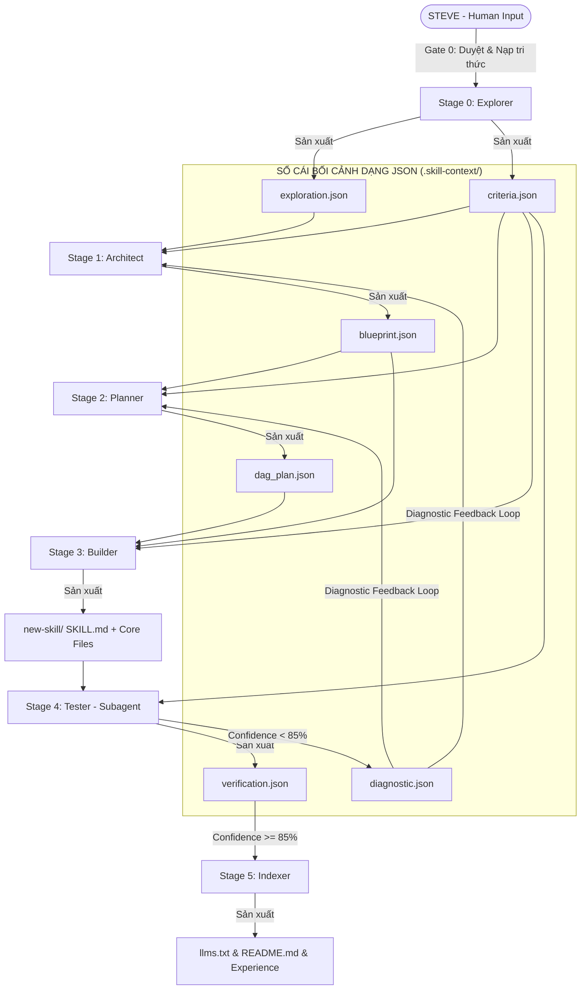

# KIẾN TRÚC TỔNG THỂ NÂNG CẤP: MASTER SKILL SUITE (VER_2.0.0 - CLEAN & SOLID)

Tài liệu này định hình kiến trúc nâng cấp toàn diện cho bộ **Master Skill Suite** từ cấu trúc Ver_0 cũ lên **Ver_2.0.0 (Adaptive & Iron-clad)**. Bản thiết kế tập trung hoàn toàn vào việc thiết lập các nguyên lý cốt lõi, xác định ranh giới trách nhiệm (Bounded Contexts), chuẩn hóa giao thức giao tiếp giữa các thành phần, tối ưu hóa kiến trúc Multi-Agent (Subagents) và đưa ra các tiêu chí thành công rõ rệt của chính bản thiết kế này.

---

## 🎯 1. TIÊU CHÍ THÀNH CÔNG RÕ RỆT CỦA BẢN THIẾT KẾ (DESIGN SUCCESS METRICS)

Để đo lường và xác nhận bản thiết kế Ver_2.0.0 thực sự hoạt động hiệu quả và đạt chất lượng thực chất, hệ thống phải vượt qua 5 chỉ số định lượng sau:

1.  **Chỉ số Không Placeholder Thực chất (Zero Placeholder Integrity - ZPI):** 100% mã nguồn được xây dựng không chứa bất kỳ mock logic rỗng, cấu trúc điều kiện thiếu xử lý hoặc semantic placeholder nào (được quét và kiểm chứng bởi Tester Subagent). **Mật độ đạt 0% tuyệt đối.**
2.  **Tỷ lệ Tự sửa lỗi Thành công (Self-Correction Rate - SCR):** Đạt tối thiểu **80%** tỷ lệ tự động sửa đổi lỗi logic hoặc lỗi biên dịch được phát hiện ở Stage 4 thông qua cơ chế tự rollback khép kín (`diagnostic.json`) mà không cần sự can thiệp của Steve trong tối đa 3 vòng lặp.
3.  **Tỷ lệ Độc lập của Subagent (Subagent Autonomy - SAA):** 100% Tester Subagents chạy hoàn toàn độc lập, không gây tràn log rác về session chính, và truyền nhận bối cảnh thành công qua JSON Specs.
4.  **Độ tin cậy của Kịch bản biên (Edge-Case Coverage - ECC):** Tester Subagent phải tự suy luận và chạy thành công tối thiểu **2 kịch bản biên (Stress-Tests)** nằm ngoài kịch bản mẫu ban đầu, giúp phát hiện lỗi logic ẩn trước khi kỹ năng được xuất xưởng.
5.  **Tốc độ Khám phá Tri thức (Knowledge Retrieval Latency - KRL):** Việc gom nhóm tri thức tránh phân mảnh (SKILL.md làm Dynamic Index) giúp giảm số lượng cuộc gọi công cụ đọc file của AI khi sử dụng kỹ năng mới xuống dưới **3 cuộc gọi**, tăng tốc độ phản hồi và tiết kiệm 60-90% token budget.

---

## 🏛️ 2. NGUYÊN LÝ THIẾT KẾ HỆ THỐNG (CORE PRINCIPLES)

*   **Ranh giới Trách nhiệm Đơn nhất (Single Responsibility Bounded Context):** Mỗi Stage hoạt động như một hộp đen độc lập (Stateless Function). Nó không cần biết Stage trước đã làm việc thế nào, chỉ cần nhận đúng cấu trúc dữ liệu đầu vào chuẩn và sản xuất ra đầu ra chuẩn.
*   **Sổ cái Bối cảnh có Cấu trúc (Structured State Ledger):** Toàn bộ dữ liệu trung gian trong `.skill-context/` được chuyển đổi sang **Structured JSON** đi kèm Schema xác thực nghiêm ngặt để đảm bảo khả năng xử lý tự động chính xác 100%.
*   **Cô lập Môi trường & Đóng gói Ngữ cảnh (Context & Environment Isolation):** Tách biệt hoàn toàn các nhiệm vụ nặng log và rủi ro (kiểm thử, nghiên cứu sâu) thông qua kiến trúc Subagents và Sandbox Docker. Session chính đóng vai trò là Orchestrator/State Manager.
*   **Vòng lặp Phản hồi Tự sửa lỗi (Closed-Loop Diagnostic Feedback):** Thay vì rollback mơ hồ, hệ thống tự động chuyển giao lỗi biên dịch/logic thành chỉ dẫn sửa đổi có cấu trúc cho các giai đoạn thiết kế/lập kế hoạch.

---

## 📦 3. RANH GIỚI TRÁCH NHIỆM & DATA CONTRACTS GIỮA CÁC STAGES

Mỗi Stage được phân định ranh giới trách nhiệm cực kỳ rõ ràng thông qua **Input/Output Contracts (Giao thức đầu vào/đầu ra)**:



### Stage 0: Explorer (The Business & Quality Boundary)
*   **Trách nhiệm:** Định hình bài toán nghiệp vụ, phân tích rủi ro kỹ thuật (Technical Risks, Prompt Injection, dependencies) và xây dựng bộ tiêu chí nghiệm thu định lượng. Đây là **Gate duy nhất** có sự phê duyệt và định hướng ngữ cảnh trực tiếp từ Steve.
*   **Input Contract:** User Prompt + Personal Knowledge Base (`knowledge/`).
*   **Output Contract:** 
    *   `exploration.json`: Bản đồ nghiệp vụ, phân tích rủi ro chi tiết.
    *   `criteria.json`: Bộ tối thiểu 5 tiêu chí nghiệm thu định lượng và 2 test-cases mẫu (input/output).

### Stage 1: Architect (The Structural Blueprint Boundary)
*   **Trách nhiệm:** Tự động chuyển hóa các yêu cầu và tiêu chí nghiệp vụ thành bản vẽ kiến trúc hệ thống tĩnh (Static Structure - 7 Zones) và động (Dynamic Behavior). Thiết lập Mitigation Map (Ánh xạ rủi ro bảo mật ở Stage 0 sẽ được khắc phục ở Zone nào ở Stage 3).
*   **Input Contract:** `exploration.json` + `criteria.json`.
*   **Output Contract:** 
    *   `blueprint.json`: Sơ đồ thư mục chi tiết (100% ánh xạ tệp vật lý vào 7 Zones), sequence flowcharts, các Interaction Points của người dùng, và kế hoạch khắc phục rủi ro.

### Stage 2: Planner (The DAG Scheduler Boundary)
*   **Trách nhiệm:** Chuyển hóa blueprint kiến trúc tĩnh thành một sơ đồ hướng công việc phi chu kỳ (DAG - Directed Acyclic Graph) nhằm tối ưu hóa luồng phụ thuộc và thứ tự thực thi của Builder.
*   **Input Contract:** `blueprint.json` + `criteria.json`.
*   **Output Contract:**
    *   `dag_plan.json`: Danh sách các task công việc độc lập, ma trận phụ thuộc (blockers), ước lượng tài nguyên và trace tags chính xác về `blueprint.json`.

### Stage 3: Builder (The Implementation Engine)
*   **Trách nhiệm:** Viết code thực chất, tuân thủ nguyên lý Đóng gói Hợp nhất (Unified Layering). Builder bị cấm tuyệt đối việc sửa đè ngược lên `blueprint.json`.
*   **Input Contract:** `dag_plan.json` + `blueprint.json` + `criteria.json`.
*   **Output Contract:**
    *   Thư mục kỹ năng hoàn chỉnh: `SKILL.md` (Mục Lục Động từ 500-1000 tokens) liên kết đến tối đa **3 file tri thức cốt lõi** (`policy/guidelines.yaml`, `knowledge/concepts.md`, `scripts/tools.py`). Triệt tiêu hoàn toàn mã nguồn giả (placeholders, mock rỗng).

### Stage 4: Tester (The Verification Sandbox & Oracle)
*   **Trách nhiệm:** Spawn một Subagent chạy độc lập trong Docker Sandbox (gVisor) để kiểm thử mã nguồn. Tester tự động sinh thêm **tối thiểu 2 kịch bản biên (Edge Cases / Stress Tests)** độc lập để tra tấn mã nguồn. Tính toán toán học chỉ số tự tin thực chất.
*   **Input Contract:** `criteria.json` + Mã nguồn kỹ năng vừa build.
*   **Output Contract:**
    *   `verification.json`: Kết quả test chi tiết, tỉ lệ test pass, điểm Semantic Placeholder Density, chỉ số tự tin CASE.
    *   `diagnostic.json`: Báo cáo chẩn đoán lỗi chi tiết khi chỉ số tự tin < 85%.

### Stage 5: Indexer (The Packaging & Distiller Boundary)
*   **Trách nhiệm:** Đóng gói kỹ năng, cập nhật `llms.txt`, tự động sinh tài liệu sử dụng nhanh (`README.md`) có kèm ví dụ Good/Bad thực tế. Tự động trích xuất tri thức, sự cố thu hoạch được từ sandbox ghi ngược lại `knowledge/experience/` theo định dạng standards.md.
*   **Input Contract:** `verification.json` + Mã nguồn kỹ năng.
*   **Output Contract:** README.md + cập nhật `llms.txt` + `knowledge/experience/{skill-name}.md`.

---

## 🛠️ 4. TÍNH MÔ-ĐUN HÓA (MODULARITY) & LINH HOẠT ĐỘNG (DYNAMIC FLEXIBILITY)

Bản thiết kế Ver_2.0.0 phá vỡ sự cứng nhắc của mô hình thác nước truyền thống bằng các đặc tính động và khả năng cô lập mô-đun cao độ:

### 4.1. Mô-đun hóa Độc lập (Loose Coupling)
*   Mỗi Stage được đóng gói thành một mô-đun chức năng tự trị. Các mô-đun giao tiếp thông qua API/Structured JSON ổn định.
*   **Khả năng Chạy Độc lập:** Có thể chạy riêng biệt Stage 4 (Tester Subagent) để kiểm định một kỹ năng viết tay bất kỳ bằng cách cung cấp tệp `criteria.json` bên ngoài. Tương tự, có thể chạy Stage 5 (Indexer) độc lập để đăng ký và trích xuất tri thức từ một báo cáo kiểm thử có sẵn mà không cần đi qua các giai đoạn Architect hay Builder.

### 4.2. Định tuyến Pipeline Linh hoạt (Dynamic Re-routing)
*   **Bypass thông minh:** Hệ thống phân tích sự thay đổi (Context Diff). Nếu Steve chỉ yêu cầu tinh chỉnh một tài liệu tri thức nhỏ hoặc sửa một lỗi cú pháp trong một kỹ năng đang chạy, hệ thống sẽ tự động bỏ qua Stage 0 (Explorer) và Stage 1 (Architect), đi thẳng từ Stage 2 hoặc Stage 3 để tiết kiệm token và thời gian.
*   **Phản hồi động thông minh (Dynamic Re-routing on Failure):** Khi phát hiện lỗi ở Stage 4 (Tester), hệ thống tự động phân loại lỗi để re-route về stage phù hợp:
    *   *Lỗi Logic/Thuật toán:* Re-route trực tiếp về Stage 3 (Builder) để viết lại hàm lỗi.
    *   *Lỗi Cấu trúc/Thiếu file/Sai Zone:* Re-route ngược về Stage 1 (Architect) để thiết kế lại bản vẽ 7 Zones.

---

## 🤖 5. KIẾN TRÚC MULTI-AGENT & GIAO THỨC ĐÓNG GÓI NGỮ CẢNH

Để tối ưu hóa tài nguyên và cửa sổ ngữ cảnh, hệ thống phân bổ rõ ràng nhiệm vụ cho các Subagents:

```text
[Main Session (State Manager & Orchestrator)]
      │
      ├─► Lọc bỏ nhiễu và logs rác (Noise Erasure)
      ├─► Đóng gói Context Package (L0 Anchor + JSON Specs)
      │
      ▼
[Subagent Session (Task-Specific Specialist)]
      │
      ├─► Tự động hóa Sandbox (Docker/gVisor)
      ├─► Tạo kịch bản kiểm thử độc lập / Nghiên cứu sâu
      │
      ▼
[Structured Result (JSON)] ──► Báo cáo gọn nhẹ về Main Session
```

*   **Tester Subagent (Sandbox Executor):**
    *   *Ngữ cảnh nạp (Context Package):* Chỉ nạp `criteria.json` + Thư mục mã nguồn vừa build + file chỉ dẫn `tester_rules.yaml`. Tuyệt đối không nạp toàn bộ lịch sử thiết kế để bảo vệ cửa sổ ngữ cảnh và chống Prompt Injection.
    *   *Sản phẩm trả về:* `verification.json` hoặc `diagnostic.json` (Structured JSON).

---

## 🔄 6. GIAO THỨC CHẨN ĐOÁN VÀ VÒNG LẶP PHỤC HỒI KHÉP KÍN (CASE RECOVERY)

Khi Tester phát hiện mã nguồn không đạt chuẩn chất lượng thực chất (chỉ số tự tin calculated < 85%), hệ thống sẽ tự động kích hoạt vòng lặp tự sửa lỗi khép kín thay vì dừng đột ngột:

```yaml
case_closed_loop:
  triggers:
    confidence_score: "< 85%"
  diagnostic_contract:
    fields:
      failed_test_case_id: "ID kịch bản kiểm thử bị tạch"
      error_category: "LogicError | CompilationError | SemanticPlaceholderError | SecurityViolation"
      target_file_line: "Đường dẫn tệp vật lý + số dòng bị phát hiện lỗi"
      error_stdout: "Traceback hoặc log lỗi chi tiết từ Sandbox"
      suggested_mitigation: "Gợi ý sửa đổi kỹ thuật của Tester"
  rollback_action:
    - "Tester sinh tệp diagnostic.json lưu vào .skill-context/{skill-name}/"
    - "Gửi tín hiệu chẩn đoán về Stage 1 (Architect) hoặc Stage 2 (Planner)"
    - "Stage 1/2 tự động đọc diagnostic.json, cập nhật lại thiết kế/kế hoạch và chuyển giao cho Builder viết lại code"
```

---

## 📚 7. QUẢN LÝ VÀ SỬ DỤNG SKILL SAU KHI BUILD (POST-BUILD LIFECYCLE)

Sau khi một kỹ năng được xây dựng và kiểm thử thành công, quy trình quản lý và đưa vào vận hành thực tế phải cực kỳ rõ ràng và an toàn:

### 7.1. Giao thức Đăng ký Vòng đời Tự động (Automated Registry)
*   Stage 5 (Indexer) tự động cập nhật kỹ năng mới vào tệp sổ cái trung tâm: `.skill-context/registry/README.md` và `llms.txt`.
*   Mỗi kỹ năng được định danh rõ ràng bởi: Version, Ngày kích hoạt, Độ tự tin thực chất khi kiểm thử Sandbox, và Capability Map (Danh sách các tác vụ có thể giải quyết).

### 7.2. Đồng bộ Runtime An toàn (Atomic Staging Swap Protocol)
*   Indexer không chép đè trực tiếp lên thư mục runtime đang chạy (`.hermes/skills/` hoặc `.claude/skills/`).
*   **Atomic Swap:**
    1.  Indexer tạo một bản cài đặt tạm thời (Staging) tại `.hermes/skills/.staging/{skill-name}/`.
    2.  Kích hoạt một dry-run test độc lập tại môi trường staging.
    3.  Nếu vượt qua, thực hiện hoán đổi nguyên tử (atomic swap/mv) thư mục staging thành production runtime. Đảm bảo an toàn tuyệt đối, không gây crash cho các agent đang hoạt động trong session chính.

### 7.3. Giao thức Kích hoạt Tri thức Động theo Nhu cầu (On-Demand Activation)
*   Khi một AI agent khác đọc `SKILL.md` của kỹ năng mới:
    *   `SKILL.md` đóng vai trò là **L0 Anchor (Mục lục Động)**, chỉ chứa metadata kích hoạt (`when_to_use`) và các markdown links tuyệt đối dẫn tới các file tri thức thành phần.
    *   AI agent sẽ chỉ nạp và đọc đúng tệp tri thức cần thiết (`policy/guidelines.yaml` hoặc `knowledge/concepts.md`) tương ứng với tác vụ hiện tại, thay vì đọc toàn bộ thư mục. Giữ session sạch sẽ và tiết kiệm 60-90% token budget.

---

## 📚 8. GIAO THỨC CHUYỂN HÓA TRI THỨC TỰ HỌC (SELF-LEARNING)

```yaml
knowledge_distiller_protocol:
  trigger: "Stage 5 Indexer khởi chạy thành công sau khi Stage 4 đạt PASS"
  input_sources:
    - ".skill-context/{skill-name}/verification.json"
    - "Sandbox execution logs"
    - "Developer manual adjustments during dry-run"
  distillation_rules:
    - "Trích xuất bài học kinh nghiệm từ các Edge Cases đã vượt qua ở Stage 4"
    - "Mã hóa các bài học này theo cấu trúc chuẩn standards.md của Steve"
    - "Định dạng:"
        markdown: "Giải thích kiến trúc và hiện tượng logic"
        yaml: "Các ràng buộc cứng (constraints, must, must_not) được rút ra"
        xml_tags: "Các ví dụ Good/Bad minh họa thực tế"
  persistence:
    path: "knowledge/experience/{skill-name}.md"
    registration: "Tự động đăng ký tệp tri thức mới vào knowledge/README.md để các lượt chạy sau của Suite tự động nạp làm dữ liệu tham chiếu"
```
