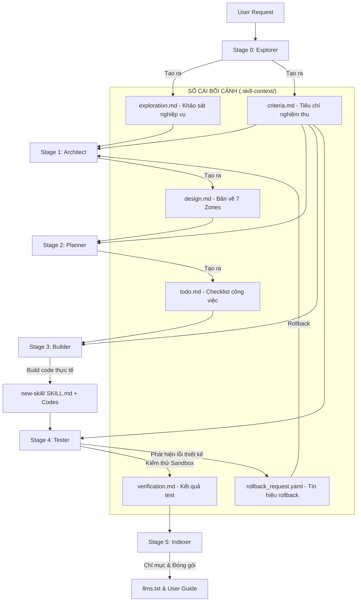

# KIẾN TRÚC TỔNG THỂ NÂNG CẤP: MASTER SKILL SUITE (VER_1.0.0)

Tài liệu này định hình kiến trúc nâng cấp toàn diện cho bộ **Master Skill Suite** từ cấu trúc Ver_0 cũ lên **Ver_1.0.0 (Production-Ready)**, tích hợp triết lý kiểm soát **CASE** (Confidence-Aware Skill Execution) và định dạng chuẩn hóa **LLM Knowledge Activation**.

---

## 1. THAM CHIẾU VÀ ĐÁNH GIÁ SO VỚI BẢN KIẾN TRÚC GỐC

<context>
Kiến trúc gốc tại `standards.md` và `architure.md` (v2.0) đã thiết lập nền tảng lý thuyết vững chắc về:
- **3 Trụ cột**: Tri thức (Knowledge), Quy trình (Logic), Kiểm soát (Guardrails/Loop).
- **7 Vùng chức năng (Zones)**: core (`SKILL.md`), `knowledge/`, `scripts/`, `templates/`, `data/`, `loop/`, `assets/`.
- **Vòng lặp kiểm soát chất lượng**: Checklist tự nghiệm thu.
</context>

### Những nâng cấp, bổ sung thực tế ở Ver_1.0.0:
Tuy nhiên, phiên bản gốc chỉ định nghĩa cấu trúc của **một kỹ năng đơn lẻ**, chưa có chỉ dẫn rõ ràng về cách **hợp tác liên kết giữa một bộ kỹ năng (Suite)** trong môi trường Agent stateless (nơi mỗi stage là một session độc lập). 

Ver_1.0.0 bổ sung các thành phần sống còn sau:

1. **Phân rã chuỗi cung ứng kỹ năng (Pipeline Decompression)**:
   - Tách biệt hoàn toàn thành 6 Giai đoạn chuyên môn hóa sâu để tránh cạn kiệt token và loãng chất lượng.
2. **Sổ cái bối cảnh (Context Ledger - Hồ sơ trung gian)**:
   - Các file trung gian được ghi trực tiếp vào `.skill-context/{skill-name}/` hoạt động như bộ nhớ trạng thái (persistent state ledger).
3. **Bản đồ Liên kết Bối cảnh & Tiêu chí Chất lượng (`criteria.md`)**:
   - Giai đoạn 0 (Explorer) giờ đây bắt buộc phải phân tích và sinh ra file tiêu chí nghiệm thu định lượng `.skill-context/{skill-name}/criteria.md` để hạ nguồn (Architect, Planner, Builder, Tester) đối chiếu và thực thi.
4. **Giai đoạn Kiểm thử Sandbox (Stage 4: Tester)**:
   - Chạy thử nghiệm mã nguồn trong Sandbox gVisor cô lập dựa trên đúng 2+ kịch bản test-cases mẫu định sẵn trong `criteria.md`, sinh ra tệp `verification.md` để quyết định nghiệm thu **PASS/FAIL** với mật độ placeholder = 0.
5. **Giai đoạn Đóng gói & Chỉ mục (Stage 5: Indexer)**:
   - Tự động hóa khâu viết hướng dẫn tích hợp nhanh (User Manual) và đồng bộ kỹ năng mới vào `llms.txt`.
6. **Tích hợp Hệ Thống CASE (Confidence-Aware)**:
   - Cơ chế phòng ngừa lỗi (PREVENT), phát hiện sớm (DETECT) và tự phục hồi/rollback khi gặp lỗi nghiêm trọng (RECOVER).

---

## 2. BẢN THIẾT KẾ CHI TIẾT VÀ QUY HOẠCH ZONE GIAO TIẾP

Sổ cái bối cảnh `.skill-context/{skill-name}/` được phân chia thành các vùng thông tin có cấu trúc nghiêm ngặt để đảm bảo tính an toàn dữ liệu và tối ưu hóa Token Budget:



Cấu hình chi tiết bối cảnh nạp theo nhu cầu (Progressive Disclosure) để tối ưu hóa Token Budget cho từng Agent:

```yaml
progressive_disclosure_policy:
  stage_0_explorer:
    load_always: ["standards.md", "exploration-standards.md"]
    target_write: ["exploration.md", "criteria.md"]
    token_budget: 800
  stage_1_architect:
    load_always: ["criteria.md"]
    load_on_demand: ["exploration.md"]
    target_write: ["design.md"]
    token_budget: 1200
  stage_2_planner:
    load_always: ["criteria.md"]
    load_on_demand: ["design.md"] # Chỉ nạp §2 Capability Map & §3 Zone Mapping để lập todo
    target_write: ["todo.md"]
    token_budget: 1000
  stage_3_builder:
    load_always: ["todo.md", "criteria.md"]
    load_on_demand: ["design.md"]
    target_write: ["SKILL.md", "src_code"]
    token_budget: 2000
  stage_4_tester:
    load_always: ["criteria.md"]
    load_on_demand: ["SKILL.md", "src_code"]
    target_write: ["verification.md"]
    token_budget: 1500
  stage_5_indexer:
    load_always: ["verification.md"]
    target_write: ["README.md", "llms.txt"]
    token_budget: 800
```

---

## 3. KHUNG TIÊU CHÍ CHẤP NHẬN ĐẦU RA (ACCEPTANCE MATRIX)

<instructions>
Mỗi giai đoạn phát triển bắt buộc phải vượt qua bộ chốt chặn chất lượng phân cấp dưới đây. Tuyệt đối KHÔNG BÀN GIAO nếu sản phẩm thuộc dải kiểm định [ ❌ BAD ].
</instructions>

```yaml
acceptance_matrix:
  stage_0_explorer:
    bad:
      - "Không làm rõ được tối thiểu 3 rủi ro kỹ thuật hoặc điểm mù bảo mật của kỹ năng"
      - "Tệp criteria.md trống hoặc chỉ mô tả định tính chung chung, thiếu test cases rõ ràng"
    good:
      - "Có tối thiểu 5 tiêu chí nghiệm thu rõ ràng và 2 kịch bản test-case định lượng cụ thể"
      - "Vượt qua schema_validator.py đối chiếu với exploration.schema.yaml"
    premium:
      - "Phân tích chi tiết rủi ro Prompt Injection đặc thù của task nghiệp vụ"
      - "Sinh sẵn bộ dữ liệu mẫu (mock inputs/outputs) chất lượng cao để chạy tự động ở Stage 4"

  stage_1_architect:
    bad:
      - "Sử dụng tên file giả định (placeholders như file1.py, script_new.sh) trong bản thiết kế"
      - "Thiếu sơ đồ Mermaid mô tả cấu trúc thư mục hoặc luồng tuần tự sequence logic"
      - "Không thiết lập các Interaction Points (Điểm dừng tương tác) bắt buộc với người dùng"
    good:
      - "Chỉ định chính xác 100% tên file vật lý và ánh xạ khớp hoàn hảo vào 7 Zones"
      - "Có đầy đủ sơ đồ folder structure và sequence flowchart"
    premium:
      - "Thiết kế chi tiết giao thức Rollback tự động phục hồi trạng thái khi gặp lỗi"
      - "Có bảng mapping chi tiết: Từng rủi ro bảo mật ở Stage 0 được khắc phục ở Zone nào ở Stage 3"

  stage_2_planner:
    bad:
      - "Checklist công việc mơ hồ, không thể triển khai lập trình (ví dụ: 'Code chức năng chính')"
      - "Thiếu hoặc ghi sai định dạng trace tags quy định"
      - "Sắp xếp tasks phi logic (ví dụ: viết logic trước khi tạo file tri thức hoặc cấu hình data)"
    good:
      - "100% các task kết thúc bằng trace tags hợp lệ: [TỪ DESIGN §N] hoặc [TỪ AUDIT TÀI NGUYÊN]"
      - "Phân tách rõ ràng Phase 0: Resource Preparation cho các tài liệu tri thức còn mỏng"
    premium:
      - "Xây dựng ma trận blocker và biểu đồ phụ thuộc công việc (DAG), ước lượng Est. Hours chuẩn"
      - "Tích hợp script tự động kiểm tra cú pháp và tính đồng nhất của todo.md"

  stage_3_builder:
    bad:
      - "Mã nguồn chứa code giả, ghi chú trì hoãn hoặc placeholders (// TODO, pass, mock())"
      - "Tệp điều hướng cốt lõi SKILL.md phình to quá 700 tokens, vi phạm chuẩn layering"
      - "Tự ý thay đổi ngược tệp thiết kế design.md gây xung đột bối cảnh hệ thống"
    good:
      - "100% code hoạt động thực tế, không chứa bất kỳ placeholder nào"
      - "SKILL.md đạt chuẩn YAML frontmatter, token budget L0 < 700 tokens, chia nhỏ logic dài dòng sang policy/ và knowledge/"
    premium:
      - "SKILL.md cực kỳ tinh gọn (< 400 tokens), hoạt động như một L0 Anchor Rule thuần khiết"
      - "Bàn giao mã nguồn kèm theo các tệp unit test chất lượng cao chạy ổn định"

  stage_4_tester:
    bad:
      - "AI tự đọc mã nguồn rồi tự xác nhận Pass mà không chạy script kiểm thử thực tế"
      - "Bỏ qua các cảnh báo kiểm tra lỗi Placeholder density (> 0)"
    good:
      - "Chạy thành công 100% kịch bản kiểm thử quy định trong criteria.md bên trong Sandbox Docker biệt lập"
      - "Mật độ placeholder density bằng 0 điểm tuyệt đối"
    premium:
      - "Tích hợp tự động kiểm thử hiệu năng, độ trễ và khả năng phòng thủ prompt injection"
      - "Tự động kích hoạt rollback và phát tín hiệu khôi phục khi phát hiện lỗi"

  stage_5_indexer:
    bad:
      - "Không viết tài liệu sử dụng nhanh hoặc viết hời hợt, thiếu ví dụ thực tế"
      - "Quên đăng ký kỹ năng mới vào chỉ mục hệ thống llms.txt"
    good:
      - "README.md đầy đủ cấu trúc, có ví dụ Good/Bad thực tế và hướng dẫn tích hợp chi tiết"
      - "Kỹ năng được đăng ký thành công vào llms.txt và skills/AGENTS.md"
    premium:
      - "Tài liệu vận hành có sơ đồ Mermaid giải thích cách tích hợp nhanh và các cổng API liên quan"
      - "Tự động đồng bộ hóa thông báo hoạt động sang Slack hoặc Terminal của nhà phát triển"
```

---

## 4. GIAO THỨC PHỤC HỒI & TỰ CỨU HỘ CASE (CASE RECOVERY PROTOCOL)

Khi một AI Agent ở hạ nguồn phát hiện lỗi nghiêm trọng hoặc độ tự tin giảm mạnh, giao thức tự phục hồi của CASE System sẽ được áp dụng:

```yaml
case_recovery_system:
  triggers:
    confidence_threshold: "< 70%"
    validation_status: "FAIL"
    compilation_error: "TRUE"
    
  rollback_procedure:
    step_1_create_signal:
      action: "Tạo file rollback_request.yaml tại .skill-context/{skill-name}/"
      properties:
        origin_stage: "Stage phát hiện lỗi"
        target_stage: "Stage cần sửa đổi (thường là Stage 1 hoặc Stage 0)"
        error_context: "Mô tả chi tiết lỗi phát hiện và đề xuất khắc phục"
        timestamp: "ISO_DATETIME"
        
    step_2_archive_state:
      action: "Nén toàn bộ thư mục bối cảnh lỗi hiện tại lưu trữ vào .skill-context/{skill-name}/archive/"
      
    step_3_update_status:
      action: "Cập nhật trường status trong metadata sang PENDING_ROLLBACK"
      
    step_4_halt_and_notify:
      action: "Dừng phiên làm việc, báo cáo rõ lỗi cho Nhà phát triển (User) và yêu cầu AI Agent giai đoạn trước khởi động lại để xử lý rollback_request.yaml"
```

```yaml
staleness_policy:
  check_interval: "Thực hiện tại mỗi Boot Sequence"
  rules:
    fresh:
      condition: "Khoảng cách thời gian sửa đổi cuối cùng < 7 ngày"
      action: "Tiếp tục chạy bình thường từ checkpoint gần nhất"
    warning:
      condition: "Khoảng cách thời gian sửa đổi cuối cùng từ 7 - 30 ngày"
      action: "Cảnh báo người dùng về nguy cơ mất ngữ cảnh, yêu cầu AI review lại todo.md trước khi chạy"
    force_fresh:
      condition: "Khoảng cách thời gian sửa đổi cuối cùng > 30 ngày"
      action: "Bắt buộc hủy bỏ checkpoint cũ và khởi động lại Pipeline từ Stage 0 để đảm bảo tính an toàn"
```
