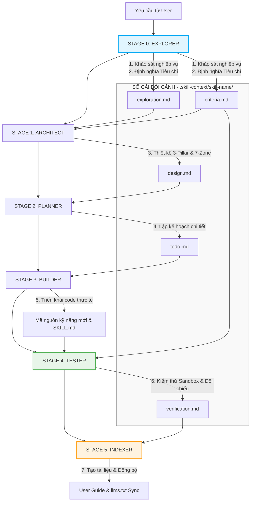

# KIẾN TRÚC TỔNG THỂ: MASTER SKILL SUITE (VER_1.0.0)

Tài liệu này xác lập kiến trúc tổng thế cải tổ toàn diện bộ **Master Skill Suite** từ Ver_0 lên **Ver_1.0.0 (Production-Ready)**. Thiết kế này được xây dựng nhằm giải quyết triệt để các vấn đề nghiêm trọng của phiên bản cũ, hướng tới một hệ thống thương mại hóa có độ tin cậy tuyệt đối, tự kiểm thử và tự vận hành đồng bộ.

---

## PHẦN 1: XÁC THỰC VÀ ĐÁNH GIÁ CÁC VẤN ĐỀ CỦA PHIÊN BẢN CŨ (VER_0)

Dựa trên phản hồi của người dùng và kết quả thẩm định kỹ thuật, chúng tôi xác nhận **100% các vấn đề người dùng đề cập là hoàn toàn chính xác, cực kỳ sâu sắc và là những điều kiện tiên quyết** để hệ thống có thể chạy ổn định trên thực tế:

1. **Explorer bị quá tải (Monolithic Explorer)**: 
   * *Đánh giá*: Đúng. Trong Ver_0, Explorer phải gánh vác từ phân tích Intent, chấm điểm SCS, đánh giá bảo mật đến cào tài nguyên. Điều này làm cạn kiệt Token Budget (gây Out-of-Token) và làm loãng chất lượng phân tích.
   * *Giải pháp*: Tinh gọn Explorer chỉ tập trung vào khảo sát nghiệp vụ và bắt buộc sinh ra **Bộ tiêu chí đánh giá chất lượng sản phẩm đầu ra (`criteria.md`)** làm gốc cho toàn bộ pipeline.
2. **Thiếu sự khớp nối bối cảnh giữa các Session độc lập (Stateless Desynchronization)**:
   * *Đánh giá*: Đúng. Khi mỗi giai đoạn là một session chat độc lập, AI sẽ bị "mất trí nhớ" nếu không có tài liệu trung gian chuẩn hóa làm cầu nối.
   * *Giải pháp*: Thiết lập **Vùng hồ sơ bối cảnh chung (`.skill-context/{skill-name}/`)** đóng vai trò là "Context Ledger" (Sổ cái bối cảnh) chứa các tài liệu có cấu trúc nghiêm ngặt để các Stage đọc hiểu lẫn nhau mà không cần lịch sử chat.
3. **Thiếu bước Kiểm định thực tế (Missing Testing/Validation Stage)**:
   * *Đánh giá*: Đúng. Ver_0 bàn giao mã nguồn ngay sau khi Build mà không chạy thử nghiệm. Điều này dẫn đến các lỗi cú pháp, thiếu file, hoặc code placeholder (`// TODO`) bị lọt vào production.
   * *Giải pháp*: Bổ sung **Stage 4: Tester & Validator** độc lập, thực thi mã nguồn trong môi trường Sandbox cô lập và đối chiếu trực tiếp với `criteria.md`.
4. **Thiếu khâu Quản lý và Hướng dẫn vận hành (Missing Index/Documentation Stage)**:
   * *Đánh giá*: Đúng. Khi số lượng micro-skills tăng lên, việc thiếu một cổng chỉ mục và hướng dẫn tích hợp khiến nhà phát triển không thể quản lý và tái sử dụng.
   * *Giải pháp*: Bổ sung **Stage 5: Indexer & Documenter** tự động sinh cẩm nang vận hành và đồng bộ hóa mục lục kỹ năng (`llms.txt`).

---

## PHẦN 2: KIẾN TRÚC MÔ HÌNH 6-STAGE LIFECYCLE

Hệ thống được tái cấu trúc thành một chuỗi cung ứng kỹ năng khép kín gồm **6 giai đoạn chuyên biệt**:

---

## PHẦN 3: CHI TIẾT TỪNG GIAI ĐOẠN, TRIỂN KHAI & TIÊU CHÍ HOÀN THÀNH (GATE RULES)

Mỗi giai đoạn hoạt động như một bộ xử lý độc lập có **Đầu vào (Input) -> Thực thi (Action) -> Đầu ra (Output) -> Tiêu chí Hoàn thành (Validation Gates)** nghiêm ngặt.

### STAGE 0: EXPLORER & SPECIFIER (Khảo sát & Định nghĩa Tiêu chí)
* **Vai trò**: Nghiên cứu miền tri thức, phân tích yêu cầu nghiệp vụ của người dùng, xác định các điểm mù công nghệ và thiết lập bộ khung chất lượng đầu ra.
* **Đầu vào**: Yêu cầu thô từ người dùng, tài nguyên dự án hiện tại.
* **Tài liệu sinh ra**:
  1. `.skill-context/{skill-name}/exploration.md` (Báo cáo khảo sát).
  2. `.skill-context/{skill-name}/criteria.md` (Bảng tiêu chí đánh giá & Kịch bản kiểm thử mẫu).
* **Tiêu chí Hoàn thành (Gate Criteria)**:
  - [ ] Báo cáo `exploration.md` phải làm rõ 3 điểm mù (blind spots) của AI đối với kỹ năng này.
  - [ ] Bảng `criteria.md` phải định lượng tối thiểu 5 tiêu chí chất lượng (ví dụ: kích thước token, bảo mật sandbox, định dạng bắt buộc) và ít nhất 2 kịch bản kiểm thử (test cases) cụ thể.
  - [ ] Chạy qua schema validator để đảm bảo cấu trúc YAML/Markdown của các file đầu ra không bị lỗi cú pháp.

### STAGE 1: ARCHITECT (Thiết kế Kiến trúc)
* **Vai trò**: Chuyển hóa nghiệp vụ và tiêu chí từ Stage 0 thành sơ đồ kỹ thuật chi tiết theo triết lý **3 Trụ cột (Tri thức, Quy trình, Kiểm soát)** và phân phối vào **7 Vùng chức năng (Zones)**.
* **Đầu vào**: `exploration.md` và `criteria.md` từ Stage 0.
* **Tài liệu sinh ra**:
  - `.skill-context/{skill-name}/design.md` (Thiết kế kỹ thuật hoàn chỉnh gồm sơ đồ Mermaid Flowchart và Sequence).
* **Tiêu chí Hoàn thành (Gate Criteria)**:
  - [ ] Thiết kế `design.md` phải map chính xác 100% các file cần tạo vào 7 Zones mà không sử dụng tên file giả định (placeholders).
  - [ ] Phải thiết lập rõ ràng các điểm dừng tương tác (Interaction Points) với người dùng khi tự chủ giảm xuống dưới 70%.
  - [ ] Đạt điểm phê duyệt thiết kế từ người dùng (User Signed-off) trước khi chuyển giai đoạn.

### STAGE 2: PLANNER (Lập Kế hoạch Thực thi)
* **Vai trò**: Phân rã kiến trúc `design.md` thành một danh sách công việc (Todo List) có thứ tự logic khoa học, quản lý phụ thuộc (dependencies) và theo dõi tiến độ.
* **Đầu vào**: `design.md` từ Stage 1.
* **Tài liệu sinh ra**:
  - `.skill-context/{skill-name}/todo.md` (Danh sách nhiệm vụ chi tiết).
* **Tiêu chí Hoàn thành (Gate Criteria)**:
  - [ ] Từng đầu việc trong `todo.md` phải có mã ánh xạ ngược về vùng cấu trúc trong thiết kế (Ví dụ: `[ ] (Zone: knowledge) Tạo tệp standards.md`).
  - [ ] Sắp xếp thứ tự thực thi hợp lý: Các file tri thức (Knowledge) và cấu hình (Data) phải được tạo trước khi viết core logic (`SKILL.md`).

### STAGE 3: BUILDER (Thực thi & Xây dựng)
* **Vai trò**: Hiện thực hóa kế hoạch `todo.md` bằng cách viết code thực tế, cấu hình dữ liệu, xây dựng kịch bản kiểm soát chất lượng tại thư mục đích.
* **Đầu vào**: `todo.md` từ Stage 2, các tài liệu thiết kế bổ trợ.
* **Sản phẩm sinh ra**:
  - Mã nguồn hoàn chỉnh của kỹ năng mới tại thư mục đích (Ví dụ: `skills/rebuild/{new-skill}/`).
  - Tệp điều hướng cốt lõi `{new-skill}/SKILL.md`.
* **Tiêu chí Hoàn thành (Gate Criteria)**:
  - [ ] Hoàn thành 100% các đầu việc được đánh dấu trong `todo.md`.
  - [ ] Không tồn tại bất kỳ đoạn mã placeholder nào (ví dụ: `// TODO`, `pass`, `mock_function()`).
  - [ ] Vượt qua vòng kiểm tra cú pháp và định dạng ban đầu của file `SKILL.md` (khớp Frontmatter YAML schema).

### STAGE 4: TESTER & VALIDATOR (Kiểm thử & Nghiệm thu)
* **Vai trò**: Đóng vai trò là chốt chặn chất lượng độc lập. Tiến hành chạy thử nghiệm kỹ năng mới được tạo ra trong Sandbox, đối chiếu sản phẩm thực tế với bảng tiêu chí `criteria.md` của Stage 0.
* **Đầu vào**: Mã nguồn của kỹ năng mới từ Stage 3 và bảng tiêu chí `criteria.md`.
* **Tài liệu sinh ra**:
  - `.skill-context/{skill-name}/verification.md` (Báo cáo kiểm thử chi tiết, ghi nhận kết quả Pass/Fail của từng test case).
* **Tiêu chí Hoàn thành (Gate Criteria)**:
  - [ ] Vượt qua 100% các kịch bản kiểm thử quy định trong `criteria.md`.
  - [ ] Đảm bảo mã nguồn hoạt động an toàn trong môi trường Docker Sandbox cô lập (nếu có script thực thi).
  - [ ] Trạng thái nghiệm thu cuối cùng phải là **PASS** mới được phép chuyển qua giai đoạn đóng gói.

### STAGE 5: INDEXER & DOCUMENTER (Tích hợp & Chỉ mục)
* **Vai trò**: Xuất bản sản phẩm thương mại. Tạo tài liệu hướng dẫn vận hành cho người dùng và đăng ký kỹ năng mới vào hệ thống chỉ mục chung của dự án để đảm bảo tính khám phá (discoverability).
* **Đầu vào**: Mã nguồn đã kiểm thử ổn định và hồ sơ bối cảnh `.skill-context/`.
* **Tài liệu sinh ra**:
  - Hướng dẫn vận hành nhanh (User Manual/README) đặt trực tiếp tại thư mục kỹ năng mới.
  - Cập nhật tệp chỉ mục kỹ năng chung của dự án (`skills/AGENTS.md` hoặc `llms.txt`).
* **Tiêu chí Hoàn thành (Gate Criteria)**:
  - [ ] Tạo thành công tài liệu hướng dẫn có đầy đủ ví dụ thực tế (Good/Bad exemplars) để người dùng dễ tiếp cận.
  - [ ] Kỹ năng mới được định danh và phân loại rõ ràng trong thư mục đích, không gây xung đột namespace.
  - [ ] Phát ra thông báo chính thức: `"STAGE 5 COMPLETE - New Skill is indexed and ready for Production deployment"`.

---

## PHẦN 4: KẾ HOẠCH TRIỂN KHAI CHO BỘ SUITE MỚI (VER_1.0.0)

Chúng tôi sẽ xây dựng bộ suite mới này trực tiếp tại phân vùng phát triển tích cực:
`/home/steve/Work-space/deep_work_by_steve/skills/Update-suite/updated-suite/`

### Kế hoạch hành động cụ thể:
1. **Bước 1**: Tạo cấu trúc thư mục mới tại `updated-suite/` bao gồm:
   - `_shared/knowledge/framework.md` (Định nghĩa chuẩn 6-Stage).
   - `skill-explorer/`, `skill-architect/`, `skill-planner/`, `skill-builder/`, `skill-tester/`, `skill-indexer/`.
2. **Bước 2**: Viết code và tài liệu chỉ dẫn `SKILL.md` chi tiết cho từng giai đoạn, tích hợp sâu cơ chế đọc hiểu tài liệu trung gian lẫn nhau thông qua sổ cái bối cảnh `.skill-context/`.
3. **Bước 3**: Xây dựng kịch bản kiểm thử chéo để chứng minh bộ suite mới tự tạo ra một micro-skill mẫu một cách hoàn mỹ.
