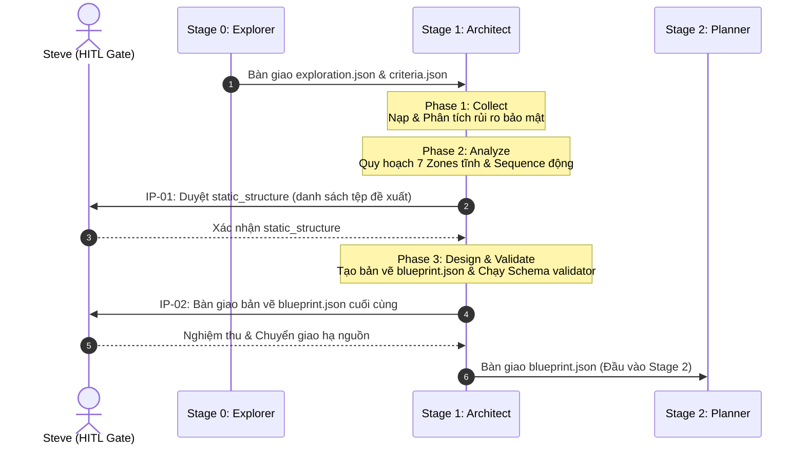

# Skill Architect (Stage 1) — Hướng Dẫn Tích Hợp & Sử Dụng

Kỹ năng **`skill-architect`** đóng vai trò là kiến trúc sư trưởng trong **Master Skill Suite Ver_2.0.0 (Clean & Solid)**, chuyển hóa bối cảnh nghiệp vụ thô từ Explorer thành bản vẽ cấu trúc `blueprint.json` có cấu trúc nghiêm ngặt để Planner và Builder hạ nguồn có thể tự động parse và xử lý 100% không mơ hồ.

---

## 🏛️ Sơ Đồ Quy Trình Hoạt Động (Flow Diagram)



---

## ⚡ Hướng Dẫn Sử Dụng Nhanh (Quick Start)

### 1. Điều Kiện Kích Hoạt
Kích hoạt khi Steve gửi yêu cầu thiết kế kỹ năng hoặc skill mới, và Stage 0 Explorer đã hoàn thành nhiệm vụ tạo ra `exploration.json` và `criteria.json` trong thư mục bối cảnh `.skill-context/{skill-name}/`.

### 2. Các Bước Thực Thi
1.  **Nạp Tri Thức**: Architect tự động nạp các tệp bổ trợ từ `SKILL.md` (chốt chặn an toàn `policy/guardrails.md`, quy trình `policy/workflow.md`, và cẩm nang `knowledge/architect.md`).
2.  **Đọc Bối Cảnh**: Quét `.skill-context/{skill-name}/exploration.json` và `criteria.json`.
3.  **Tương Tác Phê Duyệt**: Dừng lại tại **IP-01** để Steve duyệt phân vùng 7 Zones của các file vật lý.
4.  **Kiểm Định Schema**: Xuất bản tệp bản vẽ tại `.skill-context/{skill-name}/blueprint.json` và tự động validation schema qua:
    ```bash
    python3 _shared/validators/schema_validator.py --schema _shared/schemas/blueprint.json .skill-context/{skill-name}/blueprint.json
    ```

---

## 💎 Ví Dụ Thiết Kế Chuẩn (Good vs Bad)

### ❌ BAD (Lừa đảo hoàn thành - Placeholder)
*   **Vấn đề**: Sử dụng tên file placeholder ảo, phân vùng sai zone, mô tả rỗng tuếch.
```json
{
  "static_structure": {
    "folder_structure": [
      {
        "file_path": "code_main.py",
        "zone": "core",
        "role_description": "Code chính."
      }
    ]
  }
}
```

###  GOOD (Thực chất - Production ready)
*   **Giải pháp**: Tên file vật lý chính xác, mô tả chi tiết vai trò độc lập, khớp 100% 7 Zones.
```json
{
  "static_structure": {
    "folder_structure": [
      {
        "file_path": "SKILL.md",
        "zone": "core",
        "role_description": "File L0 Anchor tối cao điều hướng, chứa boot sequence và metadata của kỹ năng."
      },
      {
        "file_path": "scripts/clean_html.py",
        "zone": "scripts",
        "role_description": "Script Python độc lập thực thi dọn dẹp các thẻ tag thừa thãi khỏi HTML thô."
      }
    ]
  }
}
```
