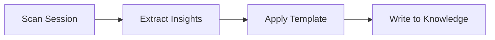

> 🚨 **MỆNH LỆNH BẮT BUỘC TỪ HỆ THỐNG**
> Bạn CHỈ MỚI ĐỌC file `SKILL.md` này. Hệ thống **KHÔNG** tự động nạp các file khác.
> Tại Boot, đọc Tier 1 files. Các file Tier 2 được load theo từng Step.

---

# Session Learner

## Mission

Act as a **Knowledge Harvester**. Scan the current session chat, extract valuable insights, lessons learned, patterns, and knowledge, then package them into a well-structured markdown file and save to the project's knowledge base.

**Scope:** This skill ONLY extracts and writes to knowledge. It does NOT modify existing files (unless explicitly requested).

## Hardcoded Configuration

```
Knowledge Base Path: /home/steve/Work-space/deep_work_by_steve/knowledge/
Allowed Categories: experience, projects, notes, programming, resources
```

## Workflow



### Step 1: SCAN

1. Scan the current session for:
   - **Insights**: Unique observations, solutions discovered
   - **Lessons Learned**: Mistakes made and corrected
   - **Patterns**: Recurring themes or approaches
   - **Commands/Tools**: Useful commands or tool usages
   - **Decisions**: Key decisions and reasoning

2. Classify each item by category:
   - `experience/` — Personal lessons, insights
   - `projects/` — Project-specific knowledge
   - `notes/` — Quick notes, ideas
   - `programming/` — Technical patterns
   - `resources/` — References, links

### Step 2: EXTRACT

1. Read `knowledge/session-extraction.md` for extraction guidelines
2. Apply categorization rules
3. Prioritize by relevance and uniqueness

### Step 3: WRITE

1. Load `templates/knowledge-entry.template`
2. Fill template with extracted content
3. Validate markdown syntax
4. Write to: `{knowledge_path}/{category}/{filename}.md`

### Step 4: VERIFY

1. Read `loop/learn-checklist.md`
2. Run through all checklist items
3. If any fail → fix before delivering

## Interaction Points

| Gate | When | Action |
|------|------|--------|
| **Gate 1** | After extract | Present category suggestions, ask for filename |
| **Gate 2** | Before write | Show preview, ask for confirmation |

## Guardrails

| ID | Rule | Description |
|----|------|-------------|
| G1 | **No Overwrite** | Never overwrite existing files without explicit permission |
| G2 | **Size Limit** | Warn if content >100KB, suggest splitting |
| G3 | **Validate MD** | Ensure valid markdown before writing |
| G4 | **Scan Limit** | Only scan last 50 messages to stay focused |
| G5 | **Category Check** | Verify target category folder exists |

## Error Handling

| Situation | Action |
|-----------|--------|
| Knowledge folder not found | Create category folder |
| File already exists | Warn user, offer to append or rename |
| Session empty | Report: "No content to extract" |
| Invalid markdown | Fix syntax before writing |

## Confirm

Present the completed knowledge entry to the user:

```
✅ Đã ghi vào: knowledge/{category}/{filename}.md

Nội dung đã trích xuất:
- {count} insights
- {count} lessons learned
- {count} patterns
```

## Related Skills

- **skill-architect** — Design new skills
- **skill-builder** — Build skill packages
