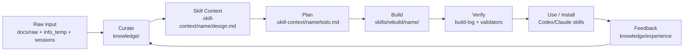

# workspce_tree.md — Phân tích workspace & đề xuất cấu trúc quản lý tri thức/skill

> **Ngày tạo:** 2026-05-09  
> **Trạng thái:** Draft phân tích — cần Steve xác nhận trước khi refactor/move file  
> **Tên file:** giữ đúng yêu cầu `workspce_tree.md` của user. Nếu muốn chuẩn hóa chính tả, có thể tạo/rename thêm `workspace_tree.md` sau.

---

## 1. Mục tiêu mình hiểu từ yêu cầu

Steve đang xây dựng một dự án cá nhân có mục đích:

1. **Tích lũy tri thức cá nhân**: ghi lại kinh nghiệm, notes, project knowledge, tài nguyên, templates.
2. **Chuyển hóa tri thức thành Agent Skill**: dùng knowledge đã tích lũy để rebuild skill cũ hoặc thiết kế skill mới.
3. **Quản lý hệ sinh thái AI agent/prompt/skill**: có agent role prompts, raw skills, rebuilt skills, context thiết kế, tài liệu kiến trúc.
4. **Tạo cấu trúc dễ duy trì**: tránh rối giữa raw input, knowledge đã curate, skill đang thiết kế, skill đã build, và prompt agent.

---

## 2. Evidence từ repository hiện tại

### 2.1 Top-level tree hiện tại

```text
deep_work_by_steve/
├── .omc/
│   ├── sessions/
│   ├── state/
│   └── project-memory.json
├── .skill-context/
│   ├── session-learner/
│   │   ├── design.md
│   │   ├── todo.md
│   │   └── resources/
│   └── spec-generator-redesign/
│       ├── design.md
│       └── todo.md
├── agents/
│   ├── README.md
│   ├── architect.md
│   ├── executor.md
│   ├── planner.md
│   ├── verifier.md
│   └── ... role prompt files
├── docs/
│   ├── raw/
│   │   └── README.md
│   └── rebuild-skill-suite-remediation-guide.md
├── info_temp/
│   ├── data.json
│   ├── data.yaml
│   ├── r.md
│   ├── temp.json
│   ├── temp.md
│   └── temp.yaml
├── knowledge/
│   ├── README.md
│   ├── experience/
│   │   ├── README.md
│   │   └── skill-suite-pipeline-workflow.md
│   ├── notes/
│   ├── programming/
│   │   └── README.md
│   ├── projects/
│   ├── resources/
│   └── templates/
│       └── note_template.md
├── skills/
│   ├── raw/
│   ├── rebuild/
│   ├── skill-architect/
│   └── ui-field-doc/
└── architure.md
```

### 2.2 Các artifact quan trọng đã thấy

| Path | Evidence | Ý nghĩa |
|---|---|---|
| `architure.md` | Có mô hình 3 Pillars, 7 Zones, workflow build skill | Tài liệu nền kiến trúc skill, nhưng tên file bị sai chính tả và nằm root nên dễ bị bỏ sót |
| `knowledge/README.md` | Định nghĩa các vùng `programming`, `experience`, `projects`, `notes`, `resources`, `templates` | Đã có ý tưởng knowledge base nhưng còn mỏng, thiếu index/metadata/ingestion workflow |
| `knowledge/experience/skill-suite-pipeline-workflow.md` | Ghi lại insight về pipeline Architect → Planner → Builder | Đây là ví dụ tốt về tri thức đã được curate |
| `.skill-context/session-learner/design.md` | Skill `session-learner` có design hoàn chỉnh, status COMPLETE | Workspace đã dùng pattern thiết kế skill theo context |
| `.skill-context/session-learner/todo.md` | Có task breakdown, trace tags, Definition of Done | Planner artifact đã tồn tại |
| `.skill-context/spec-generator-redesign/design.md` | Redesign lớn cho `spec-generator` với ambiguity detection, schema validation, phase gates | Có năng lực thiết kế skill phức tạp |
| `.skill-context/spec-generator-redesign/todo.md` | Todo ready for implementation | Có backlog triển khai skill nhưng chưa rõ trạng thái build cuối |
| `skills/rebuild/README.md` | Định nghĩa pipeline `skill-architect → skill-planner → skill-builder` | Đây đang là ứng viên “canonical skill factory” |
| `skills/rebuild/_shared/knowledge/framework.md` | Single source of truth cho 7 Zones, handoff, trace tags, quality gates | Đây là contract nền mạnh nhất hiện có |
| `docs/rebuild-skill-suite-remediation-guide.md` | Ghi rõ mục tiêu portable, dynamic, không hardcode path | Đây là tài liệu remediation quan trọng |
| `skills/raw/skills.yaml` | Registry skill cũ với path `.claude/skills/...` | Hữu ích làm inventory, nhưng còn hardcode theo Claude path |
| `agents/README.md` | Mô tả multi-layer orchestrator agent và constraints subagent | Agent prompt layer đang tồn tại song song với skill layer |
| `info_temp/` | Có file tạm `temp.*`, `data.*`, `r.md` | Đây là vùng scratch chưa có rule dọn dẹp/ingest |
| `.omc/project-memory.json` | Memory nhận diện `agents`, `docs`, `info_temp`, `knowledge`, `skills` | Có memory cũ nhưng chưa phản ánh đầy đủ mục tiêu hiện tại |

---

## 3. Ranked synthesis

| Rank | Nhận định | Confidence | Basis |
|---:|---|---|---|
| 1 | Dự án này thực chất là **Personal AI Skill Lab + Knowledge Base**, không phải app/runtime codebase truyền thống | High | `knowledge/`, `skills/`, `.skill-context/`, `agents/`, `architure.md`, `skills/rebuild/README.md` |
| 2 | `skills/rebuild/` đang là **canonical factory** tốt nhất cho bộ meta-skill Architect → Planner → Builder | High | Có `_shared/knowledge/framework.md`, schemas, validators, fixtures, `skill-architect`, `skill-planner`, `skill-builder` |
| 3 | `.skill-context/` đang là **workspace state cho skill design/planning**, nên nên giữ contract này thay vì đổi tên tùy ý | High | Shared framework định nghĩa `.skill-context/{skill-name}/design.md`, `todo.md`, `build-log.md` |
| 4 | `knowledge/` cần trở thành **curated source of truth**, còn `docs/raw/` + `info_temp/` nên là inbox/scratch | Medium | `knowledge/README.md` đã định nghĩa categories; `docs/raw/README.md` định nghĩa raw intake; `info_temp/` chưa rõ ownership |
| 5 | `agents/` và `skills/` cần registry/handoff rõ hơn để tránh lẫn giữa “role prompt” và “skill package” | Medium | `agents/README.md` mô tả orchestrator/role prompts; `skills/raw/skills.yaml` mô tả skill registry |

---

## 4. Pain points kiến trúc hiện tại

### P1 — Chưa có “source of truth” cho từng loại tri thức

Hiện repo có nhiều vùng chứa tri thức:

- `knowledge/` — curated knowledge.
- `docs/raw/` — raw ideas/designs.
- `info_temp/` — scratch nhưng chưa có rule.
- `.skill-context/` — design/todo cho skill.
- `skills/raw/` — imported/raw skills.
- `skills/rebuild/` — rebuilt/canonical skills.
- `agents/` — agent prompts.

**Inference:** Vấn đề chính không phải thiếu nội dung, mà là thiếu taxonomy + lifecycle để biết “file này đang ở phase nào?”.

### P2 — Raw / draft / canonical / built output đang bị gần nhau quá

`skills/raw/` và `skills/rebuild/` đang cùng nằm dưới `skills/`, nhưng chưa có README top-level giải thích:

- raw là nguồn tham khảo?
- rebuild là bản canonical?
- output skill hoàn chỉnh nên đặt ở đâu?
- khi nào skill được coi là “installed/usable”?

### P3 — `.skill-context/` có design/todo nhưng thiếu build evidence đều đặn

Theo framework, context chuẩn nên có:

```text
.skill-context/{skill-name}/
├── design.md
├── todo.md
├── build-log.md
├── resources/
├── data/
└── loop/
```

Hiện `session-learner` và `spec-generator-redesign` có `design.md` + `todo.md`, nhưng chưa thấy `build-log.md` ở root context. Điều này làm khó biết skill đã build xong, build ở đâu, và đã verify thế nào.

### P4 — Naming và index chưa đủ mạnh

- `architure.md` có vẻ là architecture document nhưng sai chính tả.
- `workspce_tree.md` cũng đang giữ theo request, nhưng nên cân nhắc alias đúng chính tả.
- `knowledge/README.md` còn dòng `$(date +%Y-%m-%d)` chưa render thật.
- Nhiều thư mục chưa có index mô tả “nên bỏ gì vào đây / không bỏ gì vào đây”.

### P5 — Agent prompt layer chưa nối rõ với skill layer

`agents/` chứa nhiều role như architect, executor, verifier, planner, critic. `skills/` chứa skill packages. Đây là 2 loại tài sản khác nhau:

- **Agent prompt**: vai trò/hành vi của subagent.
- **Skill package**: workflow + knowledge + scripts + templates để agent thực thi một năng lực cụ thể.

Nếu không tách rõ, dễ rơi vào tình trạng “prompt nào là tool, skill nào là workflow, cái nào là source thật?”.

---

## 5. Đề xuất Target Architecture v1

### 5.1 Nguyên tắc thiết kế

1. **Không vội move file hàng loạt.** Trước tiên tạo index/contract để repo tự giải thích được.
2. **Giữ `.skill-context/` ở root.** Đây là runtime/project contract cho pipeline skill.
3. **Giữ `skills/raw` và `skills/rebuild`.** Nhưng định nghĩa rõ:
   - `skills/raw/` = nguồn nhập/tham khảo, có thể lộn xộn.
   - `skills/rebuild/` = skill factory/canonical rebuild workspace.
4. **Biến `knowledge/` thành curated source.** Chỉ lưu tri thức đã qua chọn lọc và có khả năng tái sử dụng.
5. **Đưa `info_temp/` về vai trò inbox/scratch có thời hạn.** Không để thành “kho thứ hai”.
6. **Mọi skill mới đi qua lifecycle:** idea → knowledge/resources → design.md → todo.md → build-log.md → skill package → feedback loop.

### 5.2 Operating model: Knowledge → Skill



### 5.3 Proposed responsibility map

| Zone | Current path | Vai trò nên giữ | Quy tắc quản lý |
|---|---|---|---|
| Workspace index | `README.md` hoặc `workspce_tree.md` | Bản đồ tổng quan | Mọi top-level folder phải có purpose rõ |
| Raw inbox | `docs/raw/`, `info_temp/` | Nơi nhận ý tưởng/session/draft chưa xử lý | Có ngày tạo, có deadline curate/archive |
| Curated knowledge | `knowledge/` | Source of truth tri thức cá nhân | Mỗi note nên có category, source, related links |
| Skill design state | `.skill-context/{skill-name}/` | Nơi lưu design/todo/build-log của từng skill | Không dùng làm nơi chứa skill package cuối |
| Raw skill imports | `skills/raw/` | Nguồn tham khảo/legacy/raw import | Không sửa trực tiếp nếu muốn preserve nguồn |
| Canonical rebuild | `skills/rebuild/` | Factory/canonical portable skill suite | Nơi build/verify skill sau khi có design/todo |
| Agent prompts | `agents/` | Role prompts cho AI agents | Cần registry phân biệt role prompt vs skill |
| Architecture docs | `docs/architecture/` hoặc `architure.md` | Quyết định kiến trúc dài hạn | Nên chuẩn hóa tên và link từ root |
| Decision records | `docs/decisions/` | Vì sao chọn cấu trúc/quy tắc | Mỗi thay đổi lớn có ADR ngắn |

---

## 6. Proposed workspace tree v1 — ít xáo trộn

Đây là cấu trúc đề xuất theo hướng **không phá contract hiện có**:

```text
deep_work_by_steve/
├── README.md                         # index ngắn: dự án này là gì, dùng thế nào
├── workspce_tree.md                  # file phân tích hiện tại
├── architure.md                      # hiện có; nên rename/alias về docs/architecture sau
│
├── docs/
│   ├── raw/                          # raw ideas, brainstorm, research drafts
│   ├── architecture/                 # đề xuất tạo: architecture docs canonical
│   ├── decisions/                    # đề xuất tạo: ADR/lore decision records
│   └── rebuild-skill-suite-remediation-guide.md
│
├── knowledge/
│   ├── README.md
│   ├── index.md                      # đề xuất tạo: catalog tri thức
│   ├── programming/
│   ├── experience/
│   ├── projects/
│   ├── notes/
│   ├── resources/
│   └── templates/
│
├── .skill-context/
│   ├── README.md                     # đề xuất tạo: contract cho design/todo/build-log
│   ├── session-learner/
│   │   ├── design.md
│   │   ├── todo.md
│   │   ├── build-log.md              # nên có nếu đã build
│   │   └── resources/
│   └── spec-generator-redesign/
│       ├── design.md
│       ├── todo.md
│       └── build-log.md              # nên có nếu đã build
│
├── skills/
│   ├── README.md                     # đề xuất tạo: raw vs rebuild vs install policy
│   ├── raw/                          # imported/legacy/reference skills
│   ├── rebuild/                      # canonical portable skill factory
│   │   ├── _shared/
│   │   ├── skill-architect/
│   │   ├── skill-planner/
│   │   ├── skill-builder/
│   │   ├── session-learner/
│   │   └── spec-generator/
│   ├── skill-architect/              # cần xác định: active? duplicate? legacy?
│   └── ui-field-doc/                 # cần xác định: active? incomplete?
│
├── agents/
│   ├── README.md
│   ├── registry.md                   # đề xuất tạo: agent role catalog
│   └── *.md
│
├── info_temp/
│   └── ...                           # nên xem như scratch; curate hoặc archive định kỳ
│
└── .omc/
    └── ...                           # local memory/state; cần quyết định có version không
```

---

## 7. Lifecycle đề xuất cho tri thức cá nhân

### 7.1 Capture

Nguồn đầu vào:

- Chat/session quan trọng.
- Ghi chú nhanh.
- Kinh nghiệm debug/build.
- Prompt/skill tìm được từ bên ngoài.
- Design/pattern rút ra từ dự án thật.

Nơi đặt:

- `docs/raw/` cho ý tưởng/draft có chủ đề.
- `info_temp/` cho scratch cực ngắn hạn.
- `.omc/sessions/` hoặc runtime session source nếu có tool extract.

### 7.2 Curate

Khi một raw input có giá trị tái dùng:

- Chuyển thành note trong `knowledge/{category}/`.
- Gắn metadata tối thiểu:
  - `source`
  - `date`
  - `tags`
  - `related`
  - `used_by_skill`

### 7.3 Convert to skill context

Khi tri thức đủ để tạo skill:

```text
.skill-context/{skill-name}/
├── design.md      # Architect
├── todo.md        # Planner
├── build-log.md   # Builder evidence
└── resources/     # curated inputs from knowledge/docs/raw
```

### 7.4 Build skill package

Output nên nằm ở:

```text
skills/rebuild/{skill-name}/
```

hoặc một target install rõ ràng như:

```text
~/.codex/skills/{skill-name}/
~/.claude/skills/{skill-name}/
```

Nhưng source repo nên lưu canonical package trong `skills/rebuild/`.

### 7.5 Feedback loop

Sau khi dùng skill:

- Lỗi/thiếu sót ghi vào `.skill-context/{skill-name}/build-log.md` hoặc `loop/`.
- Insight chung ghi vào `knowledge/experience/`.
- Nếu ảnh hưởng kiến trúc chung, ghi vào `docs/decisions/`.

---

## 8. Kiến trúc quản lý skill đề xuất

### 8.1 Skill maturity levels

| Level | Ý nghĩa | Nơi lưu |
|---|---|---|
| L0 Raw | Skill/prompt copy từ nơi khác, chưa kiểm chứng | `skills/raw/{name}/` |
| L1 Designed | Đã có `design.md` | `.skill-context/{name}/design.md` |
| L2 Planned | Đã có `todo.md` trace về design | `.skill-context/{name}/todo.md` |
| L3 Built | Đã có package theo 7 Zones | `skills/rebuild/{name}/` |
| L4 Verified | Có build-log/validator evidence | `.skill-context/{name}/build-log.md` + package |
| L5 Installed/Active | Đã copy/install vào runtime AI agent | `~/.codex/skills` hoặc target được chọn |

### 8.2 Contract cho mỗi skill package

Theo framework hiện có, một skill hoàn chỉnh nên có:

```text
{skill-name}/
├── SKILL.md
├── knowledge/
├── scripts/
├── templates/
├── data/
├── loop/
└── assets/
```

Không phải skill nào cũng cần đủ tất cả folder, nhưng `SKILL.md`, `knowledge/` hoặc `loop/` thường cần để tránh skill chỉ là prompt mỏng.

### 8.3 Registry tối thiểu nên có

Nên có một file registry dạng markdown hoặc YAML:

```text
skills/registry.md
```

Fields đề xuất:

| Field | Mục đích |
|---|---|
| `name` | tên skill kebab-case |
| `status` | raw / designed / planned / built / verified / installed |
| `source` | raw import, self-designed, rebuilt |
| `context` | link `.skill-context/{name}` |
| `package` | link `skills/rebuild/{name}` |
| `runtime_target` | Codex/Claude/other |
| `last_verified` | ngày verify gần nhất |
| `known_gaps` | các gap lớn |

---

## 9. Roadmap khuyến nghị

### Phase 1 — Stabilize map, không move file

Mục tiêu: làm repo tự giải thích được.

- [ ] Tạo root `README.md`.
- [ ] Tạo `skills/README.md` giải thích `raw` vs `rebuild`.
- [ ] Tạo `.skill-context/README.md` giải thích design/todo/build-log contract.
- [ ] Tạo `knowledge/index.md`.
- [ ] Tạo `agents/registry.yaml`.
- [ ] Đánh dấu `info_temp/` là scratch/inbox, không coi là source of truth.

### Phase 2 — Chuẩn hóa canonical docs

- [ ] Chuyển hoặc alias `architure.md` → `docs/architecture/skill-framework.md`.
- [ ] Tạo `docs/architecture/workspace-operating-model.md`.
- [ ] Tạo `docs/decisions/` cho quyết định lớn.
- [ ] Cập nhật `knowledge/README.md` để bỏ placeholder date.

### Phase 3 — Chuẩn hóa skill pipeline

- [ ] Với mỗi `.skill-context/{name}`, đảm bảo có `design.md`, `todo.md`, `build-log.md`.
- [ ] Tạo `skills/registry.yaml` với các field: name, status, source, context, package, runtime_target, last_verified, known_gaps.
- [ ] Đánh trạng thái cho `session-learner`, `spec-generator`, `skill-architect`, `ui-field-doc`.
- [ ] Chạy hoặc thêm validators cho handoff: design → todo → built package.

### Phase 4 — Tạo ingestion workflow

- [ ] Dùng/hoàn thiện `session-learner` để trích xuất knowledge từ session.
- [ ] Quy định khi nào raw note được promote vào `knowledge/`.
- [ ] Quy định khi nào knowledge đủ điều kiện thành `.skill-context/{name}`.

### Phase 5 — Dọn nợ kỹ thuật

- [ ] Xử lý duplicate/incomplete dirs: `skills/skill-architect`, `skills/ui-field-doc`.
- [ ] Loại `__pycache__`, zip/reference không cần version nếu có.
- [ ] Loại hardcoded path `.claude/skills` khỏi canonical runtime docs nếu mục tiêu là portable.
- [ ] Archive raw skills không còn dùng.

---

## 10. Unknowns cần Steve xác nhận

1. Runtime chính Steve muốn ưu tiên là **Codex skills**, **Claude skills**, hay cả hai?
2. `skills/rebuild/` có phải canonical output chính không, hay chỉ là khu rebuild tạm?
3. `skills/skill-architect/` và `skills/ui-field-doc/` ở root là active package hay bản dang dở?
4. Steve muốn knowledge base theo kiểu:
   - đơn giản markdown folder,
   - wiki có index/backlinks,
   - hay database/JSON metadata để agent query?
5. Có nên giữ nguyên `info_temp/` hay đổi thành inbox/archive có quy tắc dọn?

---

## 11. Kết luận ngắn

**Evidence:** Repo hiện đã có nền rất tốt cho một “AI Skill Lab”: có knowledge base, raw skills, rebuilt skill suite, skill context artifacts, agent role prompts và architecture docs.

**Inference:** Điểm nghẽn chính hiện tại là **quản trị lifecycle**, không phải thiếu skill. Cần định nghĩa rõ mỗi folder thuộc phase nào: raw capture, curated knowledge, design context, build package, verification evidence, installed runtime.

**Recommendation:** Không nên refactor mạnh ngay. Bước đúng nhất là tạo index/README/registry trước, sau đó mới quyết định move/rename/archive. Target architecture nên giữ `.skill-context/` và `skills/rebuild/` làm 2 trục chính:

```text
knowledge/  →  .skill-context/  →  skills/rebuild/  →  installed runtime  →  feedback back to knowledge/
```

---

## 12. Câu hỏi xác nhận cho bước tiếp theo

Nếu Steve đồng ý với hướng này, bước tiếp theo nên là **Phase 1 — Stabilize map, không move file**: tạo các README/index/registry tối thiểu để workspace có contract rõ trước khi đụng tới refactor thư mục.

